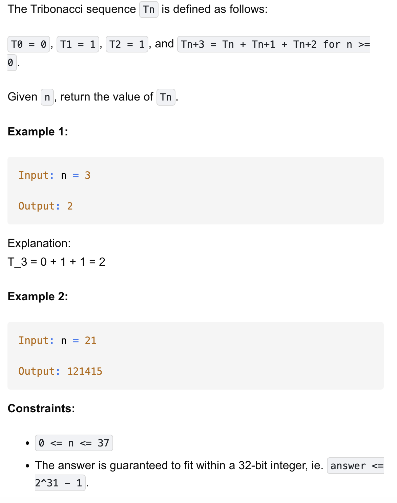

# 1137-N-th Tribonacci Number-E

## 题目描述


题意：
- 类Fibonacci，不过这里是三个数相加
- 初始化为0、1、1，求Tn

解法：
- dp

## 1. Dynamic Programming (Space Optimized)
```python
class Solution:
    def tribonacci(self, n: int) -> int:
        t = [0, 1, 1]

        if n < 3:
            return t[n]

        for i in range(3, n + 1):
            t[i % 3] = sum(t) # 执行顺序是先计算右边的 sum(t)，再把结果赋值给左边的 t[i % 3]
        return t[n % 3]
```

- TC: O(n)
- SC: O(1)

分析：
- 求Tn是要求到下标为n，而非n-1
- 本质是三个数字轮换更新，求和。所以可以用余3来在原地更新