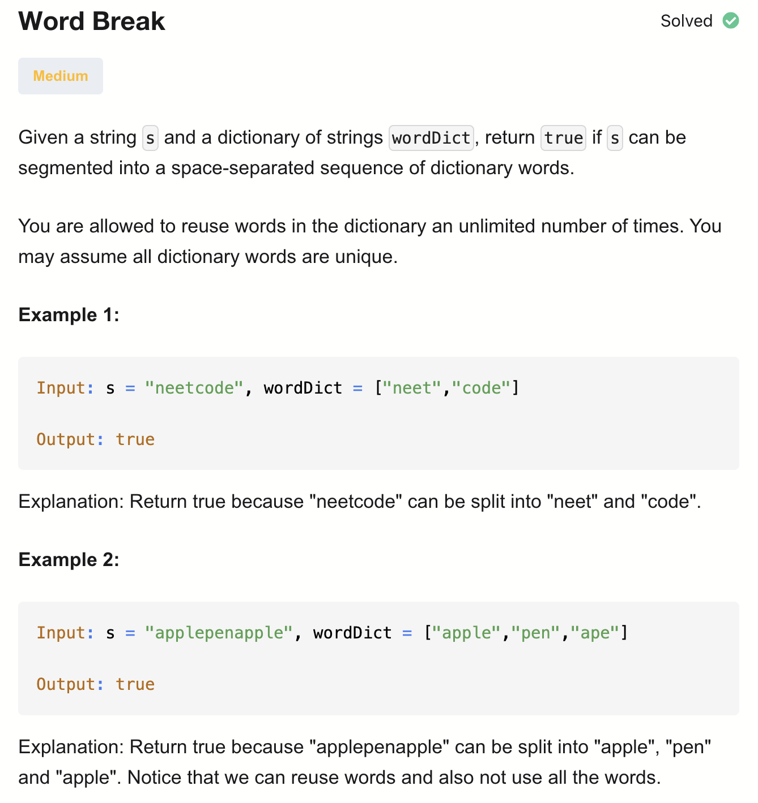
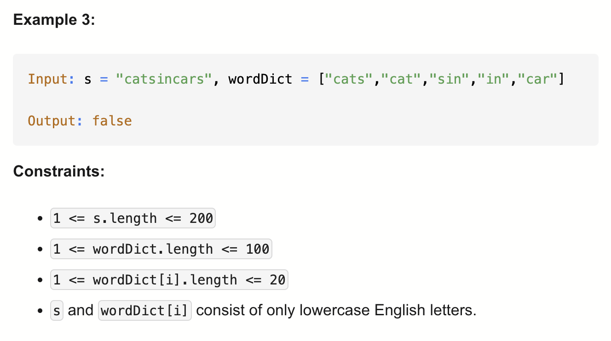

# 139-Word Break-M


## 题目描述



题意：
- 给定一个字符串 s 和一个字符串列表 wordDict（单词字典），
- 判断 s 是否能被拆分成若干个字典里的单词
- 就是给s砍几刀，分成的所有单词都需在字典里（可以重复使用**字典里的单词**，也可以不使用）

解法：
- Recursion
- dp (trie)


## 1. Recursion
```python
class Solution:
    def wordBreak(self, s: str, wordDict: List[str]) -> bool:

        def dfs(i):
            if i == len(s):
                return True

            for w in wordDict:
                if ((i + len(w)) <= len(s) and
                     s[i : i + len(w)] == w
                ):
                    if dfs(i + len(w)):
                        return True
            return False

        return dfs(0)
```
- TC: O(t * m^n)
- SC: O(n)
- n = len(s), m = len(dict), t = max length of words in dict

从左往右，判断字典里的每个单词，当前下标与w组成的子串是否可以拆分

neetcode里会超时

TC: dfs的参数从0到n，所以n为指数
dfs中有for循环，m次，所以m为底数
t是复制s[i : i + len(w)]的时间

SC: 递归栈的空间，也就是指数n


## 2. Dynamic Programming (Top-Down)
回溯+记忆化
```python
class Solution:
    def wordBreak(self, s: str, wordDict: List[str]) -> bool:
        memo = {len(s) : True}
        def dfs(i):
            if i in memo:
                return memo[i]

            for w in wordDict:
                if ((i + len(w)) <= len(s) and
                     s[i : i + len(w)] == w
                ):
                    if dfs(i + len(w)):
                        memo[i] = True
                        return True
            memo[i] = False
            return False

        return dfs(0)
```

- TC: O(n * m * t)
- SC: O(n)
- n = len(s), m = len(dict), t = max length of words in dict

## 3. Dynamic Programming (Bottom-Up) 递推
```python
class Solution:
    def wordBreak(self, s: str, wordDict: List[str]) -> bool:
        dp = [False] * (len(s) + 1)
        dp[len(s)] = True

        for i in range(len(s) - 1, -1, -1):
            for w in wordDict:
                if (i + len(w)) <= len(s) and s[i : i + len(w)] == w:
                    dp[i] = dp[i + len(w)]
                if dp[i]:
                    break

        return dp[0]
```

- TC: O(n * m * t)
- SC: O(n)
- n = len(s), m = len(dict), t = max length of words in dict

## 4. Dynamic Programming (Trie)
```python
class TrieNode:
    def __init__(self):
        self.children = {}
        self.is_word = False

class Trie:
    def __init__(self):
        self.root = TrieNode()

    def insert(self, word):
        node = self.root
        for char in word:
            if char not in node.children:
                node.children[char] = TrieNode()
            node = node.children[char]
        node.is_word = True

    def search(self, s, i, j): # 看s[i:j + 1]是否为word
        node = self.root
        for idx in range(i, j + 1):
            if s[idx] not in node.children:
                return False
            node = node.children[s[idx]]
        return node.is_word

class Solution:
    def wordBreak(self, s: str, wordDict: List[str]) -> bool:
        trie = Trie()
        for word in wordDict:
            trie.insert(word)

        dp = [False] * (len(s) + 1) # 因为下面需要+1，所以下标会到n
        dp[len(s)] = True # 不要忘了初始化最右边的

        t = 0
        for w in wordDict:
            t = max(t, len(w))

        for i in range(len(s), -1, -1):
            for j in range(i, min(len(s), i + t)): # for j in range(i, i):for循环不会执行，所以不会有dp[n+1]出现
                if trie.search(s, i, j):
                    dp[i] = dp[j + 1]
                    if dp[i]:
                        break # i 继续迭代

        return dp[0]
```

- TC: O((n * t^2) + m)
  - Trie 构建部分: O(m * t)
  - DP 部分: 外层n， 内层t，每次search最多t，所以O(n * t^2)
  - 总的就是两部分相加
- SC: O(n + m * t)
  - Trie: O(m * t) 这是worst case，即word列表里所有字符都不相同
  - dp数组: O(n)
- n = len(s), m = len(dict), t = max length of words in dict
