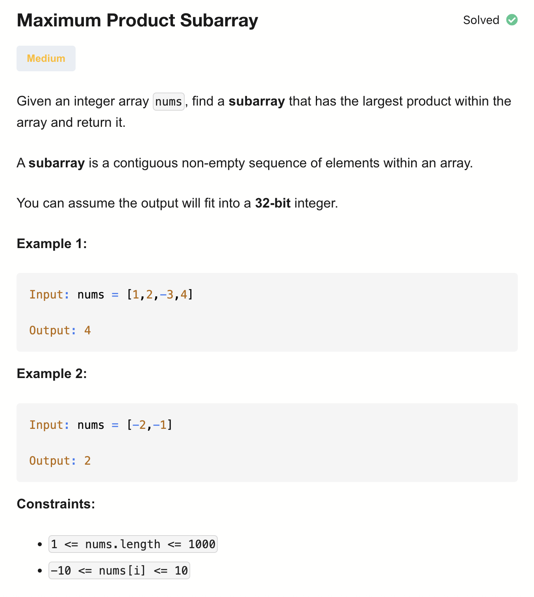

# 152-Maximum Product Subarray-M

## 题目描述


题意：
- 给一个整数数组，求数组的连续子串的最大乘积

解法：
- Kadane's Algorithm 
- Prefix & Suffix

## 1. Kadane's Algorithm
```python
class Solution:
    def maxProduct(self, nums: List[int]) -> int:
        res = nums[0]
        curMin, curMax = 1, 1

        for num in nums:
            tmp = curMax * num
            curMax = max(num * curMax, num * curMin, num)
            curMin = min(tmp, num * curMin, num)
            res = max(res, curMax)
        return res
```

- TC: O(n)
- SC: (1)

Kadane's Algorithm 由 Jay Kadane 提出，原本用来求最大连续子数组的和

这个算法的核心是 动态规划，而不是前后缀。
前后缀方法不需要维护局部状态的最小值，因为前后缀本身就覆盖了负数翻转的情况
Kadane 扩展版本则是 一边遍历，一边维护局部最小和最大，并直接更新全局最大

## 2. Prefix & Suffix
```python
class Solution:
    def maxProduct(self, nums: List[int]) -> int:
        n, res = len(nums), nums[0] 
        prefix = suffix = 0

        for i in range(n):
            prefix = nums[i] * (prefix or 1)
            suffix = nums[n - 1 - i] * (suffix or 1)
            res = max(res, max(prefix, suffix))
        return res
```

- TC: O(n)
- SC: (1)

分析：
- 思路是正向算一遍累积，反向算一遍累积，在过程中保存最大值。最终返回最大值

数组中没有0的情况：
- 若负数个数为偶数，那么子序列的最大累积就是全部数相乘
- 若负数个数为奇数，那么子序列的最大累积不能包含最靠左或最靠右的负数

数组中有0的情况：
- nums[i]为0，所以得不包含0，就乘1
- 代码逻辑：
  - 遇到为0的元素，nums[i]为0
  - 那么当下的prefix / suffix置0，并且下一个轮prefix / suffix为当前所指元素值，相当于重新开始算乘积

nums[n-1-i]是与nums[i]以nums中心为轴对称的元素
这样写是为了能在一遍循环完成：
- 为什么单向不够，必须双向？
  - 因为负数会翻转乘积的正负性， 单向遍历会“错过”最优子数组， 必须同时考虑从左到右和从右到左
  - 比如nums = [-1, -2, -3]，只算正向会得到2，但是反向会得到6
- 注意res的初始化不能是0，反例：nums=[-1]，正答是-1，但输出是0