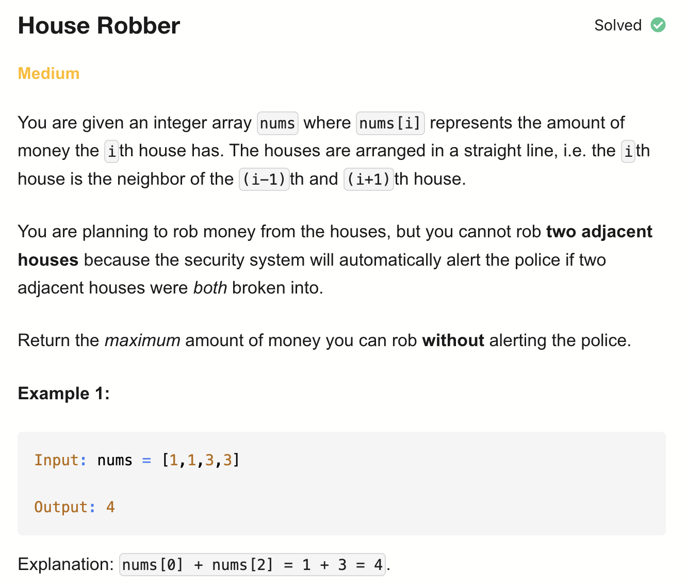
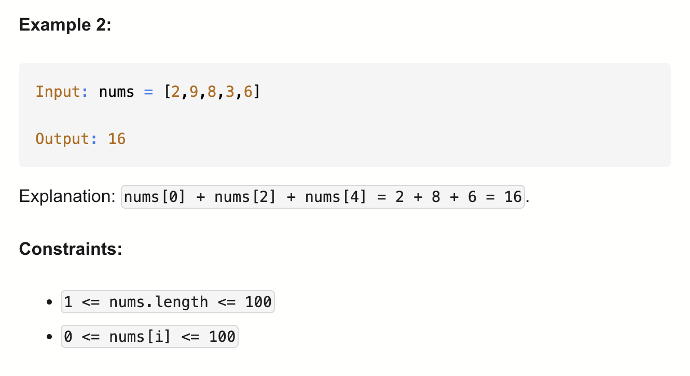

# 198-House Robber-M

## 题目描述



题意：
- 给定一个非负整数数组nums，表示每个房屋内的钱
- 不能抢相邻的房屋，求能抢到的最大金额

解法：
- Dynamic Programming
  - 状态转移方程：dp[i] = max(dp[i-1], dp[i-2]+nums[i])

## 1. Recursion
```python
class Solution:
    def rob(self, nums: List[int]) -> int:

        def dfs(i):
            if i >= len(nums):
                return 0
            return max(dfs(i + 1),
                       nums[i] + dfs(i + 2))

        return dfs(0)
```

递归会超时

- TC: O(2^n)
- SC: O(n)

## 2. Dynamic Programming (Top-Down) 回溯+记忆化搜索(用hash set)
```python
class Solution:
    def rob(self, nums: List[int]) -> int:
        memo = [-1] * len(nums)

        def dfs(i):
            if i >= len(nums):
                return 0
            if memo[i] != -1:
                return memo[i]
            memo[i] = max(dfs(i + 1), nums[i] + dfs(i + 2))
            return memo[i]

        return dfs(0)
```

- TC: O(n)
- SC: O(n)

## 3. Dynamic Programming (Bottom-Up)
```python
class Solution:
    def rob(self, nums: List[int]) -> int:
        if not nums:
            return 0
        if len(nums) == 1:
            return nums[0]

        dp = [0] * len(nums)
        dp[0] = nums[0]
        dp[1] = max(nums[0], nums[1])

        for i in range(2, len(nums)):
            dp[i] = max(dp[i - 1], nums[i] + dp[i - 2])

        return dp[-1]
```

- TC: O(n)
- SC: O(n)

## 4. Dynamic Programming (Bottom-Up) - Space Optimization
```python
class Solution:
    def rob(self, nums: List[int]) -> int:
        rob1, rob2 = 0, 0

        for num in nums:
            temp = max(num + rob1, rob2)
            rob1 = rob2
            rob2 = temp
        return rob2
```

- TC: O(n)
- SC: O(1)