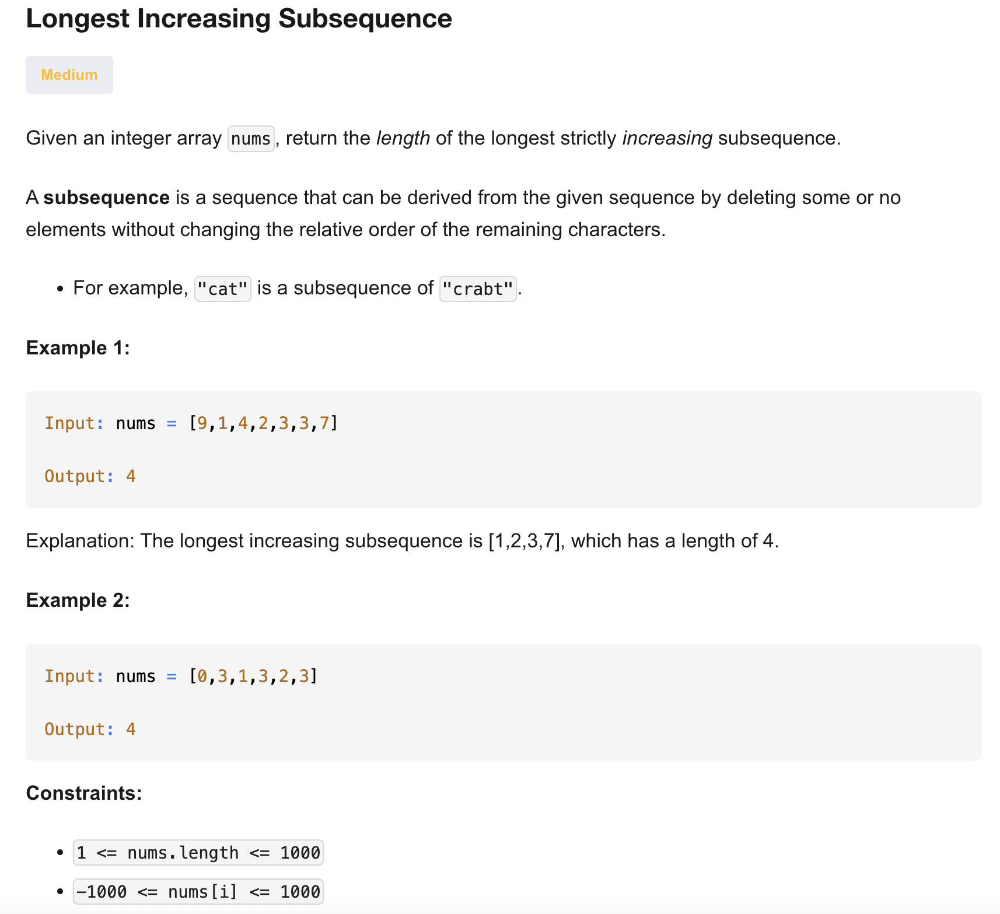

# 300-Longest Increasing Subsequence-M

## 题目描述


题意：
- 给定一个整数数组 nums ，找到其中最长严格递增子序列的长度
- 子序列Subsequence：不要求连续，只保证元素相对顺序不变
- Subarray: 要连续

解法：
- Recursion
- DP
- DP + Binary Search

## 1. Recursion
```python
class Solution:
    def lengthOfLIS(self, nums: List[int]) -> int:

        def dfs(i, j):
            if i == len(nums):
                return 0

            LIS = dfs(i + 1, j) # not include

            if j == -1 or nums[j] < nums[i]:
                LIS = max(LIS, 1 + dfs(i + 1, i)) # include

            return LIS

        return dfs(0, -1)
```

- TC: O(2^n)
- SC: O(n) (recursion stack)

参数的含义：
- i: 当前正在考虑是否要选的元素的索引
- j: 上一个被选择的元素的索引（即上一个在递增子序列中的元素）
若 j == -1 表示还没选任何元素

dfs返回值的含义：在数组 nums 中，设上一轮选中的元素是下标 j（nums[j]）。dfs的返回值是从第 i 个元素开始，能得到的最长递增子序列长度

分类讨论有两种情况：
- 选当前下标对应元素（无前置条件）
- 不选前下标对应元素（有前置条件，要满足当前比上一轮的值大）

TC: 两种选择，所以底数2；直到下标遍历完nums才结束，所以指数n
SC: 指数就是递归栈的大小

## 2. Dynamic Programming (Top-Down)
```python
class Solution:
    def lengthOfLIS(self, nums: List[int]) -> int:
        n = len(nums)
        memo = [-1] * n

        def dfs(i):
            if memo[i] != -1:
                return memo[i]

            LIS = 1
            for j in range(i + 1, n):
                if nums[i] < nums[j]:
                    LIS = max(LIS, 1 + dfs(j))

            memo[i] = LIS
            return LIS

        return max(dfs(i) for i in range(n))
```
- 
- TC: O(n^2)
- SC: O(n)

memo[i]表示以下标i开始，能构成的最长递增子序列长度。-1表示没访问过


## 3. Dynamic Programming (Bottom-Up)
```python
class Solution:
    def lengthOfLIS(self, nums: List[int]) -> int:
        LIS = [1] * len(nums)

        for i in range(len(nums) - 1, -1, -1):
            for j in range(i + 1, len(nums)):
                if nums[i] < nums[j]:
                    LIS[i] = max(LIS[i], 1 + LIS[j])
        return max(LIS)
```

- TC: O(n^2)
- SC: O(n)

从右向左，i是起始下标，j是终止下标
LIS[i]表示以下标i开始，能构成的最长递增子序列长度。

## 4. Dynamic Programming + Binary Search
```python
from bisect import bisect_left # 要引入包
class Solution:
    def lengthOfLIS(self, nums: List[int]) -> int:
        n = len(nums)
        subsequence = []
        subsequence.append(nums[0])
        LIS = 1

        for i in range(1, n):
            if subsequence[-1] < nums[i]: # subsequence里最后一个元素值小于当前遍历到的值
                subsequence.append(nums[i])
                LIS += 1
                continue
            
            idx = bisect_left(subsequence, nums[i]) # 在subsequence里找到第一个>=nums[i]的下标
            subsequence[idx] = nums[i]
                    
        return LIS
```

- TC: O(n log n)
  - 循环n，循环内二分是logn
- SC: O(n) subsequence的大小

分析：
- subsequence 从来就不是一个真实的 LIS
  - subsequence[idx] = nums[i] 可能会将子序列的值改乱，但不影响。
  - 因为subsequence只是一个长度为 k 的递增子序列中，结尾最小的那个可能值
- bisect_left不需要担心找不到idx，也就是subsequence里没有>=nums[i]的值，因为前面有判断subsequence[-1] < nums[i]，所以一定存在这样的值