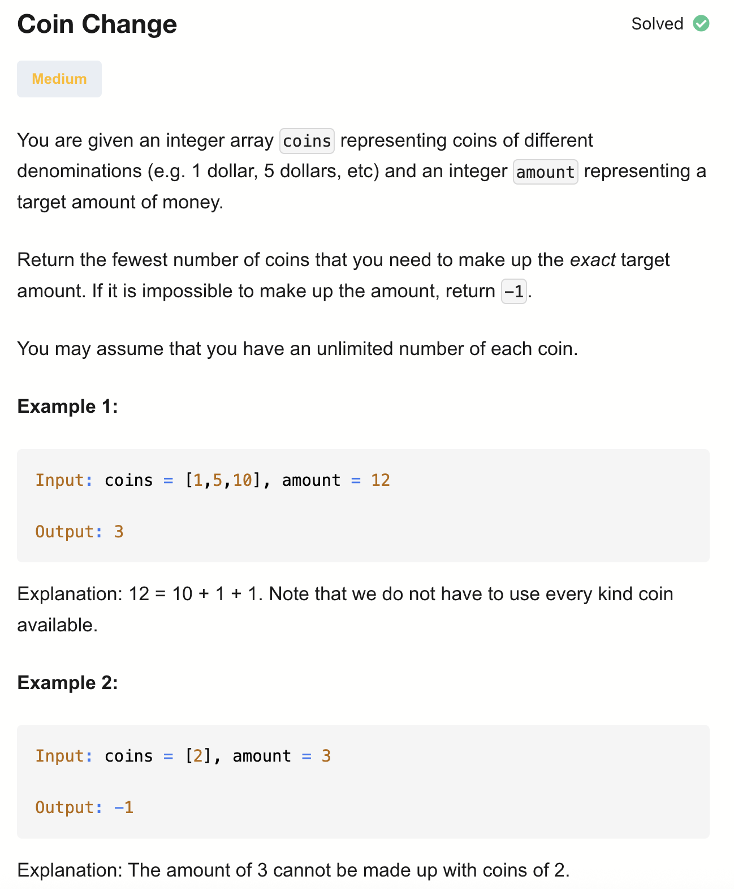
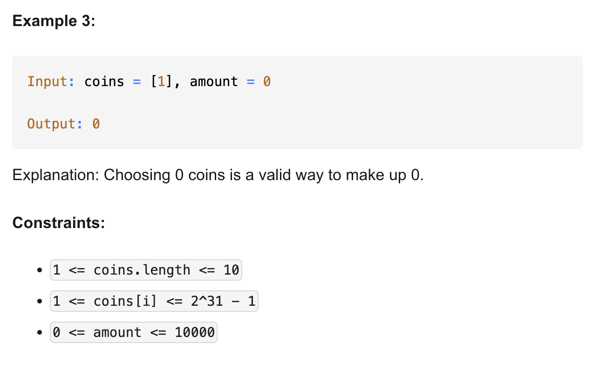

# 322-Coin Change-M

## 题目描述



题意：
- 给定一个整数数组 coins，表示不同面额的硬币；一个整数 amount
- 求组成该金额所需的最少硬币数量；如果无法组成该金额,返回 -1
- 假设每种硬币的数量是无限的

解法：
- Dynamic Programming
  - 状态转移方程：dp[i] = min(dp[i], dp[i-coin] + 1)
- bfs

## 1. Recursion
```python
class Solution:
    def coinChange(self, coins: List[int], amount: int) -> int:

        def dfs(amount):
            if amount == 0:
                return 0

            res = 1e9
            for coin in coins:
                if amount - coin >= 0:
                    res = min(res, 1 + dfs(amount - coin))
            return res

        minCoins = dfs(amount)
        return -1 if minCoins >= 1e9 else minCoins
```

- TC: O(n^t) 
- SC: O(t)
- n = len(coins), t = amount

neetcode里跑会超时


## 2. Dynamic Programming (Top-Down) 回溯+记忆化搜索
```python
class Solution:
    def coinChange(self, coins: List[int], amount: int) -> int:
        memo = {}

        def dfs(amount):
            if amount == 0:
                return 0
            if amount in memo:
                return memo[amount]

            res = float('inf') # solution里写1e9
            for coin in coins:
                if amount - coin >= 0:
                    res = min(res, 1 + dfs(amount - coin))

            memo[amount] = res
            return res

        minCoins = dfs(amount)
        return minCoins if minCoins != float('inf') else -1
        
```
- TC: O(n * t) 
- SC: O(t)
- n = len(coins), t = amount

amount从amount减到0，每一轮中for coin in coins


## 3. Dynamic Programming (Bottom-Up)
```python
class Solution:
    def coinChange(self, coins: List[int], amount: int) -> int:
        # dp[i] 表示要换到总共为i的钱需要多少个硬币
        # 因为硬币最小价值为1，所以初始化为一个达不到的最大值
        dp = [amount+1] * (amount+1) 
        dp[0] = 0

        for a in range(1, amount+1):
            for c in coins:
                if a - c >= 0:
                    dp[a] = min(dp[a], 1+dp[a-c]) 
        
        ans = dp[amount]
        return ans if ans != amount+1 else -1
        
```
- TC: O(n * t) 
- SC: O(t)
- n = len(coins), t = amount

## 4. Breadth First Search
```python
class Solution:
    def coinChange(self, coins: List[int], amount: int) -> int:
        if amount == 0:
            return 0

        q = deque([0])
        seen =[False] * (amount+1) # 金额 i 是否访问过
        seen[0] = True
        res = 0

        # BFS 按“层”遍历，每一层代表“用了多少个硬币”，也就是res的值
        while q:
            res += 1
            for _ in range(len(q)):
                cur = q.popleft()
                for coin in coins:
                    nxt = cur + coin
                    if nxt == amount: # res每次增加1，这是第一次出现方案为amount的情况
                        return res
                    if nxt > amount or seen[nxt]: # seen[nxt]表示比当前res更小的轮次已经访问过nxt
                        continue
                    seen[nxt] = True
                    q.append(nxt)
        
        return -1
```

- TC: O(n * t) 
- SC: O(t)
- n = len(coins), t = amount

分析：
- coins = [1, 2, 5], amount = 11
- res = 1 → 可以到金额 1, 2, 5
- res = 2 → 可以到金额 2, 3, 4, 6, 7, 10
- res = 3 → 可以到金额 3, 4, 5, 7, 8, 9, 11 ✅ 这里第一次到 11，res=3，就是最少硬币数。