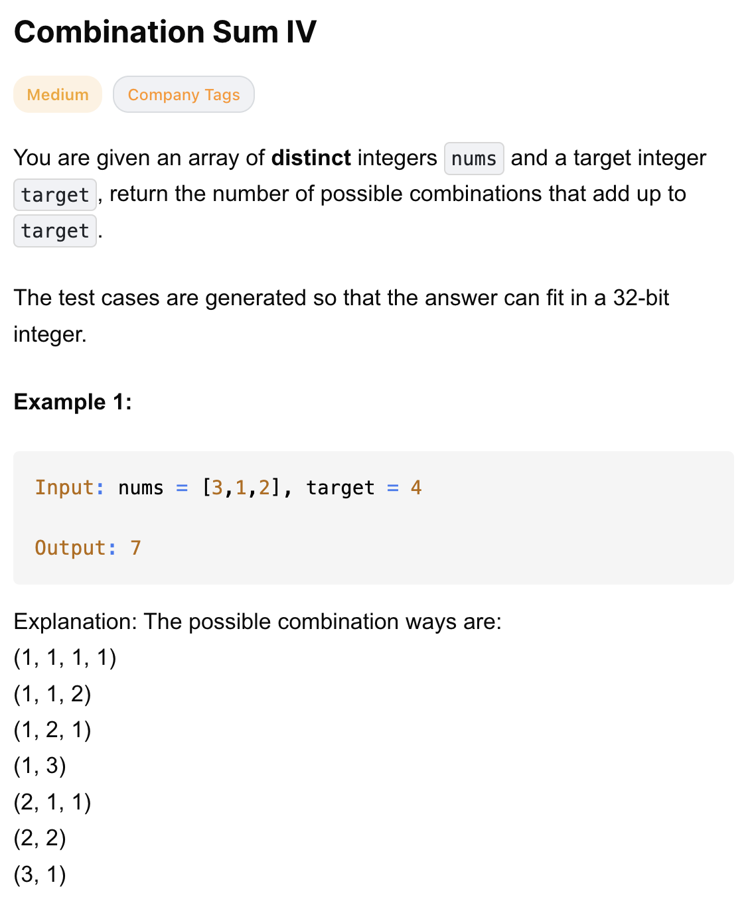
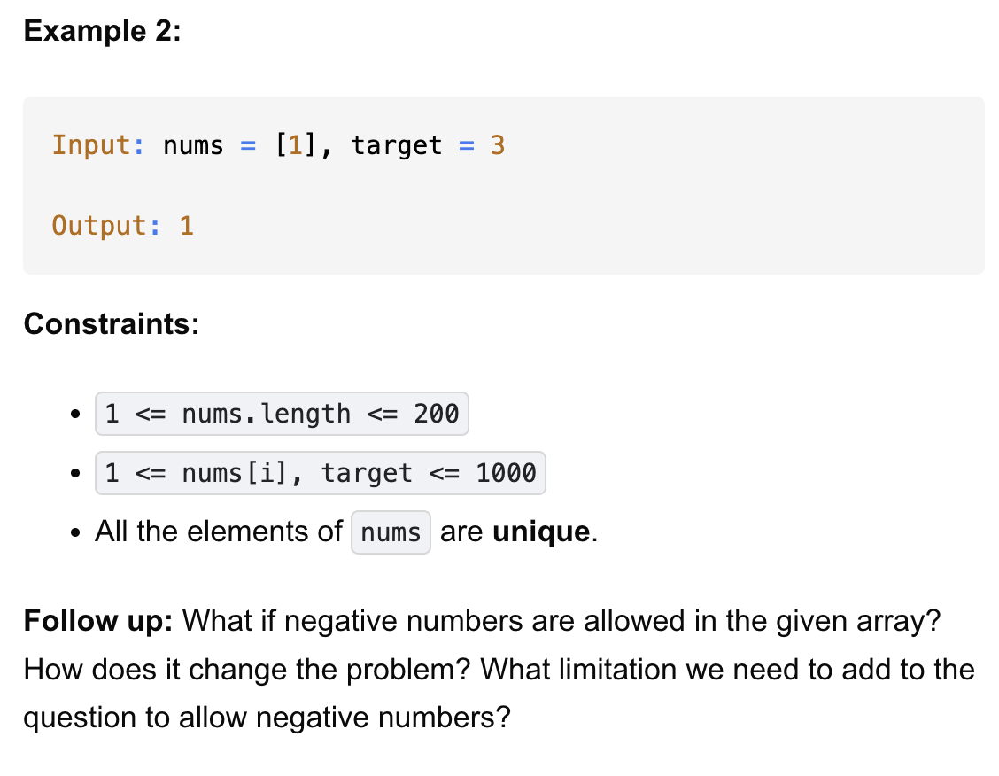

# 377-Combination Sum IV-M

## 题目描述




题意：
- 给定一个正整数数组nums，元素是唯一的；一个整数target
- 求从nums中选出若干元素（可重复取），使得这些元素的和 <= target。最终返回排列结果的数量

解法：
- Recursion
- Dynamic Programming

## 1. Dynamic Programming (Bottom-Up)
```python
class Solution:
    def combinationSum4(self, nums: List[int], target: int) -> int:
        nums.sort()
        dp = defaultdict(int)
        dp[target] = 1
        for total in range(target, 0, -1): # 到1结束，因为0时，和为0只有1种方案（啥都不选）
            for num in nums:
                if total < num:
                    break
                dp[total - num] += dp[total]
        return dp[0]
```

- TC: O(n * m)
- SC: O(m)
- n = len(nums), m = target

- dp[x] = 从“当前和为 x”，走到 target 的方案数
- dp[total - num] += dp[total]：
  - 所有能从 total 走到 target 的方案，都可以在前面加一个 num
  - 于是变成从 total - num 走到 target 的方案
