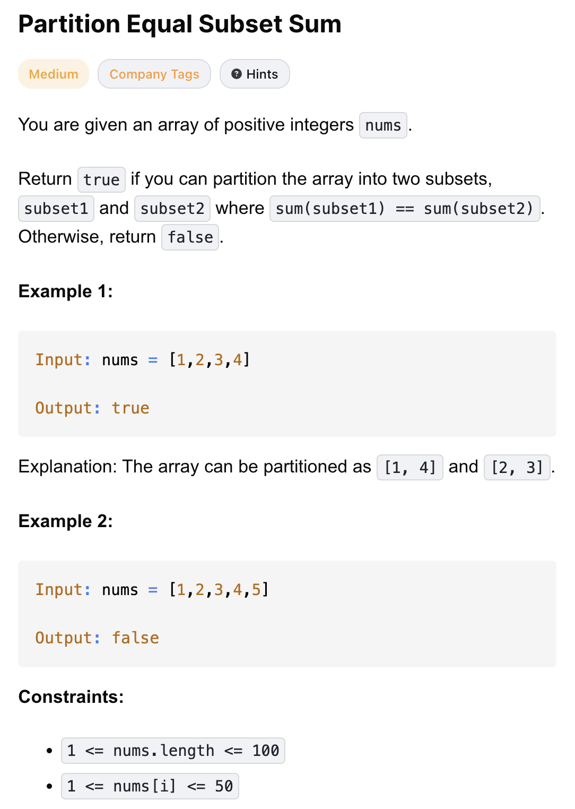

# 416-Partition Equal Subset Sum-M

## 题目描述


题意：
- 给一个nums，元素是正整数
- 是否能将其分为两个子集，使sum(subset1) == sum(subset2)，返回bool

解法：
- Recursion
- dp

## 1. dp
```python
class Solution:
    def canPartition(self, nums: list[int]) -> bool:
        if sum(nums) % 2:
            return False

        target = sum(nums) // 2
        dp = [False] * (target + 1)

        dp[0] = True
        for num in nums:
            for j in range(target, num - 1, -1): # 枚举可能的目标和
                dp[j] = dp[j] or dp[j - num] # 因为dp是bool，or表示任一为True，那么结果就是True

        return dp[target]
```

- TC: O(n * target)
  - 双层for循环
- SC: O(target)
  - dp

分析：
- 0/1 背包：每个 num 只能用一次，防止重复使用同一个数
- 将问题看作，能否从nums里选一些数出来，使其等于target，target = sum(nums) // 2
- dp[i]表示是否可以从前面的一些数中，选出若干个，使它们的和等于i
  - “前面的一些数” = 已经在 for num in nums: 遍历过的数，不是数组下标
- 为什么 dp[j - num] 是 dp[j] 的候选值？
  - 这是 0/1 背包的核心思想：如果之前能凑出 j - num，那么加上当前 num，就能凑出 j
