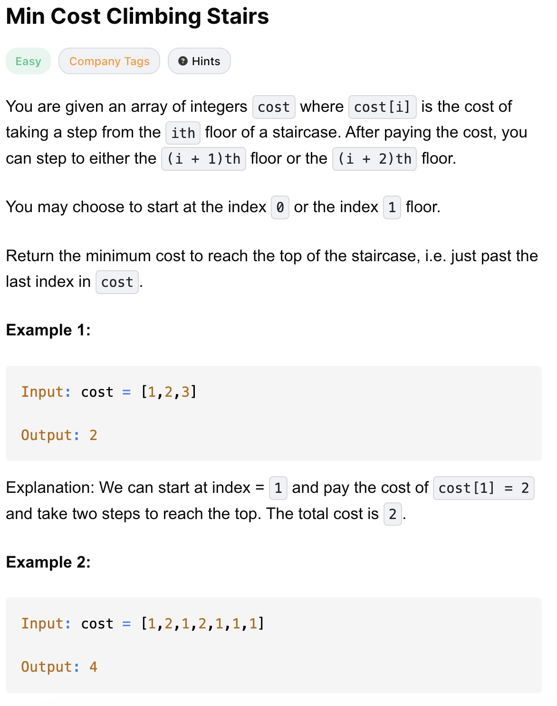
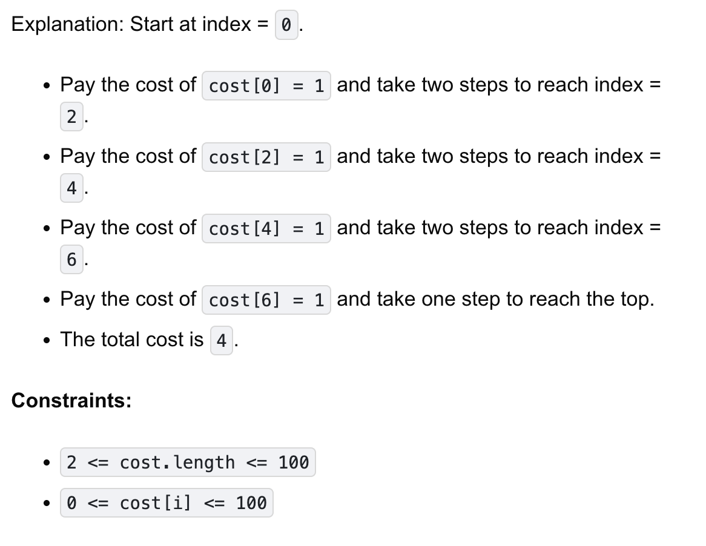

# 746-Min Cost Climbing Stairs-E

## 题目描述



题意：
- 数组表示cost，给了cost[i]才能过第i关
- 起点可以从下标0或1开始
- 每次可以走1或2步
- 要到top，不是到下标末尾就能停下，需要过了第n-1关(0-based)

解法：
- dp

## Dynamic Programming (Top-Down and Space Optimized)
```python
class Solution:
    def minCostClimbingStairs(self, cost: List[int]) -> int:
        for i in range(len(cost) - 3, -1, -1):
            cost[i] += min(cost[i + 1], cost[i + 2])

        return min(cost[0], cost[1])
```

- TC: O(n)
- SC: O(1)

- dp[i]: 从第 i 级台阶出发，爬到楼顶所需要的最小花费
- 状态转移方程：dp[i] = cost[i] + min(dp[i + 1], dp[i + 2])
- 最终答案是min(dp[0], dp[1])
- 因为dp本质含义是花费，也就是cost，所以为了节省空间，可以原地修改 cost 数组
