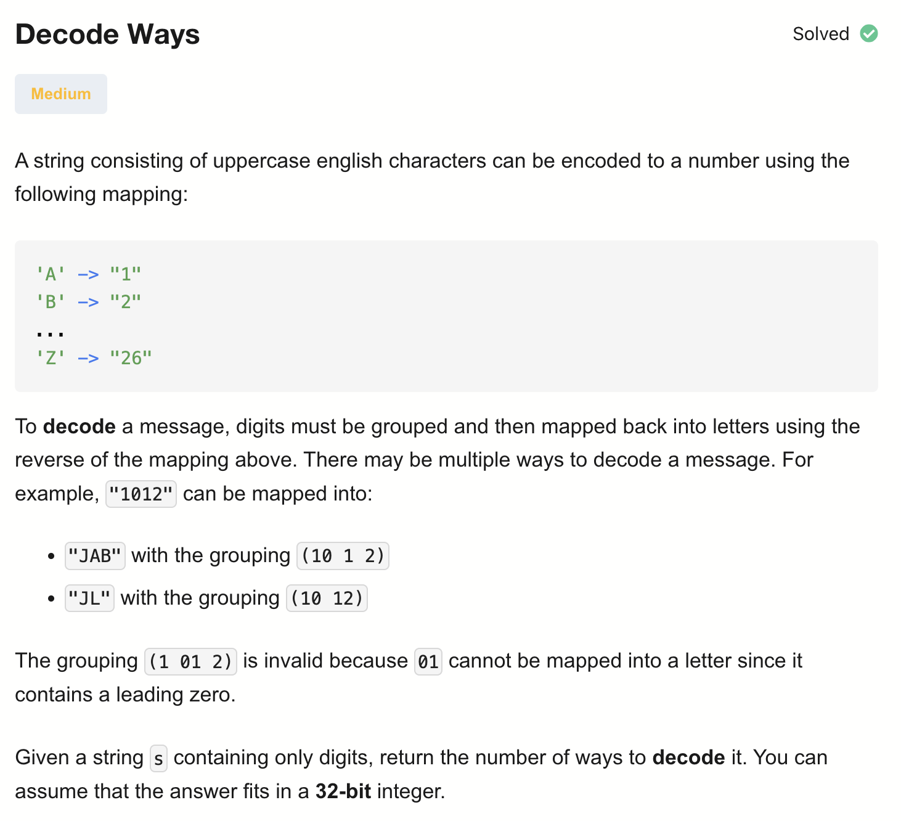
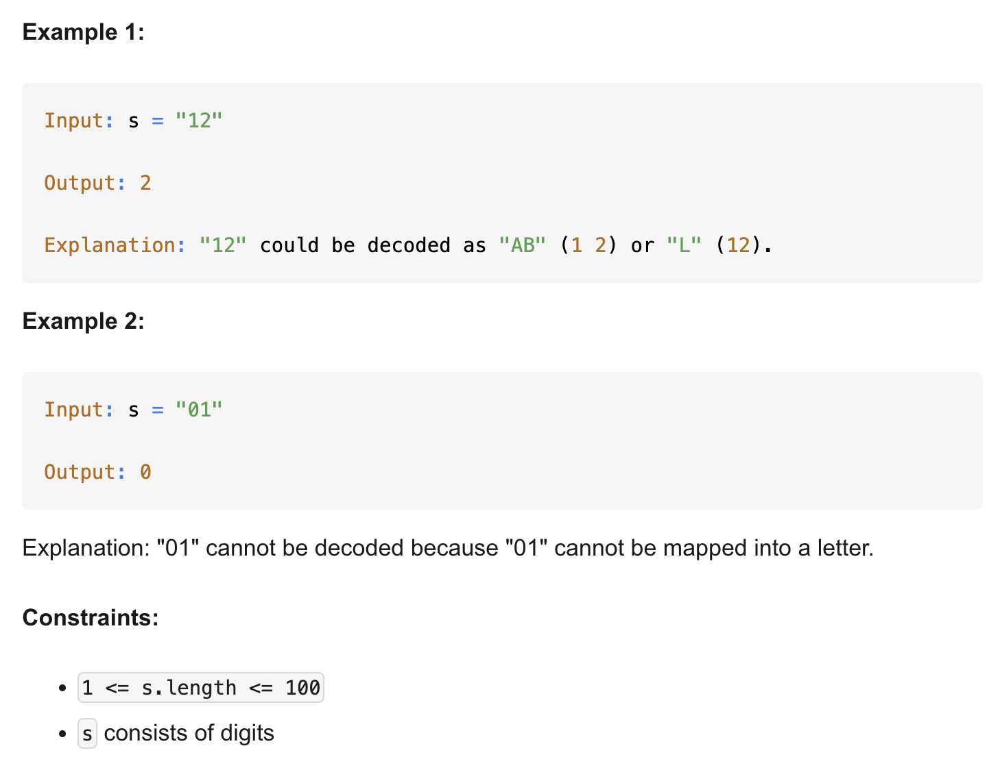

# 91-Decode Ways-M

## 题目描述



题意：
- 给定一个只包含数字的字符串，求有多少种解码方式
- 映射关系：'A'->1, 'B'->2, ..., 'Z'->26

解法：
- Dynamic Programming

状态转移方程：
if  i到i+2为10到26:
f[i] = f[i+1] + f[i+2] 
else:
 f[i] = f[i+1]

（上面是自右向左的写法。若要自左向右遍历，加号改减号）

## 1. Recursion
```python
class Solution:
    def numDecodings(self, s: str) -> int:

        def dfs(i):
            if i == len(s):
                return 1
            if s[i] == '0': # 以0开头不合法
                return 0
            
            res = dfs(i+1)
            if i < len(s)-1: # 可以按两位数来解
                if (s[i] == '1' or 
                (s[i] == '2' and s[i+1] < '7')):
                    res += dfs(i+2)
            return res
        
        return dfs(0)
        
```

- TC: O(2^n)
  - 分类讨论有两个分支
- SC: O(n)

## 2. Dynamic Programming (Top-Down) 回溯+记忆化搜索(用hash set)
```python
class Solution:
    def numDecodings(self, s: str) -> int:
        dp = {len(s) : 1}
        def dfs(i):
            if i in dp:
                return dp[i]
            if s[i] == '0': # 以0开头不合法
                return 0
            
            res = dfs(i+1)
            if (i < len(s)-1 # 可以按两位数来解
                and (s[i] == '1' or 
                (s[i] == '2' and s[i+1] < '7'))):
                res += dfs(i+2)
            dp[i] = res
            return res
        
        return dfs(0)
        
```

- TC: O(n)
- SC: O(n)

dp = { len(s): 1 }
等价于
dp = {}
dp[len(s)] = 1

## 3. Dynamic Programming (Bottom-Up)
```python
class Solution:
    def numDecodings(self, s: str) -> int:
        dp = {len(s) : 1}
        for i in range(len(s)-1, -1, -1):
            if s[i] == '0':
                dp[i] = 0
            else:
                dp[i] = dp[i+1]
            
            if (i < len(s)-1
                and (s[i] == '1' or 
                (s[i] == '2' and s[i+1] < '7'))):
                dp[i] += dp[i+2]

        return dp[0]
```

- TC: O(n)
- SC: O(n)

## 4. Dynamic Programming (Bottom-Up) Space Optimized
```python
class Solution:
    def numDecodings(self, s: str) -> int:
        dp = dp2 = 0 # dp2 = 0： dp[n+1] = 0，不存在
        dp1 = 1 # dp[n] = 1，空字符串只有 1 种“什么都不做”的解码
        for i in range(len(s)-1, -1, -1):
            # 一位数解码
            if s[i] == '0':
                dp = 0
            else:
                dp = dp1
            
            # 两位数解码
            if (i < len(s)-1
                and (s[i] == '1' or 
                (s[i] == '2' and s[i+1] < '7'))):
                dp += dp2
            dp, dp1, dp2 = 0, dp, dp1
            # dp  <- 0  (dp是阶段性结果，重置，准备下轮)
            # dp1 <- dp  (本轮 dp[i]赋值给 dp1)
            # dp2 <- dp1 (上一轮 dp[i])

        return dp1 # dp 在更新后被置为 0，最终有效的dp[i]在dp1中
```

- TC: O(n)
- SC: O(1)

分析：
- 本来的 DP 是 dp[i] = 从下标 i 开始的子串 s[i:] 的解码方式数，最终返回dp[0]
  - 单独解码一个字符：在s[i] != '0'的情况下，dp[i] += dp[i+1]
  - 合并解码两个字符：在s[i:i+2] 在 "10" ~ "26"的情况下，dp[i] += dp[i+2]

| 更新后            | 表示             |
| -------------- | -------------- |
| `dp1 = dp`     | 下一轮的 `dp[i+1]` |
| `dp2 = dp1`（旧） | 下一轮的 `dp[i+2]` |
| `dp = 0`       | 清空，准备算新的 dp[i] |


