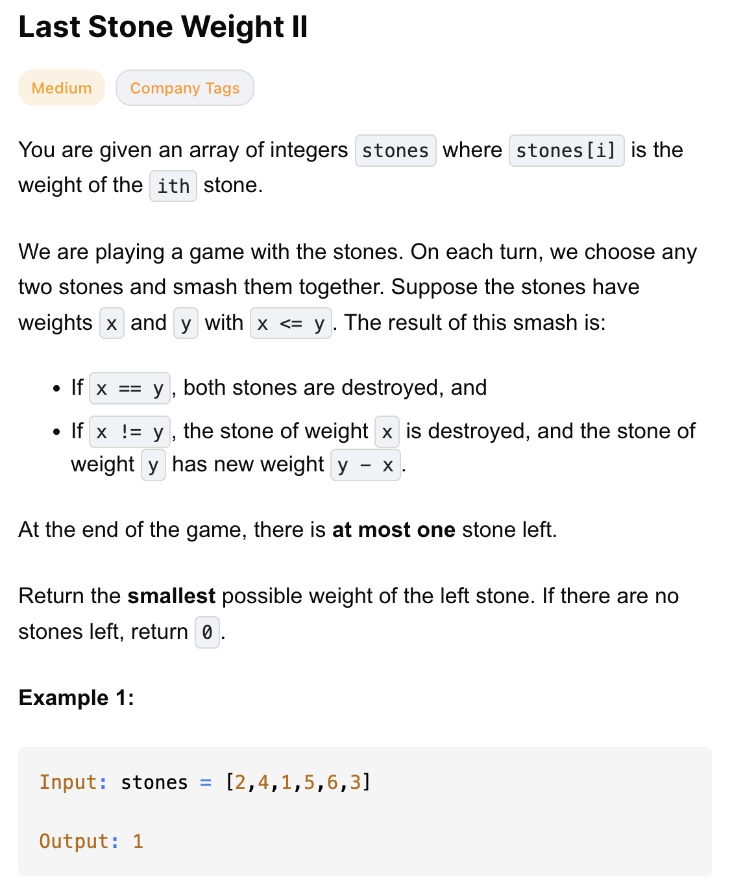
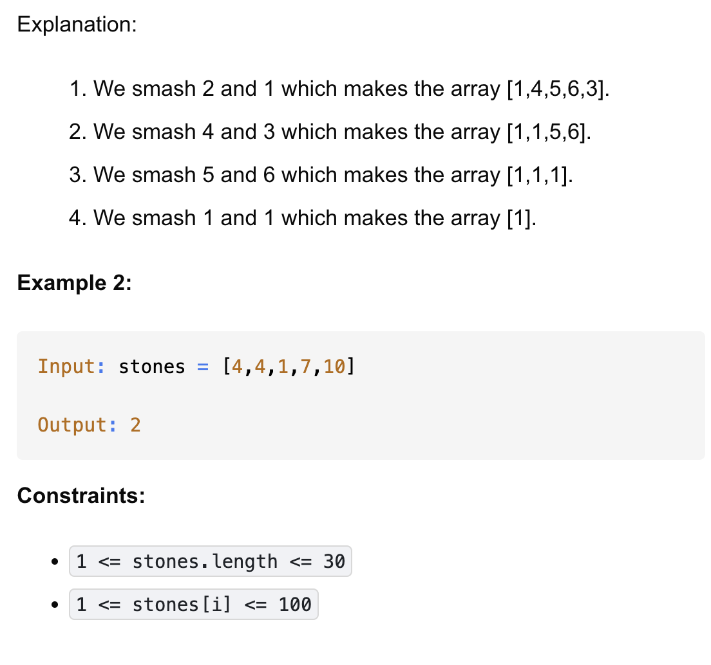

# 1049-Last Stone Weight II-M

## 题目描述



题意：
- 给定一个整数数组stones
- 对数组元素进行smash操作，要使得最后剩下的值最小，若无值剩下，那么返回0. smash定义如下:
    - 选数组里的任意两个元素，只留下两值之差。也就是说如果两者相等，那么将这两个元素都pop出数组；不相等，pop出去后加入两值之差

解法：
- Recursion
- dp + Hash Set/Bitset


## 1. Dynamic Programming (Space Optimized)
```python
class Solution:
    def lastStoneWeightII(self, stones: List[int]) -> int:
        stoneSum = sum(stones)
        target = stoneSum // 2
        dp = [0] * (target + 1)

        for stone in stones:
            for t in range(target, stone - 1, -1):
                dp[t] = max(dp[t], dp[t - stone] + stone)

        return stoneSum - 2 * dp[target]
```
- TC: O(n * m)
- SC: O(m)
- n = len(stones), m = sum(stones)

分析：
- 核心思路转化：本质就是分成两组，使重量差最小
  - 再进一步转化为0/1背包问题，容量为target，要从stones里中选出不超过target的最大价值总和
- dp[t] = 在容量 t 内，能够达到的最大石头总和(stones[i]总和)
- dp[t] = max(dp[t], dp[t - stone] + stone):
  - 不选 stone → dp[t] 保持原值
  - 选 stone → dp[t - stone] + stone (选了之后容量就变成 t - stone 了)