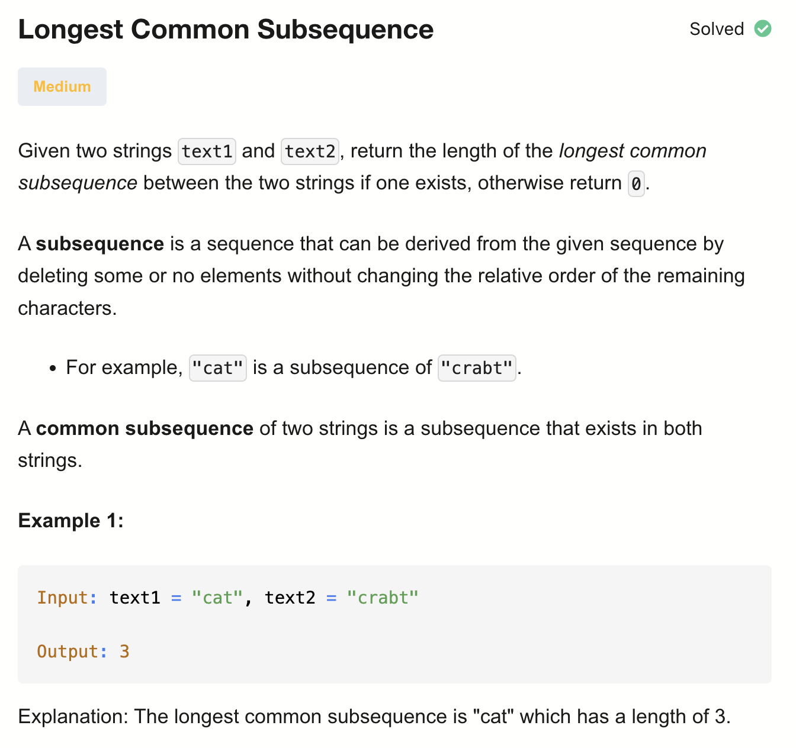
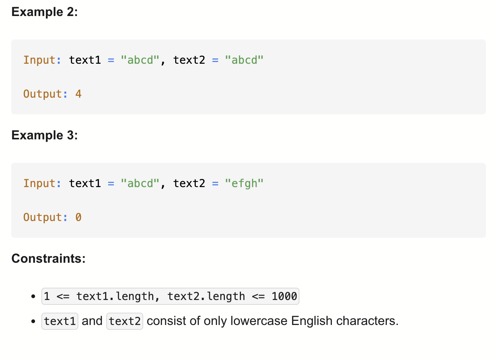

# 1143-Longest Common Subsequence-M

## 题目描述



题意：
- 给定两个字符串，返回最长公共子序列的长度
- 子序列：不要求连续，但要求顺序一致


解法：
- Recursion
- 2D Dynamic Programming

## 1. Recursion
```python
class Solution:
    def longestCommonSubsequence(self, text1: str, text2: str) -> int:

        def dfs(i, j):
            if i == len(text1) or j == len(text2):
                return 0
            if text1[i] == text2[j]:
                return 1 + dfs(i + 1, j + 1)
            return max(dfs(i + 1, j), dfs(i, j + 1))

        return dfs(0, 0)
```

- TC: O(2^(m+n))
- SC: O(m+n)
- m = len(text1), n = len(text2)

两种情况：
1.当前遍历到的两个元素相等：长度1有了，再加上两个下标都往右移后的返回值
2.当前遍历到的两个元素不相等：选其中一个，另一个下标右移；从这两个数中选较大值


## 2. Dynamic Programming (Top-Down)
```python
class Solution:
    def longestCommonSubsequence(self, text1: str, text2: str) -> int:
        memo = {}

        def dfs(i, j):
            if i == len(text1) or j == len(text2):
                return 0
            if (i, j) in memo:
                return memo[(i, j)]

            if text1[i] == text2[j]:
                memo[(i, j)] = 1 + dfs(i + 1, j + 1)
            else:
                memo[(i, j)] = max(dfs(i + 1, j), dfs(i, j + 1))

            return memo[(i, j)]

        return dfs(0, 0)
```

- TC: O(m * n)
- SC: O(m * n)
- m = len(text1), n = len(text2)

这个memo的格式有点特殊：key为(i,j) 下标元组，value为以(i,j)下标开始的LCS

## 3. Dynamic Programming (Bottom-Up)
```python
class Solution:
    def longestCommonSubsequence(self, text1: str, text2: str) -> int:
        dp = [[0 for j in range(len(text2) + 1)]
                 for i in range(len(text1) + 1)]

        for i in range(len(text1) - 1, -1, -1):
            for j in range(len(text2) - 1, -1, -1):
                if text1[i] == text2[j]:
                    dp[i][j] = 1 + dp[i + 1][j + 1]
                else:
                    dp[i][j] = max(dp[i][j + 1], dp[i + 1][j])

        return dp[0][0]
```

- TC: O(m * n)
- SC: O(m * n)
- m = len(text1), n = len(text2)

dp[i][j] 表示从 text1[i:] 和 text2[j:] 开始的 LCS 长度

## 4. Dynamic Programming (Optimal)
```python
class Solution:
    def longestCommonSubsequence(self, text1: str, text2: str) -> int:
        m = len(text1)
        n = len(text2)
        if m < n: # 保证 text2 / n 小
            text1, text2 = text2, text1
            m, n = n, m
        dp = [0] * (n+1)

        for i in range(m-1, -1, -1):
            prev = 0 # prev是右下角的值，dp[i+1][j+1]；每次循环时，j+1 = n，对于text2是越界的，所以置0
            for j in range(n-1, -1, -1):
                tmp = dp[j] # 暂存当前 dp[j] = dp[i+1][j]
                if text1[i] == text2[j]:
                    # dp[i][j] = 1 + dp[i + 1][j + 1]
                    dp[j] = 1 + prev 
                else:
                    # dp[i][j] = max(dp[i + 1][j], dp[i][j + 1])
                    dp[j] = max(dp[j], dp[j+1])
                prev = tmp  # 更新右下角（下一个 j 会用到）
        
        return dp[0]
```

- TC: O(m * n)
- SC: O(min(m, n))
- m = len(text1), n = len(text2)

分析：
- 二维 DP 在算什么？
  - dp[i][j] = text1[i:] 和 text2[j:] 的 LCS 长度
    - 如果相等：dp[i][j] = 1 + dp[i+1][j+1]
    - 如果不相等：dp[i][j] = max(dp[i+1][j], dp[i][j+1])
- 一维 DP 的核心问题：
  - dp[j] = 当前行的 dp[i][j]
  - prev 保存的是 右下角 dp[i+1][j+1]
  - tmp 用来更新 prev
  - 它们的存在，是为了在一维数组中模拟二维 DP 的状态转移


