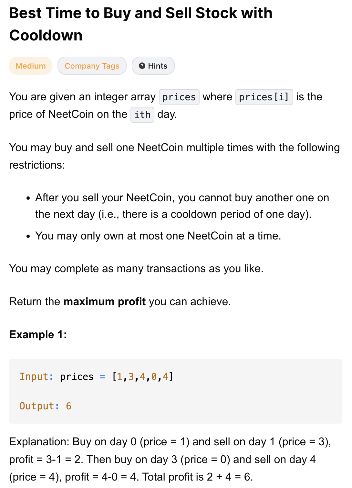
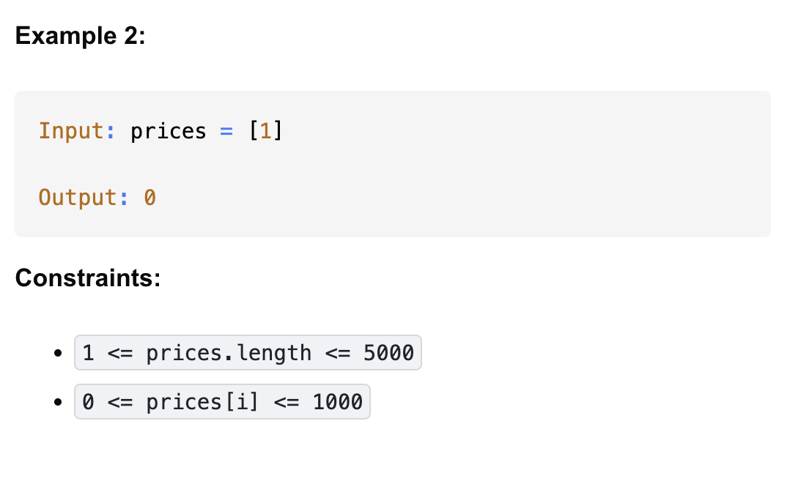

# 309-Best Time to Buy and Sell Stock with Cooldown-M

## 题目描述




题意：
- 给定一个整数数组prices，表示每天的股票价格。可以进行买卖操作，最终返回最大利润
- 限制1: 卖出股票后的第二天无法买入股票 (即冷冻期为 1 天)。
- 限制2: 手上最多只能持有一股股票。


解法：
- Recursion
- Dynamic Programming
  - 状态转移方程：
      - dp[i][1] = max(dp[i+1][1], dp[i+1][0] - prices[i]) // 第 i 天结束时，【不持有股票】的最大利润
        - max(今天不操作, 下一天没买今天买)
      - dp[i][0] = max(dp[i+1][0], dp[i+2][1] + prices[i]) // 第 i 天结束时，【持有一股股票】的最大利润
        - max(今天不操作, 后一天持股今天卖（冷冻一天）)
        - 因为冷冻期，所以是dp[i+2] 而非 dp[i+1]

## 1. Dynamic Programming (Space Optimized)
```python
class Solution:
    def maxProfit(self, prices: List[int]) -> int:
        n = len(prices)
        dp1_buy, dp1_sell = 0, 0
        dp2_buy = 0

        for i in range(n - 1, -1, -1):
            dp_buy = max(dp1_sell - prices[i], dp1_buy)
            dp_sell = max(dp2_buy + prices[i], dp1_sell)
            dp2_buy = dp1_buy
            dp1_buy, dp1_sell = dp_buy, dp_sell

        return dp1_buy
```

dp1_buy   = dp[i+1][1]   # 下一天「持股」
dp1_sell  = dp[i+1][0]   # 下一天「不持股」
dp2_buy   = dp[i+2][1]   # 后一天「持股」

- TC: O(n)
- SC: O(1)