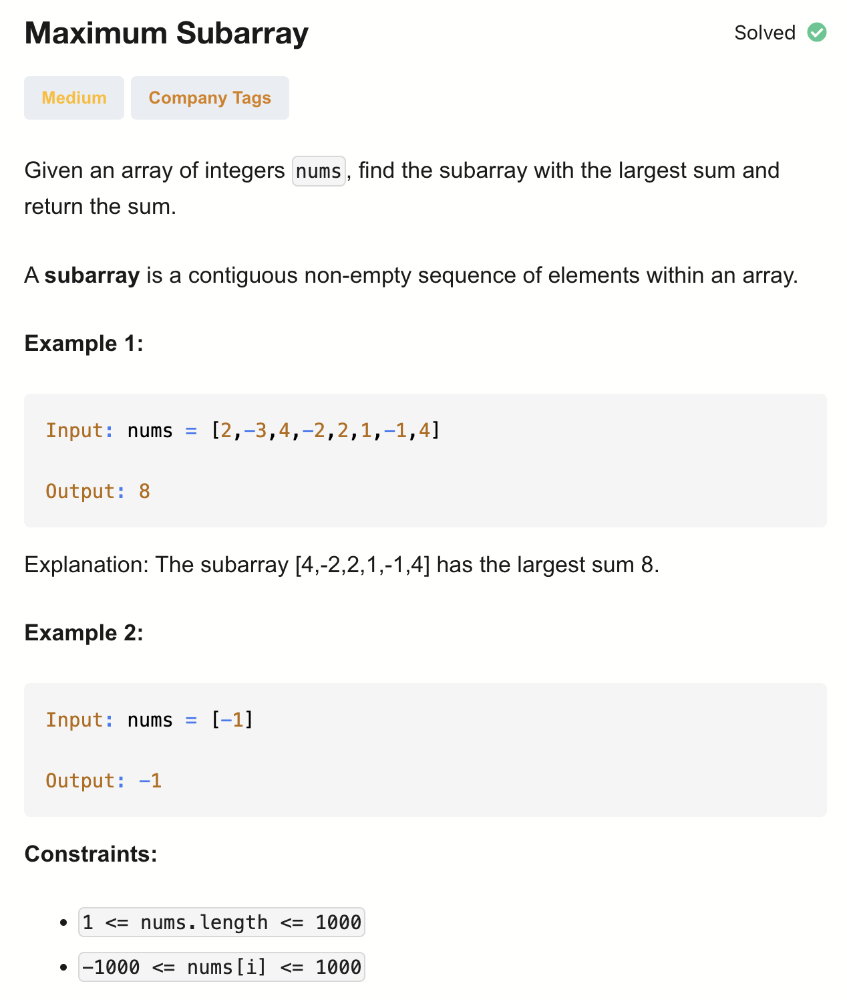

# 53-Maximum Subarray-M

## 题目描述



题意：
- 给定一个整数数组 nums ，
- 找到一个具有最大和的连续子数组（子数组最少包含一个元素），返回其最大和。

解法：
- DP

## 1. DP Space Optimization

```python
class Solution:
    def maxSubArray(self, nums: List[int]) -> int:
        n = len(nums)
        dp = [*nums] # 等价于dp = list(nums); dp[i]表示以nums[i]开头的最大子数组和
        
        for i in range(n - 2, -1, -1): 
            dp[i] = max(nums[i], nums[i] + dp[i + 1])
            
        return max(dp)
```

- TC: O(n)
- SC: O(n)

dp = [*nums]：
1.简洁：这是 Python 3 的一种简写形式，比 list(nums) 更短。
2.拷贝一份新列表（避免引用同一个对象）。
因为：
dp = nums  # 只是引用同一个列表
dp = [*nums]  # 新建了一个独立的副本
所以修改 dp 不会影响原始的 nums。
