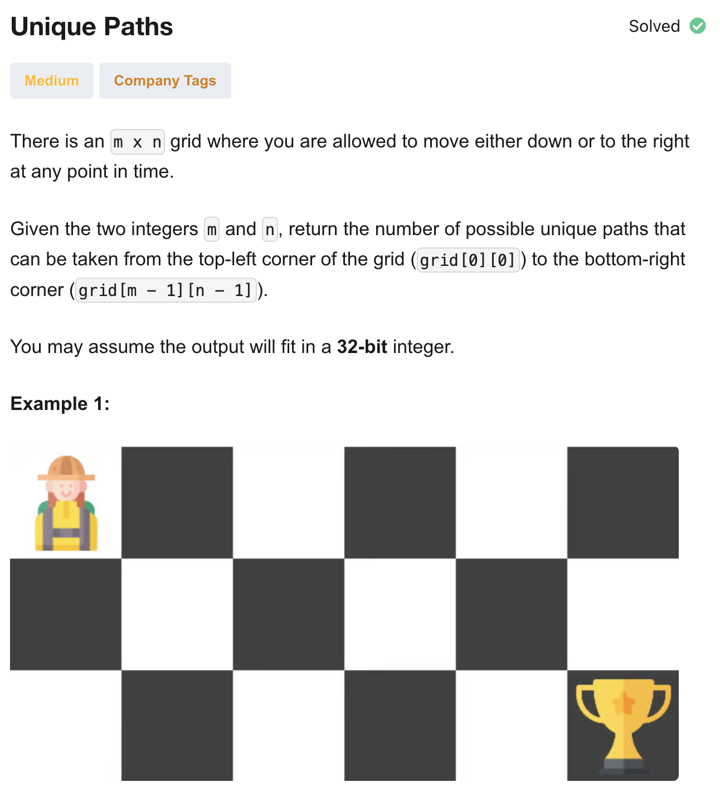
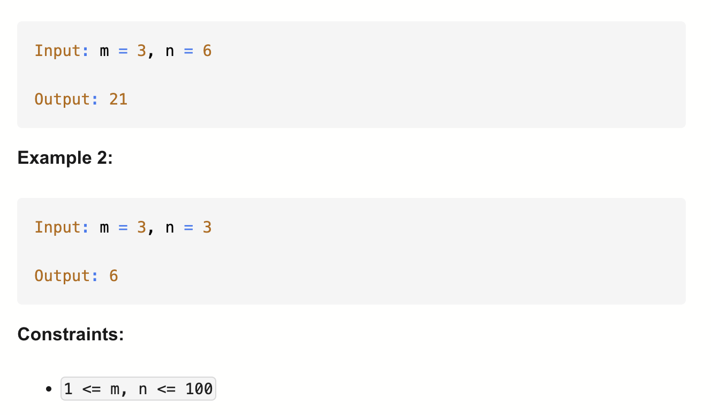

# 62-Unique Paths-M

## 题目描述



题意：
- m * n 的格子，人只能向右 或 下走
- 问一个人从最左上走到最右下的方案数


解法：
- dp

## 1. Recursion
```python
class Solution:
    def uniquePaths(self, m: int, n: int) -> int:

        def dfs(i, j):
            if i == (m - 1) and j == (n - 1):
                return 1
            if i >= m or j >= n:
                return 0
            return dfs(i, j + 1) + dfs(i + 1, j)

        return dfs(0, 0)
```

- TC: O(2^(m+n))
  - 假设从左上角 (0,0) 到右下角 (m-1,n-1): 
    - 总共要走向右 n-1 次+向下 m-1 次，所以递归树的深度为 O(m + n)
    - 而在每个节点（格子）要么向右要么向下，所以每个节点最多生成两个子节点
- SC: O(m+n)


## 2. Dynamic Programming (Top-Down)
```python
class Solution:
    def uniquePaths(self, m: int, n: int) -> int:
        memo = [[-1] * n for _ in range(m)]
        def dfs(i, j):
            if i == (m - 1) and j == (n - 1):
                return 1
            if i >= m or j >= n:
                return 0
            if memo[i][j] != -1:
                return memo[i][j]

            memo[i][j] =  dfs(i, j + 1) + dfs(i + 1, j)
            return memo[i][j]

        return dfs(0, 0)
```

- TC: O(m * n)
- SC: O(m * n)

## 3. Dynamic Programming (Bottom-Up)
```python
class Solution:
    def uniquePaths(self, m: int, n: int) -> int:
        dp = [[0] * (n + 1) for _ in range(m + 1)]
        dp[m - 1][n - 1] = 1

        for i in range(m - 1, -1, -1):
            for j in range(n - 1, -1, -1):
                dp[i][j] += dp[i + 1][j] + dp[i][j + 1]

        return dp[0][0]
```

- TC: O(m * n)
- SC: O(m * n)

代码分析：
- dp[i][j]表示 从网格 (i, j) 出发，到达右下角 (m-1, n-1) 的路径总数
- dp[0][0] 就是我们要的答案（从起点走到终点的路径数）
- dp[m-1][n-1] = 1（在终点只有 1 种走法——原地不动）

- Q: 为什么是dp[i][j] += dp[i+1][j] + dp[i][j+1]？ 而非dp[i][j] = dp[i+1][j] + dp[i][j+1]
- A: 因为给dp[m - 1][n - 1] 赋了初始值1，接着立刻又开始从 (m-1, n-1) 向上循环。为了不覆盖掉 dp[m-1][n-1] = 1，所以加上的。也就是说+= 是为了防止在边界情况时丢掉已存在的初始值
写成if else也是等价的
```python
class Solution:
    def uniquePaths(self, m: int, n: int) -> int:
        dp = [[0] * (n+1) for _ in range(m+1)]
        dp[m-1][n-1] = 1

        for i in range(m-1, -1, -1):
            for j in range(n-1, -1, -1):
                if i == m-1 and j == n-1:
                    dp[i][j] = 1
                else:
                    dp[i][j] = dp[i][j+1] + dp[i+1][j]
        
        return dp[0][0]
```

## 4. Dynamic Programming (Space Optimized)
```python
class Solution:
    def uniquePaths(self, m: int, n: int) -> int:
        row = [1] * n

        for i in range(m - 1):
            newRow = [1] * n
            for j in range(n - 2, -1, -1):
                newRow[j] = newRow[j + 1] + row[j]
            row = newRow
        return row[0]
```

- TC: O(m * n)
- SC: O(n)

代码分析：
- Q: 为什么二维的dp[i][j] = dp[i][j+1] + dp[i+1][j] 能变成一维的dp[j] = dp[j] + dp[j + 1]？
- A: 
  - 首先，dp[i][j]是从右下角转移过来的，是当前行右一列 + 下一行当前列的值
  - 所以其实只涉及到两行的转移（当前行和下一行）。
  - 初始化是[1] * n，表示最后一行的路径数都是 1（在底部，只能一直向右走）。
  - 而dp[j]当前存的其实是 “下面一行的 dp[i+1][j]”
  - dp[j+1] 是 “当前行右边的 dp[i][j+1]”

## 5. Dynamic Programming (Optimal)
```python
class Solution:
    def uniquePaths(self, m: int, n: int) -> int:
        dp = [1] * n
        for i in range(m - 2, -1, -1):
            for j in range(n - 2, -1, -1):
                dp[j] += dp[j + 1]

        return dp[0]
```
- TC: O(m * n)
- SC: O(n)

代码分析：
- 这里空间优化了，二维转一维：
  - 虽然看起来只依赖右一列的值，但是公式仍是dp[i][j] = down routes + right routes
  - 因为等式右边的dp[j]其实就是dp[下一行格子]
- 最终返回的是最左上角的dp值，列=0，所以dp[0]

## 6. Math
```python
class Solution:
    def uniquePaths(self, m: int, n: int) -> int:
        if m == 1 or n == 1:
            return 1
        if m < n:
            m, n = n, m

        res = j = 1
        for i in range(m, m + n - 1):
            res *= i
            res //= j
            j += 1

        return res
```

时间复杂度分析：
- TC: O(min(m, n))
  - i 从 m 到 m + n - 2
  一共循环 (n-1) 次
  因为前面判断交换过，所以保证 m ≥ n
- SC: O(1)