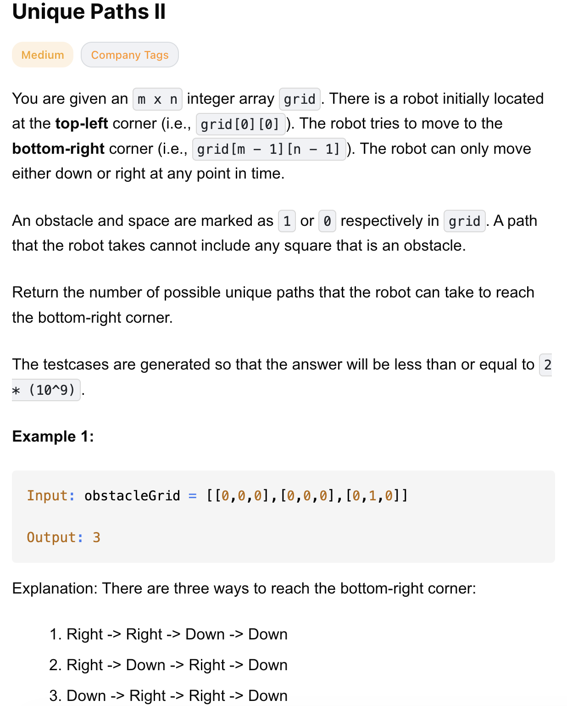
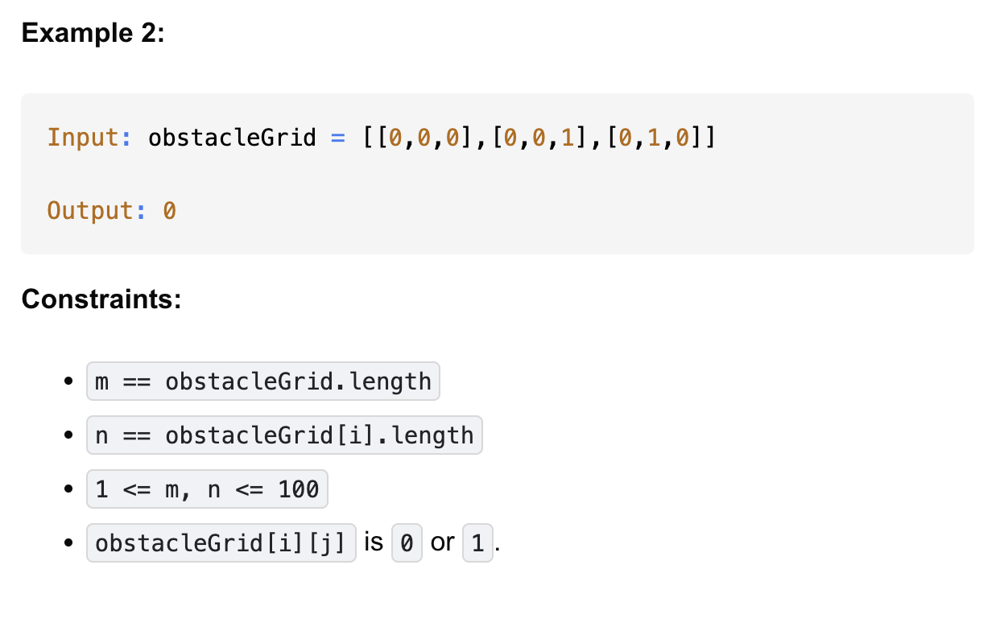

# 63-Unique Paths II-M

## 题目描述



题意：
- m * n 的格子，元素为0或1，1表示障碍，0表示可通行
- 问一个人从最左上走到最右下的方案数
  - 前提人只能向右 或 下走
  - 不能走到障碍格子

解法：
- dp

## 1. Dynamic Programming (In-Place)
```python
class Solution:
    def uniquePathsWithObstacles(self, grid: List[List[int]]) -> int:
        M, N = len(grid), len(grid[0])
        if grid[0][0] == 1 or grid[M - 1][N - 1] == 1:
            return 0

        grid[M - 1][N - 1] = 1 # 从终点开始反向填表，终点到终点只有一种走法，所以为1

        for r in range(M - 1, -1, -1):
            for c in range(N - 1, -1, -1):
                if r == M - 1 and c == N - 1: # 终点已经填过了，所以跳过
                    continue

                if grid[r][c] == 1:
                    grid[r][c] = 0 # 有障碍，所以路径数为0
                else:
                    down = grid[r + 1][c] if r + 1 < M else 0
                    right = grid[r][c + 1] if c + 1 < N else 0
                    grid[r][c] = down + right # 从当前位置到终点的路径数 = 向下走的路径数 + 向右走的路径数

        return grid[0][0]
```
- grid[i][j]表示从(i, j)走到(m-1, n-1)有多少种方案
- 核心 DP 公式：从当前位置到终点的路径数 = 向下走的路径数 + 向右走的路径数
- 从终点往起点计算，反向填表
- 直接在原 grid 上修改，用 grid 来做 DP 表，节省空间

- TC: O(m * n)
- SC: O(1)
- m is len of row, n is len of col