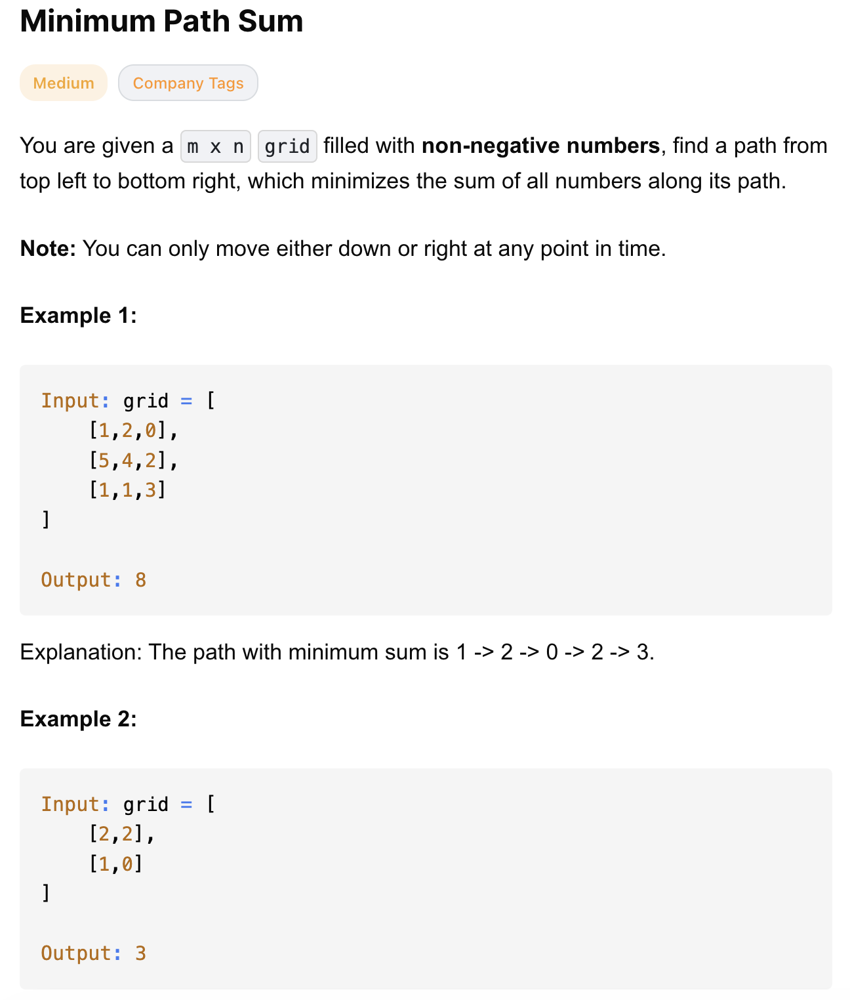
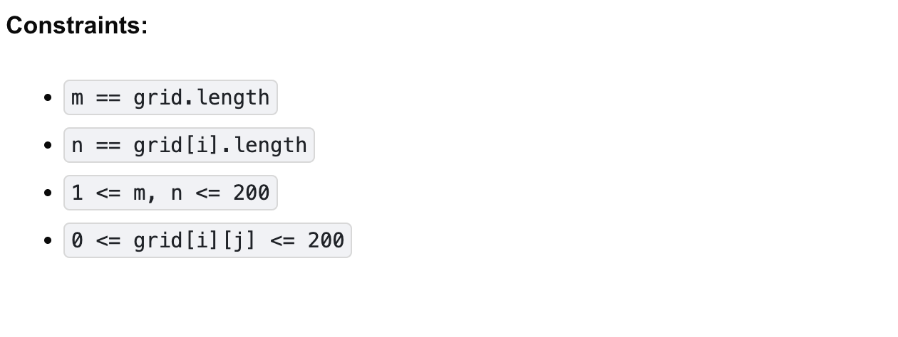

# 64-Minimum Path Sum-M

## 题目描述




题意：
- 给定一个m * n的格子，格子元素是数值
- 从最左上走到最右下，只能往右或往下，求最小的路径数值之和

解法：
- dp

## 1. Dynamic Programming (Space Optimized)
```python
class Solution:
    def minPathSum(self, grid: List[List[int]]) -> int:
        ROWS, COLS = len(grid), len(grid[0])
        dp = [float("inf")] * (COLS + 1)
        dp[COLS - 1] = 0 # 注意这里是初始化最右下的格子，而非dp[COLS]. 在填(m-2, n-1)时会用到dp[COLS+1]，若初始化为0，会影响结果

        for r in range(ROWS - 1, -1, -1):
            for c in range(COLS - 1, -1, -1):
                dp[c] = grid[r][c] + min(dp[c], dp[c + 1])

        return dp[0]
```

- TC: O(m * n)
- SC: O(n)

分析：
- 看似dp只有一维，但是够用
  - 当遍历最后一行时体现不出来，因为无法往下走了，只依赖右边列
  - 当遍历到(m-2, n-2)时，彼时dp[c]就是往下走的值，dp[c + 1]就是往右走的值
- dp初始化大小为COLS + 1，是因为for循环里有用到dp[c + 1]