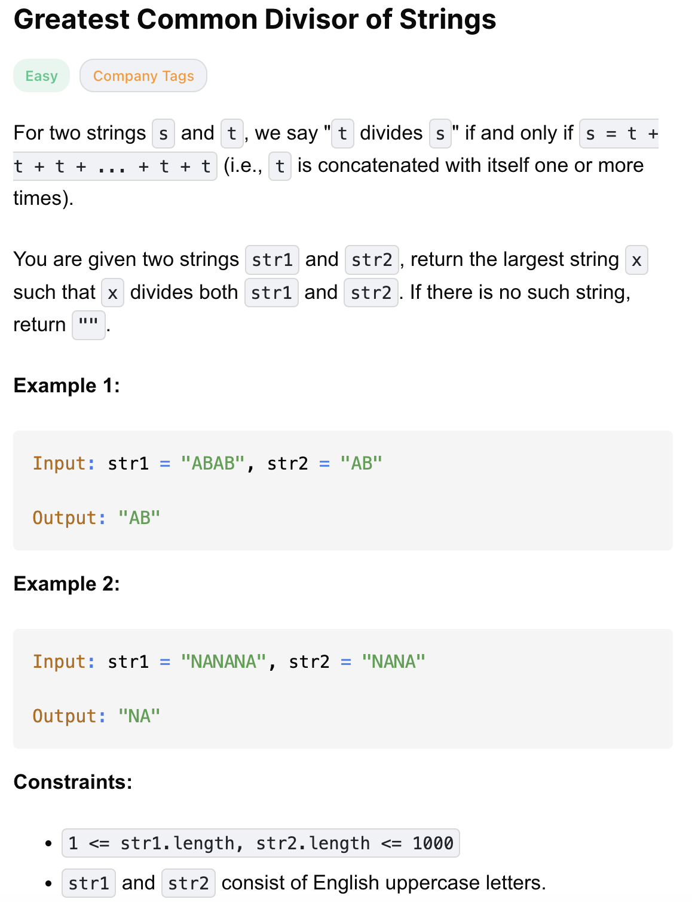

# 1071-Greatest Common Divisor of Strings-E

## 题目描述


题意：
- 给定两个字符串 str1 和 str2，返回俩字符串的最大公约数 X，要求满足：
  - X 能够被 str1 和 str2 **同时整除**: str1能整除X 且 str2能整除X，还需让 X 的长度最长
  - 定义：如果字符串 S 可以由字符串 T 重复 1 次或多次得到，那么我们称 T 能够除 S 整除。
    - str1 可以写成 X 重复若干次的形式（X* k1 = str1）
    - str2 可以写成 X 重复若干次的形式（X* k2 = str2）
  - 没有则返回空字符串
- 还有一个容易混淆的概念就是 最小公倍数（LCM, Least Common Multiple）

解法：
- Math + String

## 1. Greatest Common Divisor (Space Optimized)
```python
from math import gcd # neetcode里需要，leetcode里不需要

class Solution:
    def gcdOfStrings(self, str1: str, str2: str) -> str:
        g = gcd(len(str1), len(str2))

        if all(str1[i] == str1[i % g] for i in range(len(str1))) and \
           all(str2[i] == str1[i % g] for i in range(len(str2))): ## 注意这里等式右边仍是 str1
            return str1[:g]
        return ""
```
- TC: O(n + m)
  - 计算gcd的时间复杂度为O(log(min(n, m)))，其中n和m分别是str1和str2的长度
  - 检查字符串是否可以由公共前缀重复构成的时间复杂度为O(n + m)
- SC: O(g) 
  - g = gcd(len(str1), len(str2)), for the output string

分析：
- 注意这里等式右边仍是 str1
  - 若仍是 str2 则会在str1 和 str2等长，但无最大公因数的情况下出错