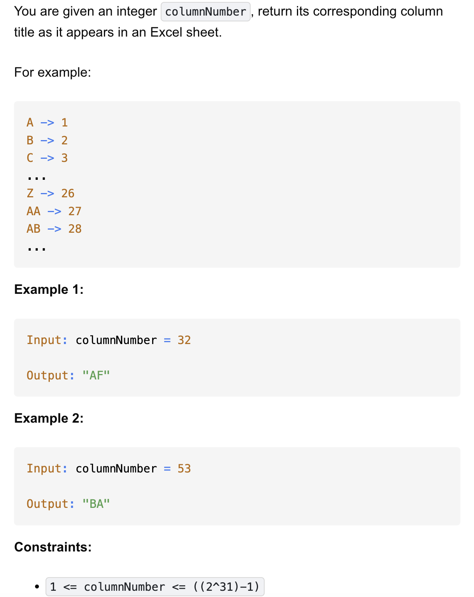

# 168-Excel Sheet Column Title-E

## 题目描述


题意：
- 给一个整数，范围为1到2^31-1，返回其excel里的字符串形式
- excel里的字符串形式：
  - A -> 1 , ..., Z -> 26
  - AA -> 27 , AB -> 28

解法：
- Iteration


## 1. Iteration
```python
class Solution:
    def convertToTitle(self, columnNumber: int) -> str:
        res = []
        while columnNumber > 0:
            columnNumber -= 1
            offset = columnNumber % 26
            res += chr(ord('A') + offset)
            columnNumber //= 26

        return ''.join(reversed(res))
```
- TC: O(logn)
  - 看while循环次数：
    - 第 1 次：n
    - 第 2 次：n / 26
    - 第 3 次：n / 26²
    - ....
    - 所以循环次数 ≈ log₍26₎(n)
- SC: O(1)

分析：
- 本质就是以26为一个单位做除余，注意低位的先加进来但是实际编码是在右边的，所以最后需要reversed
- Q：对于list的 += 操作？
- A：相当于.extend(x), 将x里的元素全加入list，要求x是可迭代对象，比如list、tuple、str等