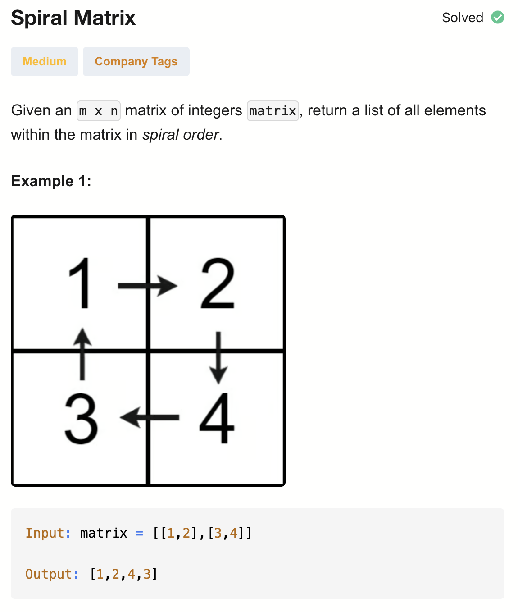
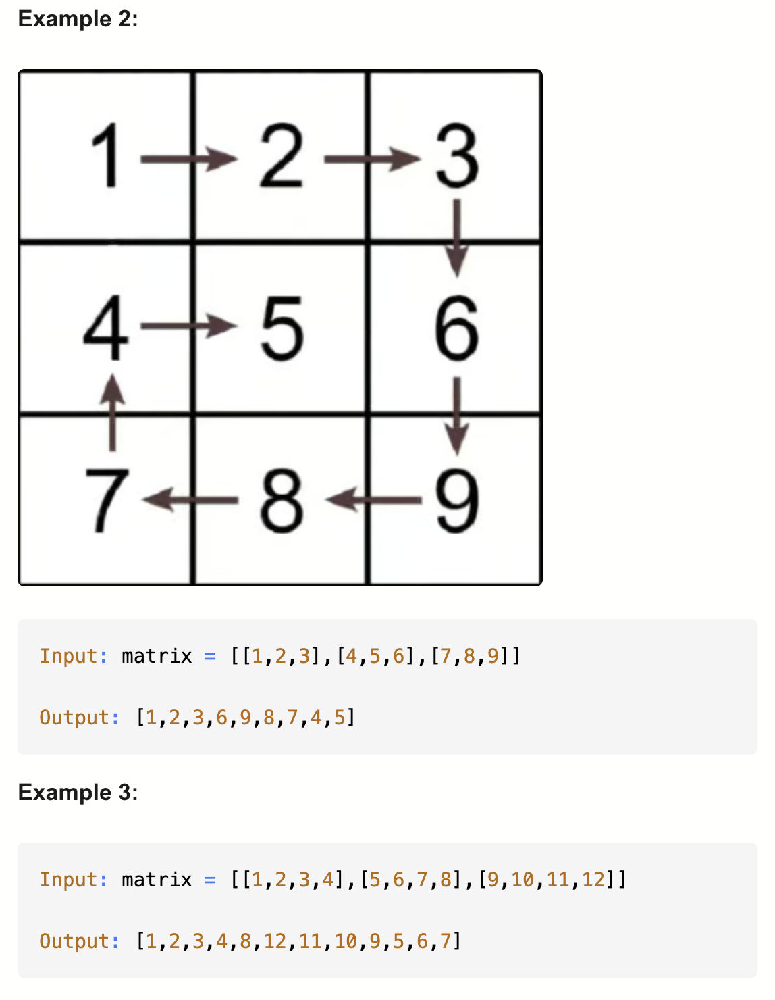
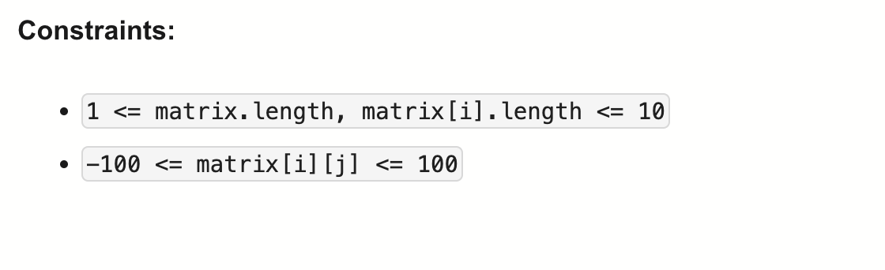

# 54-Spiral Matrix-M

## 题目描述




题意：
- 给定一个m * n的矩阵，从最左上开始按照螺旋顺序遍历，返回遍历的值（一维数组）

解法：
- Recursion
- Iteration


## 1. Recursion
```python
class Solution:
    def spiralOrder(self, matrix: List[List[int]]) -> List[int]:
        m, n = len(matrix), len(matrix[0])
        res = []

        # append all the elements in the given direction
        def dfs(row, col, r, c, dr, dc):
            if row == 0 or col == 0:
                return

            for i in range(col):
                r += dr
                c += dc
                res.append(matrix[r][c])

            # sub-problem
            dfs(col, row - 1, r, c, dc, -dr)

        # start by going to the right
        dfs(m, n, 0, -1, 0, 1)
        return res
```

- TC: O(m * n)
- SC: 
  - O(min(m, n)) for recursion stack
  - O(m * n) for output list
- m = len(rows), n = len(cols)

- 这里递归的时间复杂度不是指数而是线性的，因为和动态规划 / 回溯不同，这里没有重复计算。
不会出现“同一格被访问两次”的情况。


分析：
先看递归调用入口：
整个矩阵大小是 m × n
从位置 (0, -1) 开始（在左边界外一格）
初始方向 (dr, dc) = (0, 1) → 向右移动

dfs(col, row-1, r, c, dc, -dr)
子问题，这行代码相当于做了三件事
1.右转 90°：方向 (dr, dc) 变为 (dc, -dr)
2.进入内层矩阵：当我们走完一整条边后，下一层矩阵的大小变了。行数：原来的 col，列数：原来的 row - 1
为什么？
因为原来我们是沿着“列方向”走的 col 步；
走完后进入的子矩阵，其行列交换了角色（旋转视角）；
并且由于已经走过一条边，所以列方向少了一层。
3.“新的起点”
新的起点就是当前最后到达的 (r, c)。
我们从这里“右转”并进入下一个方向继续走。

## 2. Iteration
```python
class Solution:
    def spiralOrder(self, matrix: List[List[int]]) -> List[int]:
        res = []
        directions = [(0, 1), (1, 0), (0, -1), (-1, 0)] # 这四个方向有有顺序：右 下 左 上
        steps = [len(matrix[0]), len(matrix) - 1] # 当前轮需要走的步数：横向、纵向

        r, c, d = 0, -1, 0 # c从-1开始，避免错过(0,0)点；d表示direction
        while steps[d & 1]: # 写成 %2 也是一样的
            for i in range(steps[d & 1]):
                r += directions[d][0]
                c += directions[d][1]
                res.append(matrix[r][c])
            steps[d & 1] -= 1 # 走完一组横向/纵向，steps会减少1
            d += 1
            d %= 4
        return res
```

- TC: O(m * n)
- SC: O(m * n) for output list
- m = len(rows), n = len(cols)

分析：
- steps 表示当前轮需要走的步数：
  - steps[0] 表示横向还剩多少步；
  - steps[1] 表示纵向还剩多少步。
  - 只要当前方向还能走，就继续循环。
  - 走完一组横向/纵向，steps会减少1
  - 初始化：
    - 第一次向右走 len(matrix[0])（列数）步；
    然后向下走 len(matrix) - 1（行数 - 1）步；

- &操作：二进制位1 & 1 才等于1，其他都是0
  - x & 1 等价于 x % 2：
    - 因为x & 1 只看最低位，最低位是0 → 偶数 → 结果 0；最低位是 1 → 奇数 → 结果 1
  - 当方向是 水平移动（右/左） → d = 0 or 2 → d & 1 = 0
  - 当方向是 垂直移动（下/上） → d = 1 or 3 → d & 1 = 1

