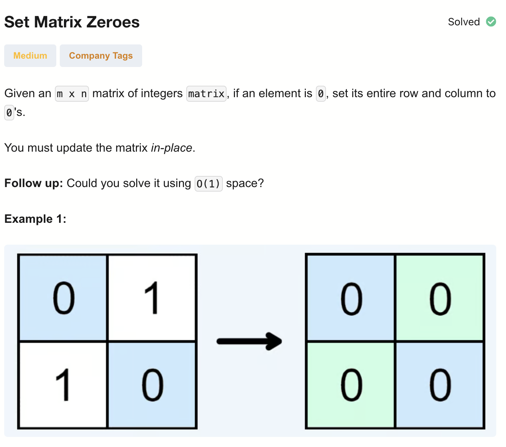
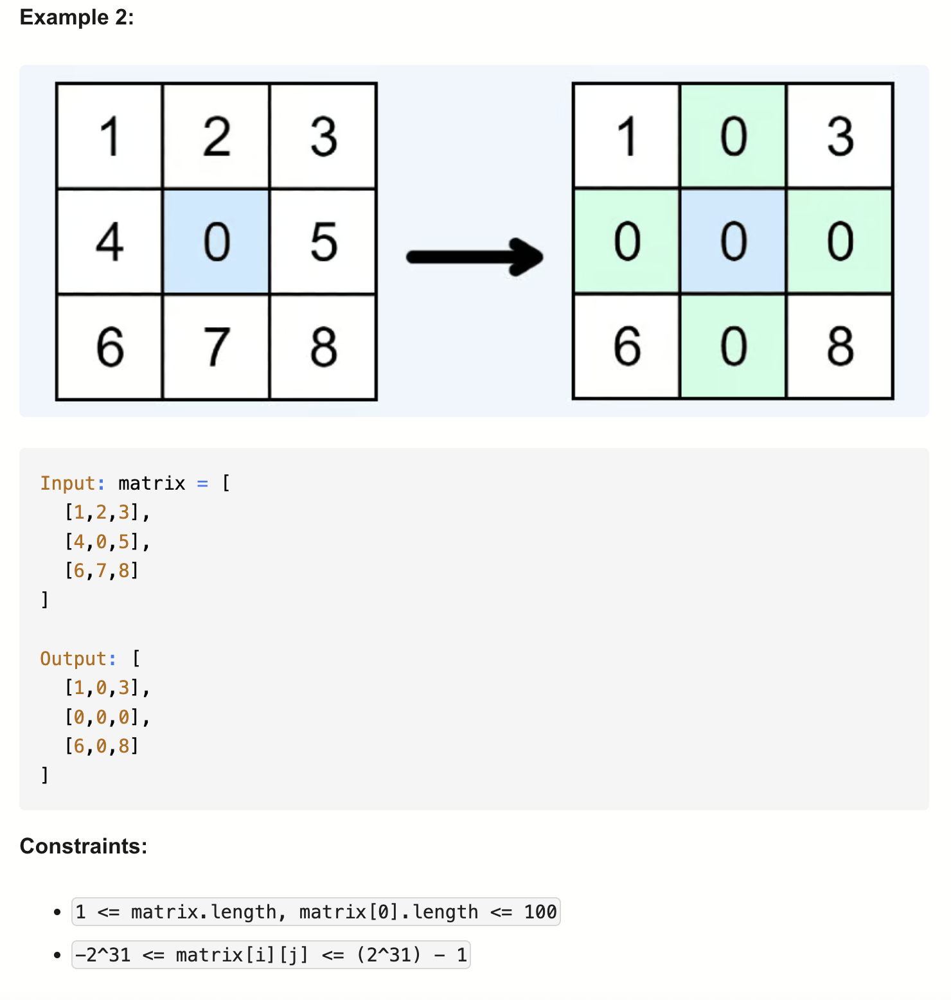

# 73-Set Matrix Zeroes-M

## 题目描述




题意：
- 给定一个m x n的矩阵matrix
- 如果一个元素为0，则将其所在行和列的所有元素都设为0
- 要求：使用**原地**算法

解法：
- Brute Force
- Iteration

## 1. Brute Force
```python
class Solution:
    def setZeroes(self, matrix: List[List[int]]) -> None:
        ROWS, COLS = len(matrix), len(matrix[0])
        mark = [[matrix[r][c] for c in range(COLS)] for r in range(ROWS)]

        for r in range(ROWS):
            for c in range(COLS):
                if matrix[r][c] == 0:
                    for col in range(COLS):
                        mark[r][col] = 0
                    for row in range(ROWS):
                        mark[row][c] = 0

        for r in range(ROWS):
            for c in range(COLS):
                matrix[r][c] = mark[r][c]
```
- TC: O(m * n * (m + n))
- SC: O(m * n)
- m = number of rows, n = number of columns

分析：
- Q: 为什么需要一个辅助的二维数组？
- A: 因为只有原有的0才会影响其所在行/列。在原地修改会影响其他行列

## 2. Iteration
```python
class Solution:
    def setZeroes(self, matrix: List[List[int]]) -> None:
        ROWS, COLS = len(matrix), len(matrix[0])
        rows, cols = [False] * ROWS, [False] * COLS

        for r in range(ROWS):
            for c in range(COLS):
                if matrix[r][c] == 0:
                    rows[r] = True
                    cols[c] = True

        for r in range(ROWS):
            for c in range(COLS):
                if rows[r] or cols[c]:
                    matrix[r][c] = 0
```

- TC: O(m * n)
- SC: O(m + n)
- m = number of rows, n = number of columns

用行和列的分别的一维数组辅助

## 3. Iteration (Space Optimized)
```python
class Solution:
    def setZeroes(self, matrix: List[List[int]]) -> None:
        ROWLS, COLS = len(matrix), len(matrix[0])
        rowZero = False # 将(0,0)给第0列使用，单独记录第0行是否有0

        # 将第0行和第0列作为标识位，记录该行/列是否有0
        for r in range(ROWLS):
            for c in range(COLS):
                if matrix[r][c] == 0:
                    matrix[0][c] = 0
                    if r > 0: # 非第0行才更新标志位，因为第0行是否有0是用rowZero记录
                        matrix[r][0] = 0
                    else: # 第0行有0
                        rowZero = True
        
        # 从(1,1)开始处理
        for r in range(1, ROWLS):
            for c in range(1, COLS):
                if  matrix[0][c] == 0 or matrix[r][0] == 0:
                    matrix[r][c] = 0
        
        # 单独处理第0列
        if matrix[0][0] == 0:
            for r in range(1, ROWLS):
                matrix[r][0] = 0
        
        # 单独处理第0行
        if rowZero:
            for c in range(COLS):
                matrix[0][c] = 0
```


- TC: O(m * n)
- SC: O(1)
- m = number of rows, n = number of columns

用第一行和第一列作为辅助