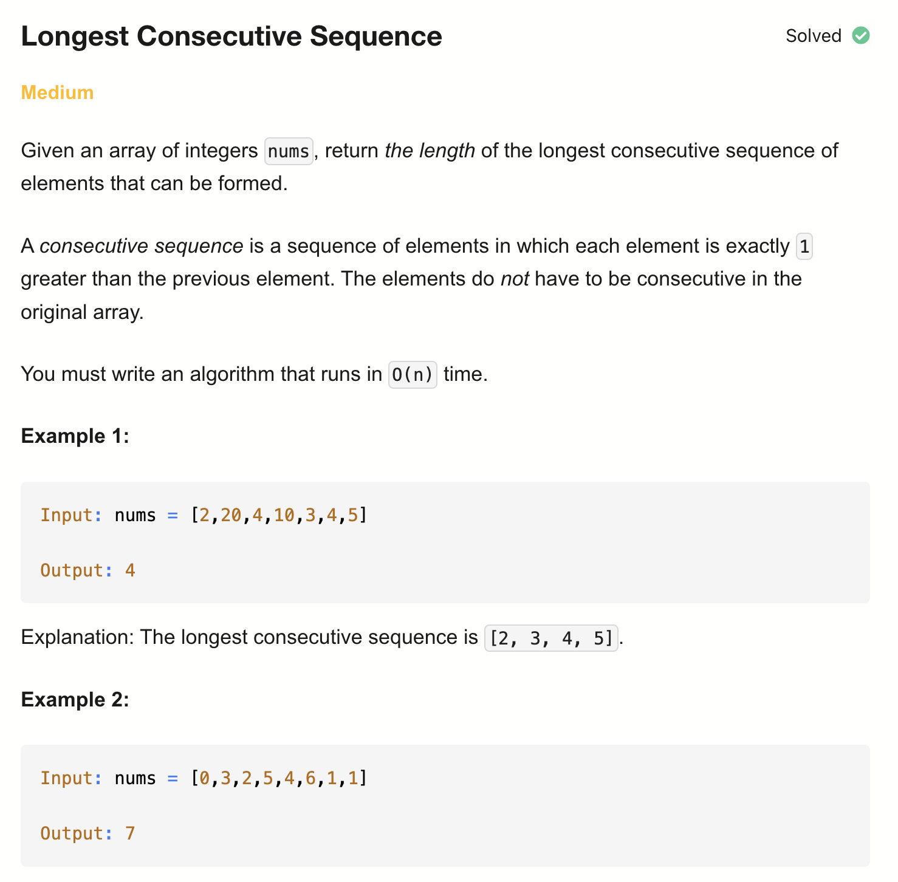
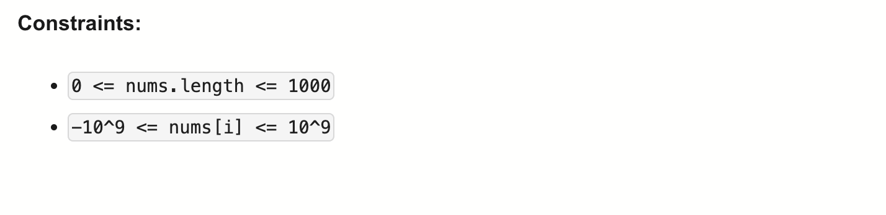

# 128-Longest Consecutive Sequence-M

## 题目描述




题意：
- 给定一个未排序的整数数组，找出最长连续序列的长度
  - 连续序列：元素值差1，但是在原数组中不要求连续出现
- 要求算法的时间复杂度为 O(n)

解法：
- Sorting
- Hash Set
- Hash Map

## 1. Sorting
```python
class Solution:
    def longestConsecutive(self, nums: List[int]) -> int:
        if not nums:
            return 0
        res = 0
        nums.sort()

        curr, streak = nums[0], 0
        i = 0
        while i < len(nums):
            if curr != nums[i]:
                curr = nums[i]
                streak = 0
            while i < len(nums) and nums[i] == curr:
                i += 1
            streak += 1
            curr += 1
            res = max(res, streak)
        return res
```

- TC: O(nlogn)
- SC: O(1)

## 2. Hash Set
```python
class Solution:
    def longestConsecutive(self, nums: List[int]) -> int:
        numSet = set(nums)
        longest = 0

        for num in numSet:
            if (num - 1) not in numSet:
                length = 1
                while (num + length) in numSet:
                    length += 1
                longest = max(length, longest)
        return longest
```

- TC: O(n)
- SC: O(n)

## 3. Hash Map
```python
class Solution:
    def longestConsecutive(self, nums: List[int]) -> int:
        mp = defaultdict(int)
        res = 0

        for num in nums:
            if not mp[num]:
                mp[num] = mp[num - 1] + mp[num + 1] + 1
                mp[num - mp[num - 1]] = mp[num]
                mp[num + mp[num + 1]] = mp[num]
                res = max(res, mp[num])
        return res
```

- TC: O(n)
- SC: O(n)

分析：
- defaultdict(int) 生成的是默认值为0的字典

- 创建一个字典 mp，用来记录 某个数字所在连续区间的长度
如果 [1, 2, 3] 是一个连续区间，mp[1]、mp[2]、mp[3]都等于3

- mp[num] = mp[num - 1] + mp[num + 1] + 1：
  - mp[num - 1] 是左边连续区间的长度
  - mp[num + 1] 是右边连续区间的长度
  - +1 是当前数字本身
   -想象num是一个新加入的值，而已经有以num-1为右边界的差值为1的递增序列，以及有以num+1为左边界的差值为1的递增序列

- mp[num - mp[num - 1]] = mp[num] 是在更新左边界的长度
  - 因为有num的加入，所以需要找到num - 1所在连续区间的最左边，更新为跟num一样的长度
  - 想象有这样的一个序列（相差为1的递增序列）：a, ..., num-1, num, num+1, ..., b
  - mp[num - 1]是a到num-1的长度，num -1 - a + 1 = mp[num - 1]。所以num - mp[num - 1] = a
  - 同理num + mp[num + 1] = b

举个完整例子
输入：[1, 2, 3, 5, 6, 4]
过程：
num	操作	mp状态（关键值）	说明
1	新建	mp[1]=1	[1]
2	合并	mp[1]=mp[2]=2	[1,2]
3	合并	mp[1]=mp[3]=3	[1,2,3]
5	新建	mp[5]=1	[5]
6	合并	mp[5]=mp[6]=2	[5,6]
4	连接两边	mp[1]=mp[6]=6	[1,2,3,4,5,6]
