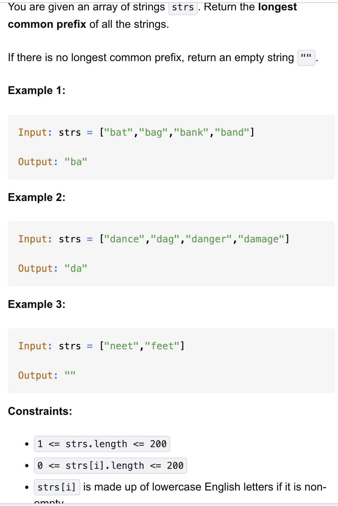

# 14-Longest Common Prefix-E

## 题目描述


题意：
- 给一个字符串列表，返回所有字符串的最长公共前缀，若不存在，则返回""


解法：
- Vertical Scanning
- Sorting
- Trie

## 1. Vertical Scanning
```python
class Solution:
    def longestCommonPrefix(self, strs: List[str]) -> str:
        for i in range(len(strs[0])):
            for s in strs:
                if i == len(s) or s[i] != strs[0][i]:
                    return s[:i]
        return strs[0]
```

- TC: O(m * n)
- SC: O(1)
- m = num of strs, n = len(min(str))

分析：
- 以第一个str为基准
  - 如果第一个str就是最短的了（并且是最长公共前缀），for循环也只会遍历完第一个str就结束了，所以会走到最后一行的return
  - 如果第一个str不是最短的，会一直判断，直到i到达下标边界或不相等时
- s[:i] = "" if i == 0