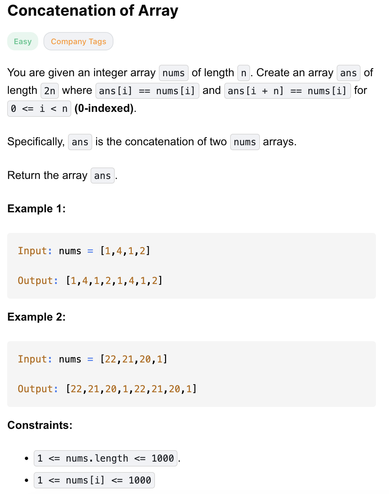

# 1929-Concatenation of Array-E
Concatenation 一系列，连结

## 题目描述


题意：
- 给一个数字数组，返回原数组duplicate一遍的结果

解法：
- Iteration

## 1. Iteration

```python
class Solution:
    def getConcatenation(self, nums: List[int]) -> List[int]:
        n = len(nums)
        ans = [0] * (2 * n)
        for i, num in enumerate(nums):
            ans[i] = ans[i + n] = num
        return ans
```

- TC: O(n)
- SC: O(n)