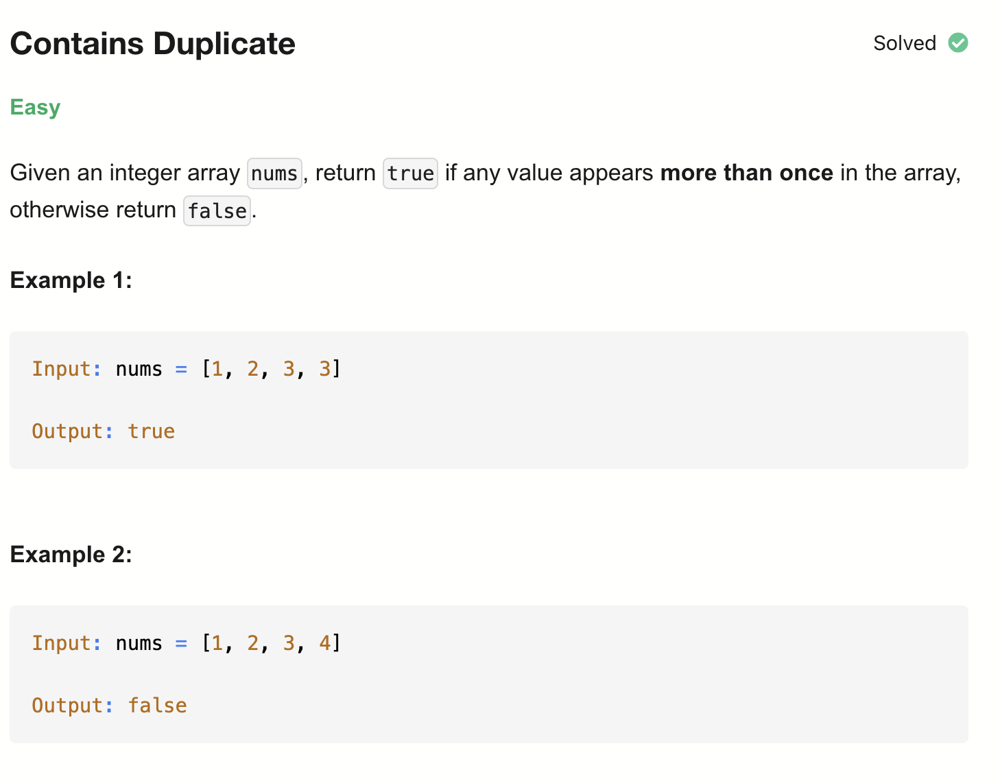

# 217-Contains Duplicate-E

## 题目描述

题意:
- 看整数数组里是否有重复元素

解法：
- Sorting
- Hash Set

## 1. Brute Force
```python
class Solution:
    def hasDuplicate(self, nums: List[int]) -> bool:
        for i in range(len(nums)):
            for j in range(i + 1, len(nums)):
                if nums[i] == nums[j]:
                    return True
        return False
```

- TC: O(n^2)
- SC: O(1)

## 2. Sorting
```python
class Solution:
    def hasDuplicate(self, nums: List[int]) -> bool:
        nums.sort()
        for i in range(1, len(nums)):
            if nums[i] == nums[i - 1]:
                return True
        return False
```

- TC: O(nlogn) 排序
- SC: O(1) 忽略排序空间

## 3. Hash Set
```python
class Solution:
    def hasDuplicate(self, nums: List[int]) -> bool:
        seen = set()
        for num in nums:
            if num in seen:
                return True
            seen.add(num)
        return False
```

- TC: O(n) 
- SC: O(n)

## 4. Hash Set Length
```python
class Solution:
    def hasDuplicate(self, nums: List[int]) -> bool:
        return len(set(nums)) < len(nums)
```
- TC: O(n) 
- SC: O(n)