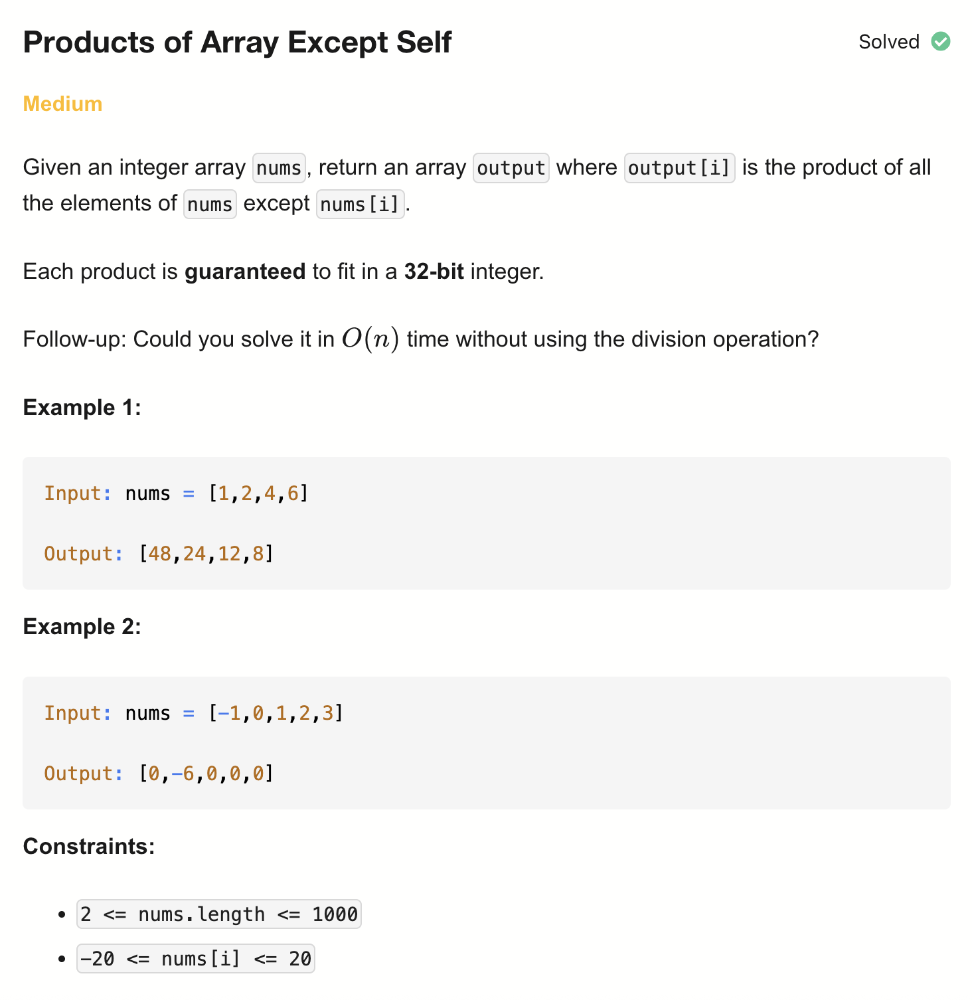

# 238-Products of Array Except Self-M

## 题目描述


题意：
- 给定一个整数数组 nums，返回一个数组 answer，其中 answer[i] 等于 nums 中除 nums[i] 之外其余各元素的乘积。
- 要求在 O(n) 时间复杂度内完成，且不使用除法。

解法：
- Prefix & Suffix Products


## 1. Division
```python
class Solution:
    def productExceptSelf(self, nums: List[int]) -> List[int]:
        prod, zero_cnt = 1, 0
        for num in nums:
            if num:
                prod *= num
            else:
                zero_cnt +=  1
        if zero_cnt > 1: return [0] * len(nums)

        res = [0] * len(nums)
        for i, c in enumerate(nums):
            if zero_cnt: res[i] = 0 if c else prod
            else: res[i] = prod // c
        return res
```

- TC: O(n)
- SC: O(1)

## 2. Prefix & Suffix Products
```python
class Solution:
    def productExceptSelf(self, nums: List[int]) -> List[int]:
        res = [1] * (len(nums))

        prefix = 1
        for i in range(len(nums)):
            res[i] = prefix
            prefix *= nums[i]
        postfix = 1
        for i in range(len(nums) - 1, -1, -1):
            res[i] *= postfix
            postfix *= nums[i]
        return res
```

- TC: O(n)
- SC: O(1) (不计算返回结果的空间)