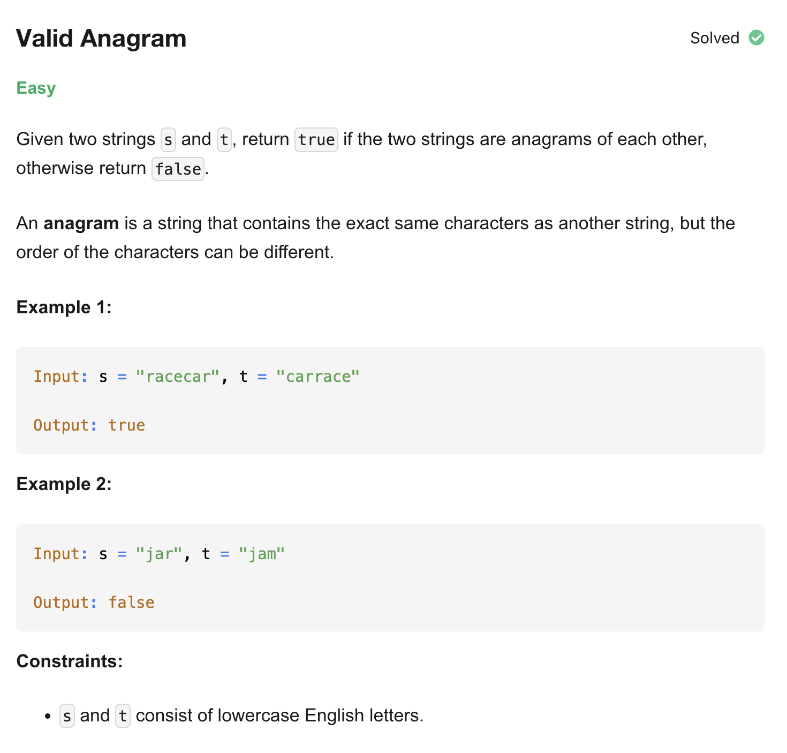

# 242-Valid Anagram-E

## 题目描述


题意：
- 给定两个字符串s 和 t，判断它俩是否为Anagram，返回bool
- Anagrams: 有相同的字符，且字符数字相等，顺序可以不一样

解法：
- Sorting


## 1. Sorting
```python
class Solution:
    def isAnagram(self, s: str, t: str) -> bool:
        if len(s) != len(t):
            return False

        return sorted(s) == sorted(t)
```

- TC: O(nlogn + mlogm)
- SC: O(1)
- n = len(s), m = len(t)

## 2. Hash Map
```python
class Solution:
    def isAnagram(self, s: str, t: str) -> bool:
        if len(s) != len(t):
            return False

        countS, countT = {}, {}

        for i in range(len(s)):
            countS[s[i]] = 1 + countS.get(s[i], 0)
            countT[t[i]] = 1 + countT.get(t[i], 0)
        return countS == countT
```

- TC: O(n + m)
- SC: O(1)
- n = len(s), m = len(t)

## 3. Hash Table (Using Array)
```python
class Solution:
    def isAnagram(self, s: str, t: str) -> bool:
        if len(s) != len(t):
            return False

        count = [0] * 26
        for i in range(len(s)):
            count[ord(s[i]) - ord('a')] += 1
            count[ord(t[i]) - ord('a')] -= 1

        for val in count:
            if val != 0:
                return False
        return True
```

- TC: O(n)
- SC: O(1)
- n = len(s), m = len(t)