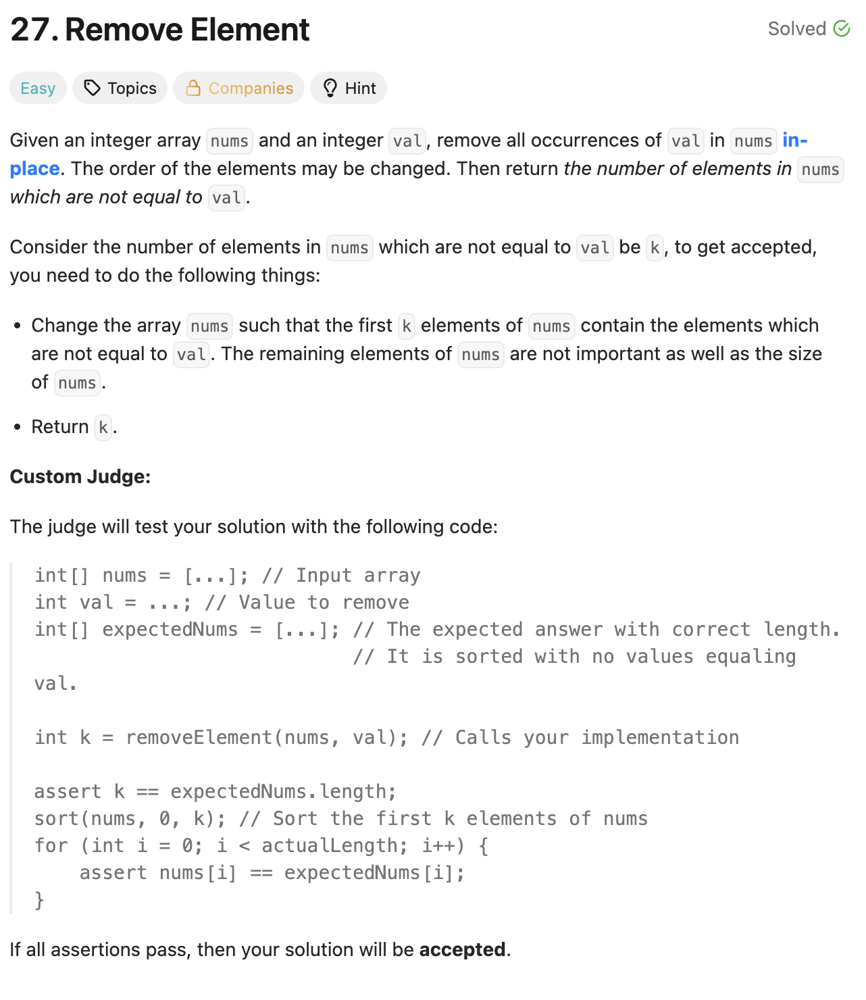
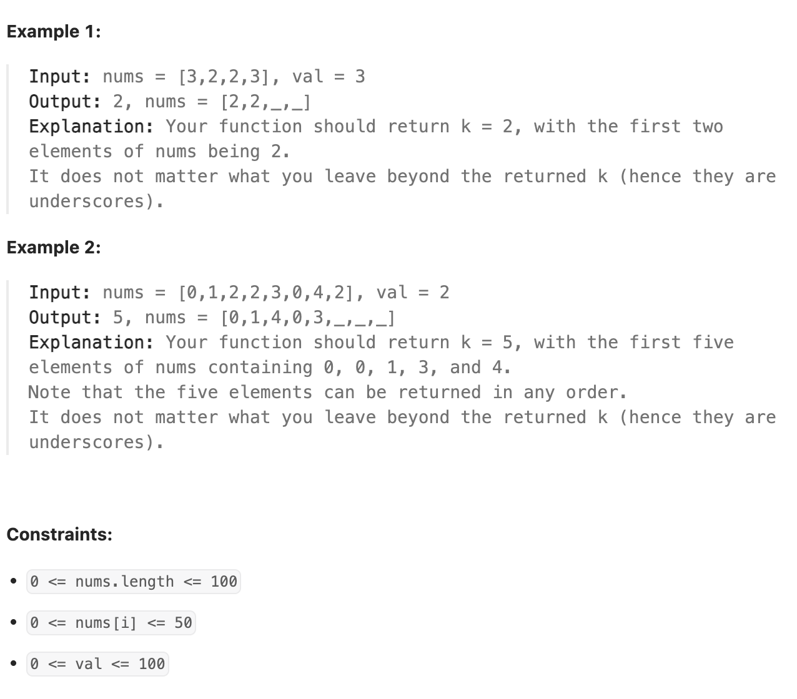

# 27-Remove Element-E

## 题目描述



题意：
- 给你一个数组 nums 和一个值 val， **原地** "移除" 数组中所有数值等于 val 的元素
- 最终返回移除后数组的新长度k，nums的前k个元素必须是非val的元素
- 本质就是把所有不等于val的元素都移到数组前面，返回新长度k。数组k个以后的元素不关心

解法：
- Two Pointers


## 1. Two Pointers
```python
class Solution:
    def removeElement(self, nums: list[int], val: int) -> int:
        i = 0
        n = len(nums)
        while i < n:
            if nums[i] == val:
                n -= 1
                nums[i] = nums[n]
            else:
                i += 1
        return n
```

- TC: O(n)
- SC: O(1)
