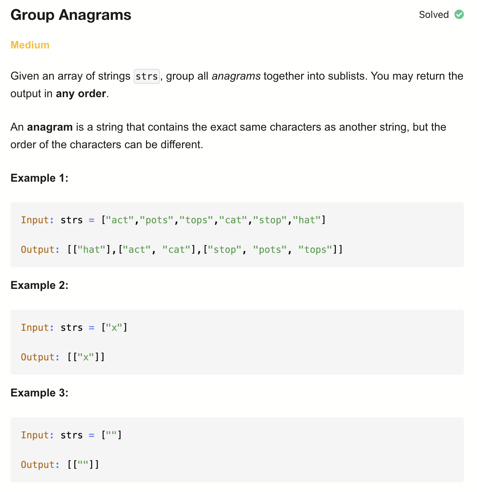
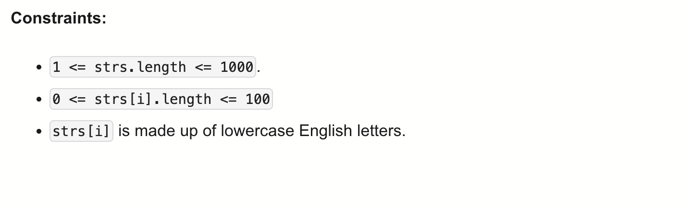

# 49-Group Anagrams-M

## 题目描述




题意：
- 给一个字符串list，将其中的 Anagrams (易位构词)分组，返回二维数组
- Anagrams: 有相同的字符，且字符数字相等，顺序可以不一样

解法：
- Sorting
- Hash Table


## 1. Sorting
```python
class Solution:
    def groupAnagrams(self, strs: List[str]) -> List[List[str]]:
        res = defaultdict(list)
        for s in strs:
            sortedS = ''.join(sorted(s))
            res[sortedS].append(s)
        return list(res.values())
```

- TC: O(m * nlogn)
- SC: O(m * n)
- m is the number of strings and n is the length of the longest string.

## 2. Hash Table
```python
class Solution:
    def groupAnagrams(self, strs: List[str]) -> List[List[str]]:
        res = defaultdict(list) # defaultdict，给每个元素 的value都设置了默认值，为空list
        for s in strs:
            count = [0] * 26
            for c in s:
                count[ord(c) - ord('a')] += 1
            res[tuple(count)].append(s)
        return list(res.values())
```

- TC: O(m * n)
- SC: O(m * n)
- m is the number of strings and n is the length of the longest string.