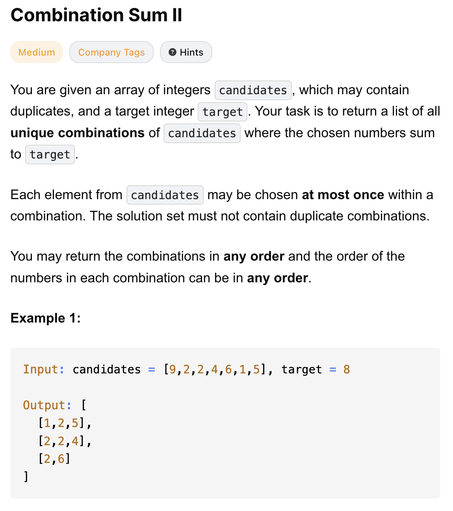
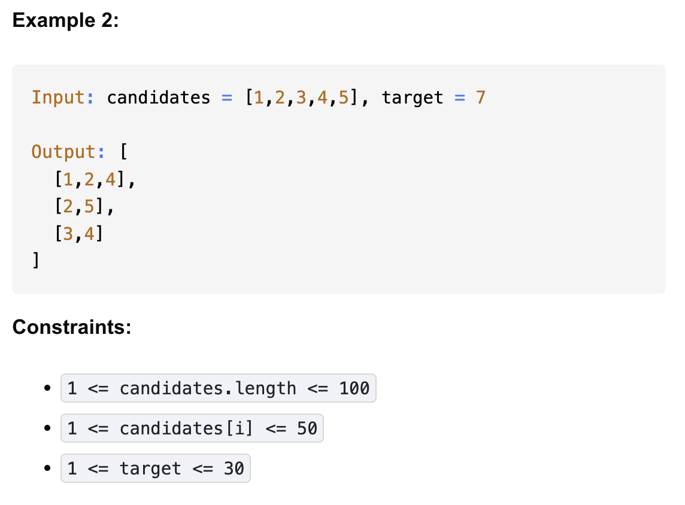

# 40-Combination Sum II-M

## 题目描述



题意：
- candidates是一个整数数组，内可能会含重复元素；target是一个整数
- 从candidates选子集，使得总和为target
  - 每个数字只能用一次
  - 最终返回值内部顺序无所谓

解法：
- backtracking


## 1. backtracking
```python
class Solution:
    def combinationSum2(self, candidates: List[int], target: int) -> List[List[int]]:
        res = []
        candidates.sort()

        def dfs(idx, path, cur):
            if cur == target:
                res.append(path.copy())
                return
            for i in range(idx, len(candidates)):
                if i > idx and candidates[i] == candidates[i - 1]:
                    continue
                if cur + candidates[i] > target:
                    break

                path.append(candidates[i])
                dfs(i + 1, path, cur + candidates[i])
                path.pop()

        dfs(0, [], 0)
        return res
```
时空复杂度：
- 在不考虑剪枝和去重的情况下，也就是worst case如下。
- 解法代码中有剪枝和去重的优化，会减少实际搜索量但理论上最坏情况仍是如下结果。
- TC: O(n * 2^n)
  - n 是 copy时间
  - 选或不选两种情况，所以2^n
- SC: O(n)
  - 递归栈 和 path路径存储 都是O(n)


分析：
- 排序的作用
  - 去重（代码中continue的逻辑）
  - 提前剪枝（代码中break的逻辑）
- dfs的参数idx表示从candidates的第idx开始选
  - 而真正选的逻辑， 即放入path的逻辑是在for循环里的：将candidates[i]放入path
- 下一个子问题的idx是i + 1，因为数字只能用一次，所以dfs(**i+1**,..,..)

- Q：为什么代码中continue的逻辑就能保证“同一层重复数字跳过，不同层重复数字不跳过”？
- A：拿第一层 (idx=0)举例
  - i=0 → 选 1 → path=[1] → **下一层 dfs(idx=1)** （这个是path里要加入的第二个元素
  - i=1 → candidates[1] == candidates[0] 且 i>idx → 跳过 （此处因为选的是path里的第一个元素，而与上一个重复，所以跳过
  - i=2 → 选 2 → path=[2] → 下一层 dfs(idx=3)
  - 所以，第一层就不会重复选择同样的 1 了