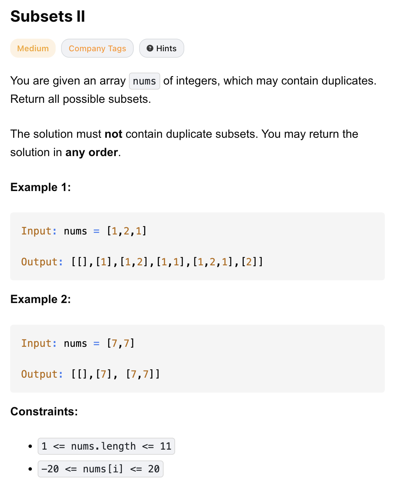

# 90-Subsets II-M

## 题目描述


题意：
- 给定一个可能包含重复元素的整数数组 nums，返回该数组所有可能的子集。
- 解集不能包含重复的子集。返回的子集可以按任意顺序排列。

解法：
- Backtracking

## 1. Backtracking
```python
class Solution:
    def subsetsWithDup(self, nums: List[int]) -> List[List[int]]:
        nums.sort()
        res = []
        def backtrack(i, subset):
            res.append(subset[::])

            for j in range(i, len(nums)):
                if j > i and nums[j] == nums[j - 1]:
                    continue
                subset.append(nums[j])
                backtrack(j + 1, subset)
                subset.pop()

        backtrack(0, [])
        return res
```

- TC: O(n * 2^n)
  - 递归 O(2^n) 次
  - 加入答案时复制 subset (执行 subset[::])需要 O(n) 的时间
- SC: O(n) 递归栈的空间

与 78-Subsets-M 的区别：要去重，排序是为了方便去重