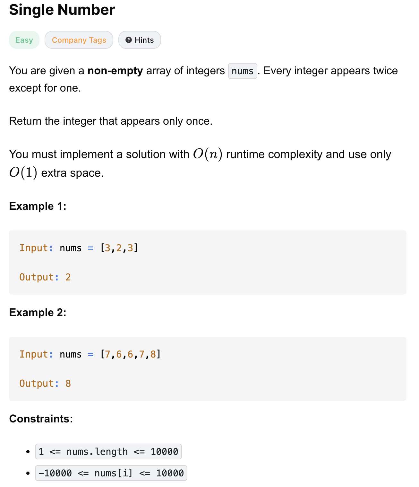

# 136-Single Number-E

## 题目描述


题意：
- 给定一个非空整数数组，里面的元素除了一个元素之外，都出现了两次
- 返回只出现一次的元素
- 要求O(n)时间，O(1)空间

解法：
- Bit Manipulation
- Sorting
- Hash Set

## 1. Bit Manipulation
```python
class Solution:
    def singleNumber(self, nums: List[int]) -> int:
        res = 0
        for num in nums:
            res ^= num
        return res
```

- TC: O(n)
- SC: O(1)

分析：
- `^` 是异或：同1异0
  - a ^ a = 0
  - a ^ 0 = a
  - a ^ b = b ^ a
