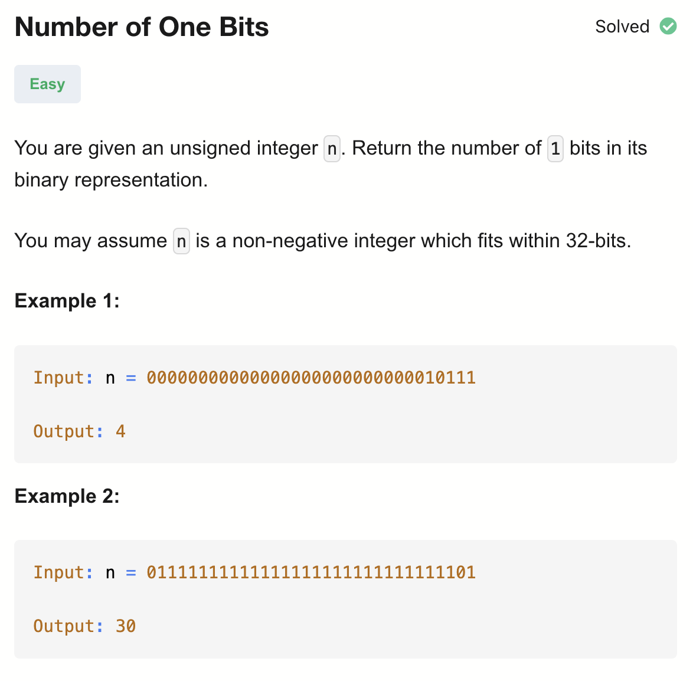

# 191-Number of One Bits-E

## 题目描述


题意：
- 给一个正整数n，求其二进制形式里1的个数


解法：
- Bit Mask

## 1. Bit Mask - I
```python
class Solution:
    def hammingWeight(self, n: int) -> int:
        res = 0
        for i in range(32):
            if (1 << i) & n:
                res += 1
        return res
```

- TC: O(1)
- SC: O(1)

思路：
从第0位开始判断它是否为1

1 << i ：
把 1 左移 i 位，得到一个 只有第 i 位是 1，其余都是 0 的掩码
例如 i=3 → 1 << 3 = 0000...1000

(1 << i) & n：
与 n 做按位与运算，只有同为1，那么那一位才会1，不然都是0
比如00010 & 10111 得到 00010
(1 << i) & n 结果为0，说明n 的第 i 位是 0；结果非0，说明n 的第 i 位是 1，进入if分支，res加1


## 2. Bit Mask - II
```python
class Solution:
    def hammingWeight(self, n: int) -> int:
        res = 0
        while n:
            res += 1 if n & 1 else 0
            n >>= 1
        return res
```

- TC: O(1)
- SC: O(1)

思路：从第0位开始判断它是否为1
每次都跟1来进行与运算，第一轮判断的是第0位是否为1
更新n，将其右移，相当于第二轮判断的是原第1位是否为1

<< 左移，右边补0，其他全部往左移
>> 右移，左边补0，其他全部往右移


## 3. Bit Mask (Optimal)
```python
class Solution:
    def hammingWeight(self, n: int) -> int:
        res = 0
        while n:
            n &= n - 1
            res += 1
        return res
```

- TC: O(1)
- SC: O(1)

n - 1 对于二进制形式而言，会把最右边的 1 翻转成 0，同时它右边的 0 全部变成 1
比如：10111 ->  10110；10100 -> 10011

与原来的 n 做按位与，就能把最右边的 1 清掉
比如：10111 &  10110 = 10100；10100 & 10011 = 10000

## 4. Built-In Function
```python
class Solution:
    def hammingWeight(self, n: int) -> int:
        return bin(n).count('1')
```

- TC: O(1)
- SC: O(1)

bin(n)：
将整数 n 转换为 二进制字符串
返回值是 字符串形式，前面带 '0b'

.count('1')：
str.count('1') 会统计字符串中 '1' 出现的次数