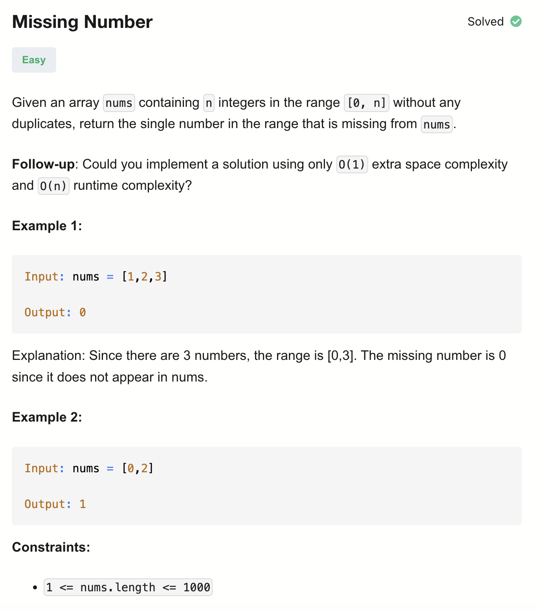

# 268-Missing Number-E

## 题目描述


题意：
- 给一个整数数组nums，n个元素，保证元素值范围为[0,n]，并且没有重复元素
- 返回缺少的那一个num


解法：
- Sorting
- Hash Set
- Bitwise XOR
- Math

## 1. Sorting
```python
class Solution:
    def missingNumber(self, nums: List[int]) -> int:
        n = len(nums)
        nums.sort()
        for i in range(n):
            if nums[i] != i:
                return i
        return n
```

- TC: O(nlogn)
- SC: O(1)

## 2. Hash Set
```python
class Solution:
    def missingNumber(self, nums: List[int]) -> int:
        num_set = set(nums)
        n = len(nums)
        for i in range(n + 1):
            if i not in num_set:
                return i
```

- TC: O(n)
- SC: O(n)

## 3. Bitwise XOR
```python
class Solution:
    def missingNumber(self, nums: List[int]) -> int:
        n = len(nums)
        xorr = n
        for i in range(n):
            xorr ^= i ^ nums[i]
        return xorr
```

- TC: O(n)
- SC: O(1)


分析：
按位异或

XOR运算操作：同0
对应位上，如果两个位不同，结果为 1
如果两个位相同，结果为 0

特性：
交换律：a ^ b = b ^ a
结合律：a ^ (b ^ c) = (a ^ b) ^ c
任何数 XOR 自己 = 0：a ^ a = 0
任何数 XOR 0 = 自己：a ^ 0 = a

- 因为数组索引是 0 ~ n-1，但是数字是 0 ~ n. 所以先把 n 包含进 XOR
- 每次把索引 i 和 数组值 nums[i] 都 XOR 进去。这样如果没有缺失数字的话，最终结果应该是0，因为每个值都算了两次，a ^ a = 0。
- 因为有一个缺失数字b，所以对应下标也有一个b，除此b之外的值为0，0 ^ b = b。所以最终得到的值就是b

## 4. Math
```python
class Solution:
    def missingNumber(self, nums: List[int]) -> int:
        res = len(nums)

        for i in range(len(nums)):
            res += i - nums[i]
        return res
```

- TC: O(n)
- SC: O(1)

跟3. Bitwise XOR的思路差不多
