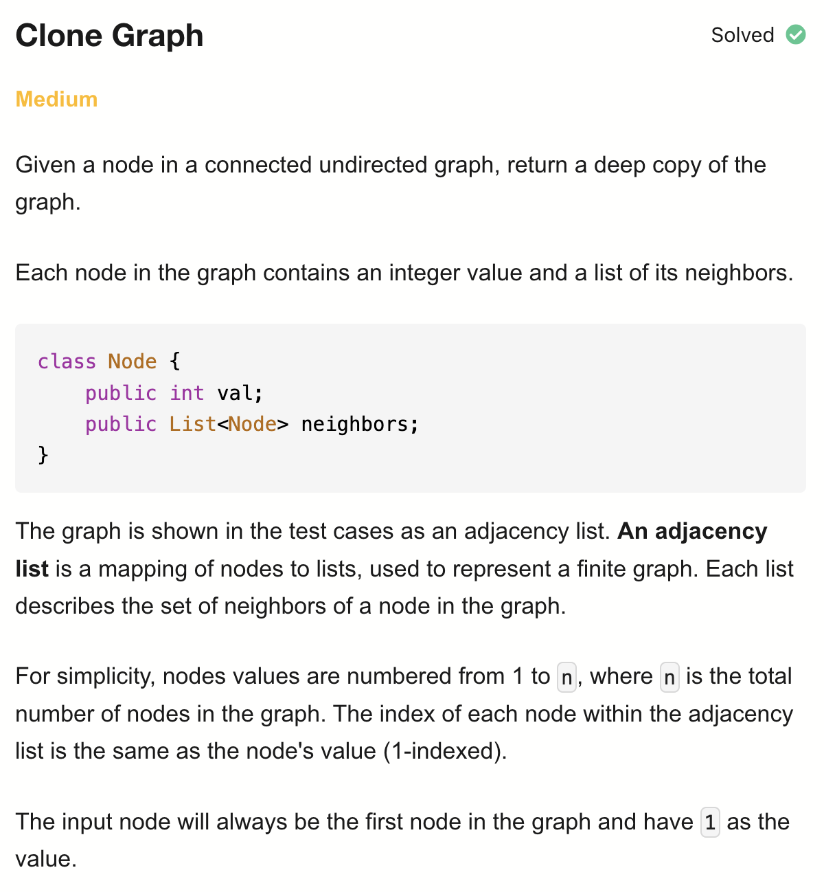
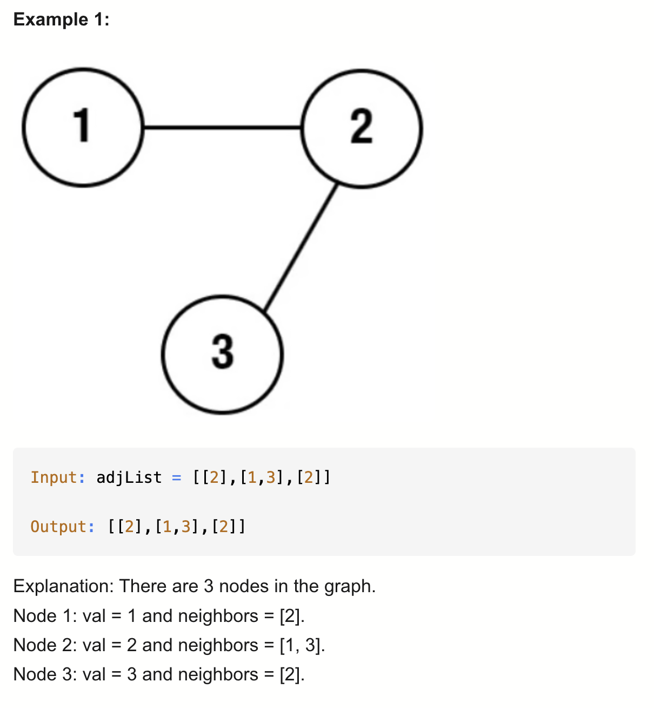
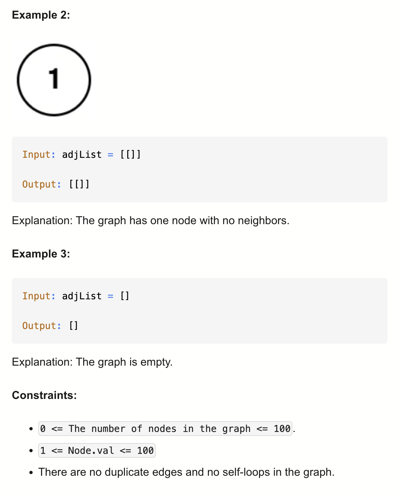

# 133-Clone Graph-M

## 题目描述




题意：
- 给一个连通无向图的一个节点，要深拷贝图
  - 深浅拷贝的区别：
    - 浅拷贝：不会复制内部对象本身，只会复制引用。修改深拷贝的内部对象**会**影响原对象。
    - 深拷贝：会递归地拷贝对象及其所有引用的对象，生成完全独立的副本。修改深拷贝的内部对象**不会**影响原对象。
    - 对于 基本类型（primitive types），比如 int、double、boolean 等，深拷贝和浅拷贝是一样的效果。

解法：
- dfs
- bfs

## 1.DFS

```python
"""
# Definition for a Node.
class Node:
    def __init__(self, val = 0, neighbors = None):
        self.val = val
        self.neighbors = neighbors if neighbors is not None else []
"""

class Solution:
    def cloneGraph(self, node: Optional['Node']) -> Optional['Node']:
        oldToNew = {} # key:原节点; value:新节点

        def dfs(node):
            if node in oldToNew: # 说明此节点已经拷贝过了
                return oldToNew[node]
            copy = Node(node.val) # 新建节点
            oldToNew[node] = copy # 建立映射: 旧->新
            for nei in node.neighbors: 
                copy.neighbors.append(dfs(nei)) #在dfs过程中会新建节点以及更新邻居关系
            return copy
        
        return dfs(node) if node else None
```

- TC: O(V + E)
- SC: O(V)
- V顶点数；E边数

## 2.BFS
```python
"""
# Definition for a Node.
class Node:
    def __init__(self, val = 0, neighbors = None):
        self.val = val
        self.neighbors = neighbors if neighbors is not None else []
"""

class Solution:
    def cloneGraph(self, node: Optional['Node']) -> Optional['Node']:
        if not node:
            return None

        oldToNew = {}
        oldToNew[node] = Node(node.val)
        q = deque([node])

        while q:
            cur = q.popleft()
            for nei in cur.neighbors:
                if nei not in oldToNew:
                    oldToNew[nei] = Node(nei.val)
                    q.append(nei)
                oldToNew[cur].neighbors.append(oldToNew[nei])
        
        return oldToNew[node]
```

- TC: O(V + E)
- SC: O(V)
- V顶点数；E边数