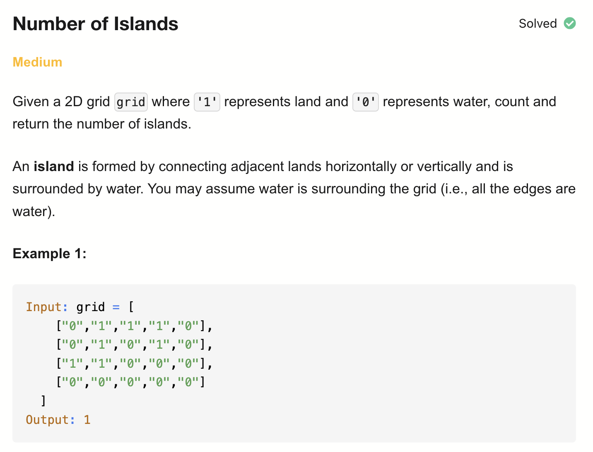
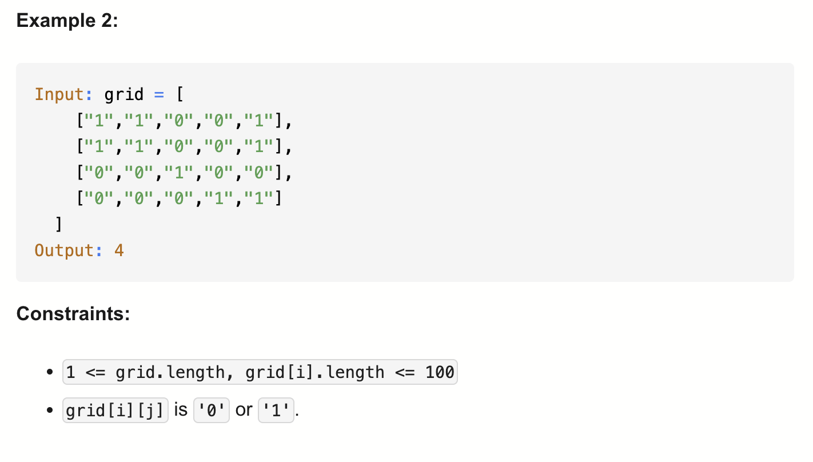
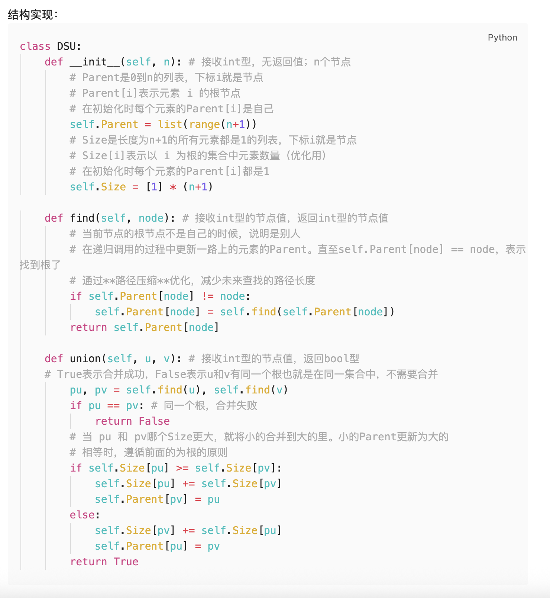
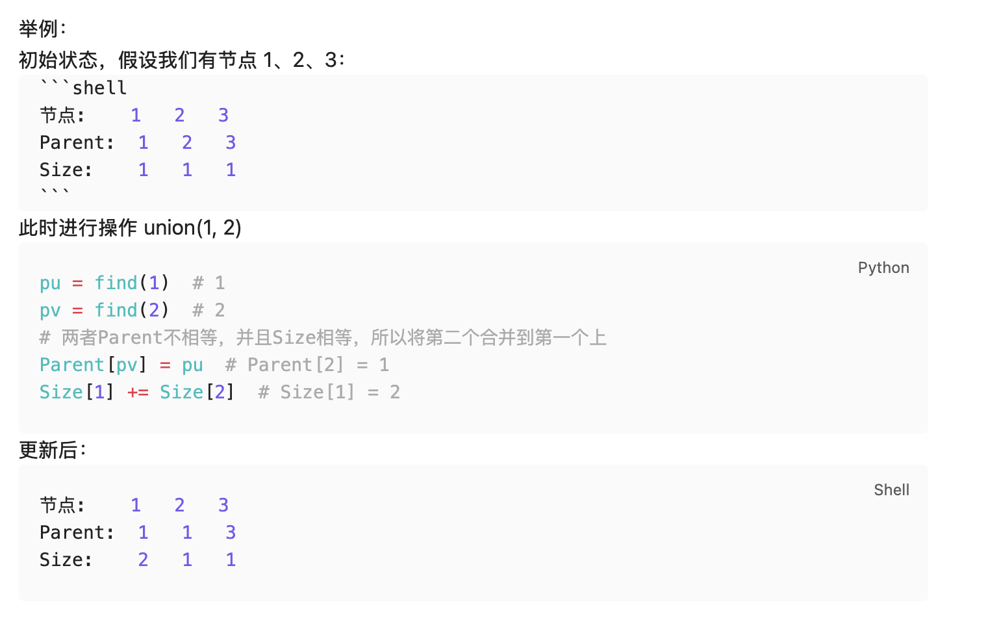

# 200-Number of Islands-M

## 题目描述



题意：
- 给定一个由 '1'（陆地）和 '0'（水）组成的二维网格，计算岛屿的数量。
- 岛屿总是被水包围，并且每座岛屿只能由水平方向或垂直方向上相邻的陆地连接形成。
- 网格的四个边均被水包围。
- 总结：就是找出二维矩阵中有多少个“连通分量”

解法：
- Depth-First Search
- Breadth-First Search
- Union Find (Disjoint Set Union)

## 1. Depth First Search
```python
class Solution:
    def numIslands(self, grid: List[List[str]]) -> int:
        directions = [[1, 0], [-1, 0], [0, 1], [0, -1]]
        ROWS, COLS = len(grid), len(grid[0])
        islands = 0

        def dfs(r, c):
            if (r < 0 or c < 0 or r >= ROWS or
                c >= COLS or grid[r][c] == "0"
            ):
                return

            grid[r][c] = "0"
            for dr, dc in directions:
                dfs(r + dr, c + dc)

        for r in range(ROWS):
            for c in range(COLS):
                if grid[r][c] == "1":
                    dfs(r, c)
                    islands += 1

        return islands
```

- TC: O(m * n)
- SC: O(m * n)
- m = number of rows, n = number of columns

这里directions的四个值其实等价于下面调用4次dfs（分别是上下左右4个方向）


## 2. Breadth First Search
```python
class Solution:
    def numIslands(self, grid: List[List[str]]) -> int:
        directions = [[1, 0], [-1, 0], [0, 1], [0, -1]]
        ROWS, COLS = len(grid), len(grid[0])
        islands = 0

        def bfs(r, c):
            q = deque()
            grid[r][c] = "0"
            q.append((r, c))

            while q:
                row, col = q.popleft()
                for dr, dc in directions:
                    nr, nc = dr + row, dc + col
                    if (nr < 0 or nc < 0 or nr >= ROWS or
                        nc >= COLS or grid[nr][nc] == "0"
                    ):
                        continue
                    q.append((nr, nc))
                    grid[nr][nc] = "0"

        for r in range(ROWS):
            for c in range(COLS):
                if grid[r][c] == "1":
                    bfs(r, c)
                    islands += 1

        return islands
```

- TC: O(m * n)
- SC: O(m * n)
- m = number of rows, n = number of columns

## 3. Disjoint Set Union
```python
class DSU:
    def __init__(self, n):
        self.Parent = list(range(n + 1)) # 初始化：下标 == 值
        self.Size = [1] * (n + 1)

    def find(self, node):
        if self.Parent[node] != node:
            self.Parent[node] = self.find(self.Parent[node])
        return self.Parent[node]

    def union(self, u, v):
        pu = self.find(u)
        pv = self.find(v)
        if pu == pv:
            return False
        if self.Size[pu] >= self.Size[pv]:
            self.Size[pu] += self.Size[pv]
            self.Parent[pv] = pu
        else:
            self.Size[pv] += self.Size[pu]
            self.Parent[pu] = pv
        return True

class Solution:
    def numIslands(self, grid: List[List[str]]) -> int:
        ROWS, COLS = len(grid), len(grid[0])
        dsu = DSU(ROWS * COLS)

        def index(r, c):
            return r * COLS + c

        directions = [(1, 0), (-1, 0), (0, 1), (0, -1)]
        islands = 0

        for r in range(ROWS):
            for c in range(COLS):
                if grid[r][c] == '1':
                    islands += 1
                    for dr, dc in directions:
                        nr, nc = r + dr, c + dc
                        if (nr < 0 or nc < 0 or nr >= ROWS or
                            nc >= COLS or grid[nr][nc] == "0"
                        ):
                            continue

                        if dsu.union(index(r, c), index(nr, nc)):
                            islands -= 1

        return islands
```

- TC: O(m * n)
- SC: O(m * n)
- m = number of rows, n = number of columns

分析：
- `Disjoint Set Union (DSU)`（又叫 **Union-Find 并查集**） 
是算法中一种非常经典的数据结构，用来处理 **“集合合并与查找”** 的问题

- DSU 的核心目标是管理 **若干个不相交的集合**，支持两个操作：
1. **find(x)**：查找元素 `x` 所在集合的代表（根节点）。
2. **union(x, y)**：把元素 `x` 和 `y` 所在的集合合并成一个集合。

常见用途：
- 判断两个元素是否在同一个集合。
- 处理连通性问题，例如岛屿、网络、朋友圈、最小生成树等。






- if dsu.union(index(r,c), index(nr,nc))的判断是针对当前格子，往四个方向寻找判断的。
- 如果能合并，说明根节点都是目前连接上的1中最左上的那个
- 不能合并的情况就是在遍历过程中之前已经合并过了

对于两个隔离的岛屿，是不会判断他俩能否合并的，因为只往4个方向延展


find的写法：
1. 递归版
```python
    def find(self, node):
        if self.Parent[node] != node:
            self.Parent[node] = self.find(self.Parent[node])
        return self.Parent[node]
```
2. while版
```python
    def find(self, node):
        cur = node
        while cur != self.parent[cur]:
            self.parent[cur] = self.parent[self.parent[cur]]
            cur = self.parent[cur]
        return cur
```

注意：
union方法里要写find方法去找u/v的根节点，不能直接pu = self.parent[u]，find还在找的过程中压缩了路径
```python
pu = self.find(u)
pv = self.find(v)
```