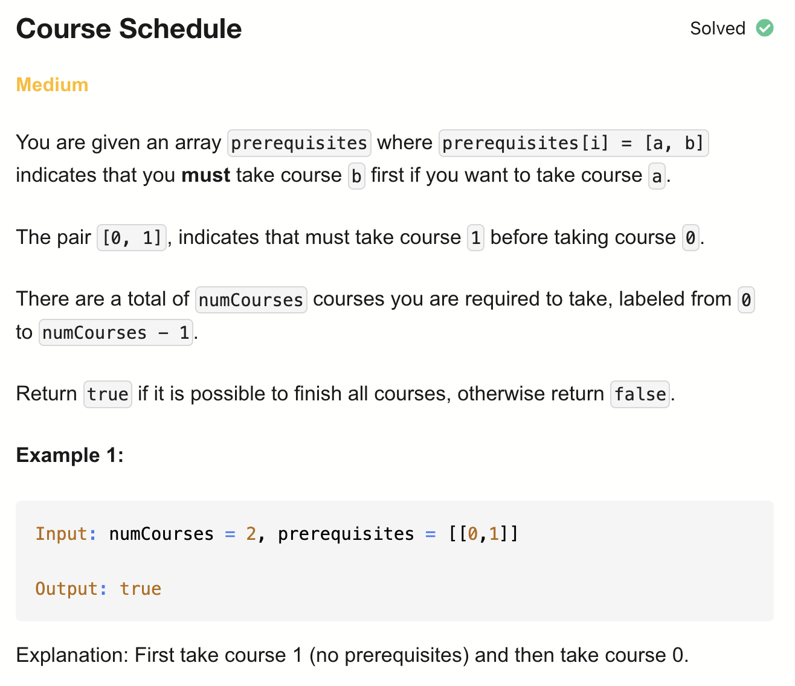
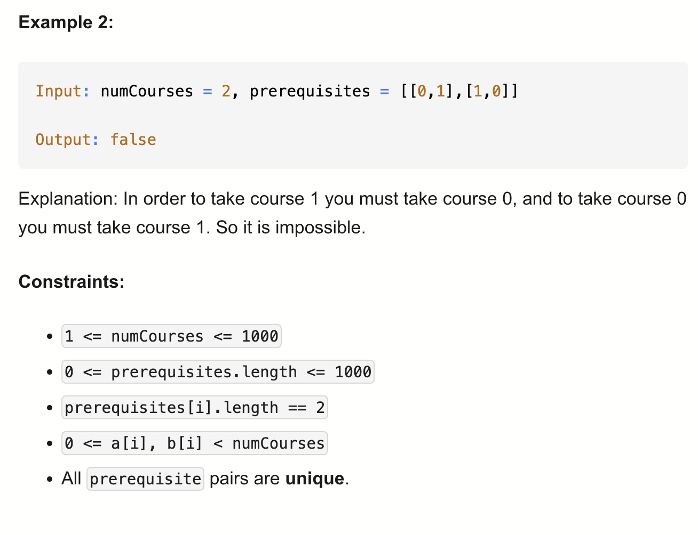

# 207-Course Schedule-M


## 题目描述




题意：
- prerequisites[i]的长度为2,[a, b]表示b是a的先修课
  - 但并不代表一门课就最多只有一门先修课，比如prerequisites = [[1, 0], [2, 0], [2, 1]]
- 本质要判断整个上课过程是否有环，在无环的情况下，return上课总数 == numCourses

解法：
- dfs
- Topological Sort

## 1.Cycle Detection (DFS)

```python
class Solution:
    def canFinish(self, numCourses: int, prerequisites: List[List[int]]) -> bool:
        preMap = {i:[] for i in range(numCourses)}
        # 能这样解包的前提是prerequisites的元素都是一个长度为2的列表
        # 解包过程相当于for pair in prerequisites: crs=pair[0], pre=pair[1]
        # 但这并不是说一门课最多只有一个先修课，比如prerequisites = [[1, 0], [2, 0], [2, 1]]
        for crs, pre in prerequisites:
            preMap[crs].append(pre)

        visit = set()
        def dfs(crs):
            if crs in visit: # 判断是否有环
                return False
            if preMap[crs] == []: # crs这门课没有先修课的条件，可以是本来就没有，也可以是dfs过程中修过了
                return True
            
            visit.add(crs)
            for pre in preMap[crs]:
                if not dfs(pre):
                    return False
            visit.remove(crs) # 返回到上层时要恢复现场
            preMap[crs] = [] # 记忆化结果，表示crs这门课修过了，避免重复dfs
            return True
        
        for c in range(numCourses):
            if not dfs(c):
                return False
        return True
```

- TC: O(V + E)
  - 每个节点和边最多访问一次
- SC: O(V + E)
  - 图存储需要O(V + E)，V门课，E条先修关系
  - preMap = {
    0: [],
    1: [0],
    2: [0],
    3: [1, 2]
  }
  - DFS 栈: O(V)
  - visit数组: O(V)

## 2.Topological Sort (Kahn's Algorithm)

```python
class Solution:
    def canFinish(self, numCourses: int, prerequisites: List[List[int]]) -> bool:
        indegree = [0] * numCourses
        adj = [[] for i in range(numCourses)]
        for course, pre in prerequisites:
            indegree[course] += 1 # 入度：课程有多少个前置课
            adj[pre].append(course) # 从pre出发能到达哪些课程

        q = deque()
        for n in range(numCourses):
            if indegree[n] == 0:
                q.append(n)

        finish = 0
        while q:
            node = q.popleft() # 取出，表示学完这门课了
            finish += 1
            for nei in adj[node]: # 遍历以它为先修课的课程
                indegree[nei] -= 1
                if indegree[nei] == 0:
                    q.append(nei)

        return finish == numCourses
```

时空复杂度同上