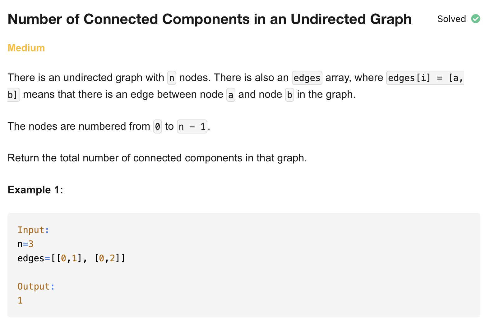
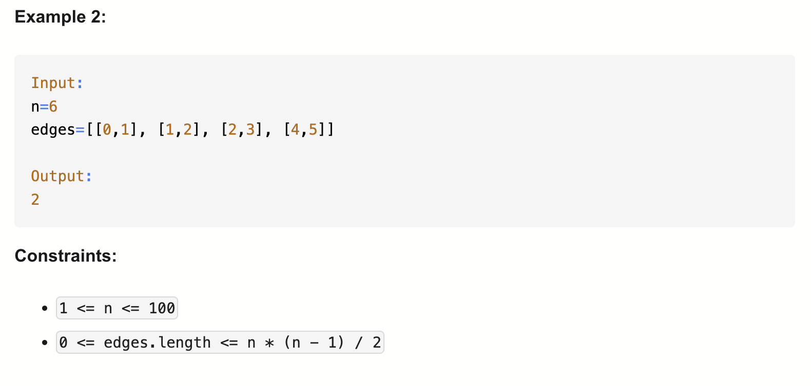

# 323-Number of Connected Components in an Undirected Graph-M

## 题目描述



题意：
- 给定n个节点（0到n-1）和一组无向边
- 求图中连通分量的数量

解法：
- Depth-First Search
- Disjoint Set Union (Rank | Size)
- Breadth-First Search

## 1. Depth First Search
```python
class Solution:
    def countComponents(self, n: int, edges: List[List[int]]) -> int:
        adj = [[] for _ in range(n)]
        visit = [False] * n
        for u, v in edges:
            adj[u].append(v)
            adj[v].append(u)

        def dfs(node):
            for nei in adj[node]:
                if not visit[nei]:
                    visit[nei] = True
                    dfs(nei)

        res = 0
        for node in range(n):
            if not visit[node]:
                visit[node] = True
                dfs(node)
                res += 1
        return res
```

- TC: O(n + e)
- SC: O(n + e)
- n = number of nodes, e = number of edges

## 2. Breadth First Search
```python
class Solution:
    def countComponents(self, n: int, edges: List[List[int]]) -> int:
        adj = [[] for _ in range(n)]
        visit = [False] * n
        for u, v in edges:
            adj[u].append(v)
            adj[v].append(u)

        def bfs(node):
            q = deque([node])
            visit[node] = True
            while q:
                cur = q.popleft()
                for nei in adj[cur]:
                    if not visit[nei]:
                        visit[nei] = True
                        q.append(nei)

        res = 0
        for node in range(n):
            if not visit[node]:
                bfs(node)
                res += 1
        return res
```

- TC: O(n + e)
- SC: O(n + e)
- n = number of nodes, e = number of edges

## 3. Disjoint Set Union (Rank | Size)
```python
class DSU:
    def __init__(self, n):
        self.parent = list(range(n)) # 因为节点编号是 0 到 n-1，所以n就够了
        self.rank = [1] * n

    def find(self, node):
        cur = node
        while cur != self.parent[cur]:
            self.parent[cur] = self.parent[self.parent[cur]]
            cur = self.parent[cur]
        return cur

    def union(self, u, v):
        pu = self.find(u)
        pv = self.find(v)
        if pu == pv:
            return False
        if self.rank[pv] > self.rank[pu]: # 始终保持pu是更大的集合，要把pv合并到pu上
            pu, pv = pv, pu
        self.parent[pv] = pu # 重点！
        self.rank[pu] += self.rank[pv] # 重点！
        return True

class Solution:
    def countComponents(self, n: int, edges: List[List[int]]) -> int:
        dsu = DSU(n)
        res = n
        for u, v in edges:
            if dsu.union(u, v):
                res -= 1
        return res
```
- TC: O(n + e * α(n))
  - 从最下面的for循环开始看，每一条边调用一次union，union内部调用find
  - find 的复杂度：摊销复杂度是 O(α(V))，其中 α(V) 是反阿克曼函数，非常慢增长 → 可以看作常数
  - 所以这段是O(E⋅α(V))
- SC: O(n)
  - self.Parent、self.Size初始化需要O(V)
- n = number of nodes, e = number of edges. α() is used for amortized(分摊的) complexity.

与261题Graph Valid Tree相比，本题不需要检测环，只需要看连通性
所以在下面for循环里不需要判断union的返回结果

并查集 = 维护“谁和谁已经连在一起了”：
- 一开始：n 个点 ⇒ n 个连通分量
- 每成功合并(union)一次两个不同集合 ⇒ 连通分量 -1
- 最后剩下多少，就是答案

parent:
- 初始值是自己
- parent[node] = node 的意思是 node 是自己集合的老大（根节点
- 通过 parent 链条一直往上找，直到找到“自己是自己老大”的节点（根节点

rank = 这个集合里有多少个节点（size）
- 小集合挂到大集合下面，防止树变高

find:
- 找到 node 所属集合的 根节点（老大）. 并且顺手把路径压扁
- 一开始 cur = node，而且初始化时 parent[node] = node， 那 cur == self.parent[cur]，while 怎么可能进得去？
  - 第一次 find 的确进不去；但之后的 find 就能进了
  - 因为 union 的时候会把一个节点的 parent 指向另一个节点
