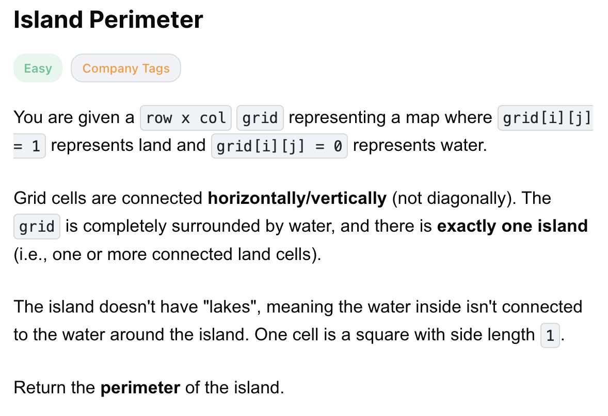
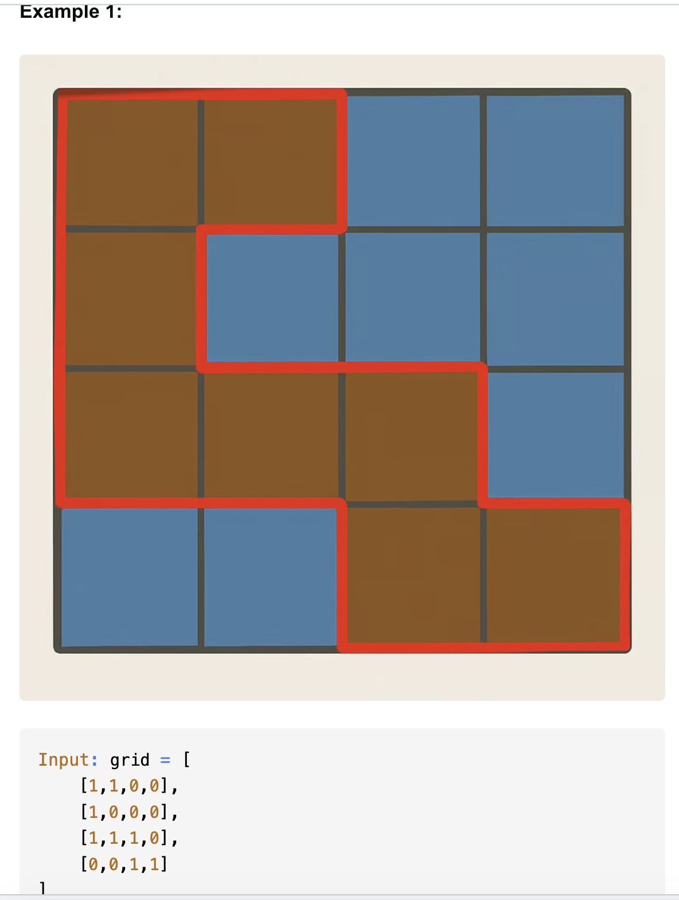
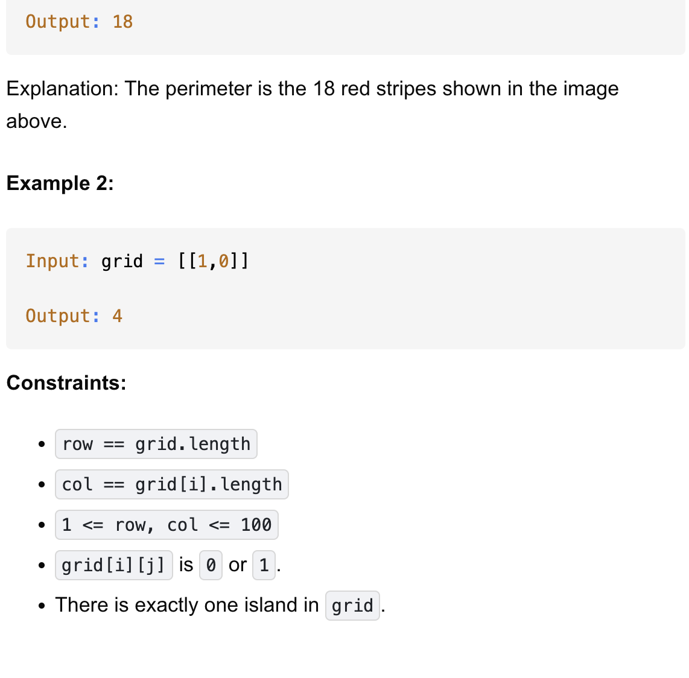

# 463-Island Perimeter-E

Perimeter 周长

## 题目描述




题意：
- 二维数组，元素1代表地，0代表水
- 求岛屿的周长之和，题目已经说明只有一个岛屿
- 题目已经简化，假定不会出现有lake的情况。
  - lake: 岛内有水，比如一个3*3的九宫格，最中间是水其他是地。这样算1个岛屿，但是周长计算变复杂了

解法：
- dfs
- bfs
- iteration

## 1. Iteration

```python
class Solution:
    def islandPerimeter(self, grid: List[List[int]]) -> int:
        m, n = len(grid), len(grid[0])
        res = 0
        for r in range(m):
            for c in range(n):
                if grid[r][c] == 1:
                    res += 4
                    if r and grid[r - 1][c] == 1:
                        res -= 2
                    if c and grid[r][c - 1] == 1:
                        res -= 2
        return res
```

- TC: O(m * n)
- SC: O(1)
- m is len of row, n is len of col

分析：
- 每一格都是正方形，边长为4
- 所以遇到岛屿，就加4。
- 而若相邻格子也是岛屿，那么需要减去相邻的边2遍
  - 为了方便且不重复计算，从坐标(0,0)出发，且check上一行及左一列这两个方向的相邻格子

## 2. dfs

```python
class Solution:
    def islandPerimeter(self, grid: List[List[int]]) -> int:
        rows, cols = len(grid), len(grid[0])
        visit = set()

        def dfs(i, j):
            if i < 0 or j < 0 or i >= rows or j >= cols or grid[i][j] == 0:
                return 1
            if (i, j) in visit: # 很重要！不要忘
                return 0

            visit.add((i, j))
            perim = dfs(i, j + 1) + dfs(i + 1, j) + dfs(i, j - 1) + dfs(i - 1, j)
            return perim
        
        # 这里是要从(0,0)出发，找到第一个岛屿格子，开始dfs
        for i in range(rows):
            for j in range(cols):
                if grid[i][j]:
                    return dfs(i, j)
        return 0
```
- TC: O(m * n) 
  - dfs
- SC: O(m * n)
  - visit的空间
  - visit也可以写成二维数组 `visit = [[False] * n for _ in range(m)]`
- m is len of row, n is len of col


计算的核心：
- 从当前格子出发，查四周是什么情况
  - 遇到网格边界或者遇到水，周长就应该加1
- 比如从(0,0)出发：
  - 右 (0,1) → DFS(0,1)
  - 下 (1,0) → DFS(1,0)
  - 左 (0,-1) → 越界 → return 1 
  - 上 (-1,0) → 越界 → return 1
  - p = DFS(0,1) + DFS(1,0) + 2
    - 然后接着往下求DFS(0,1) 和 DFS(1,0)
    - 最终得到DFS(0,0) = 18