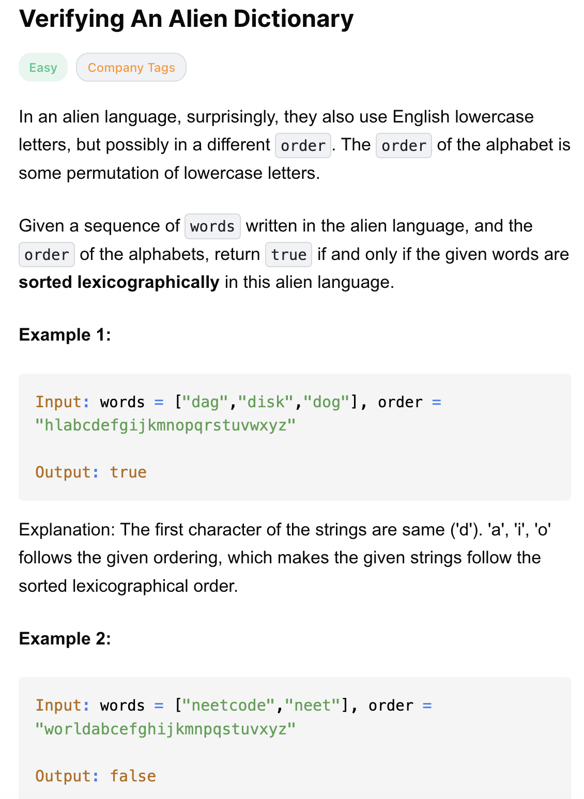
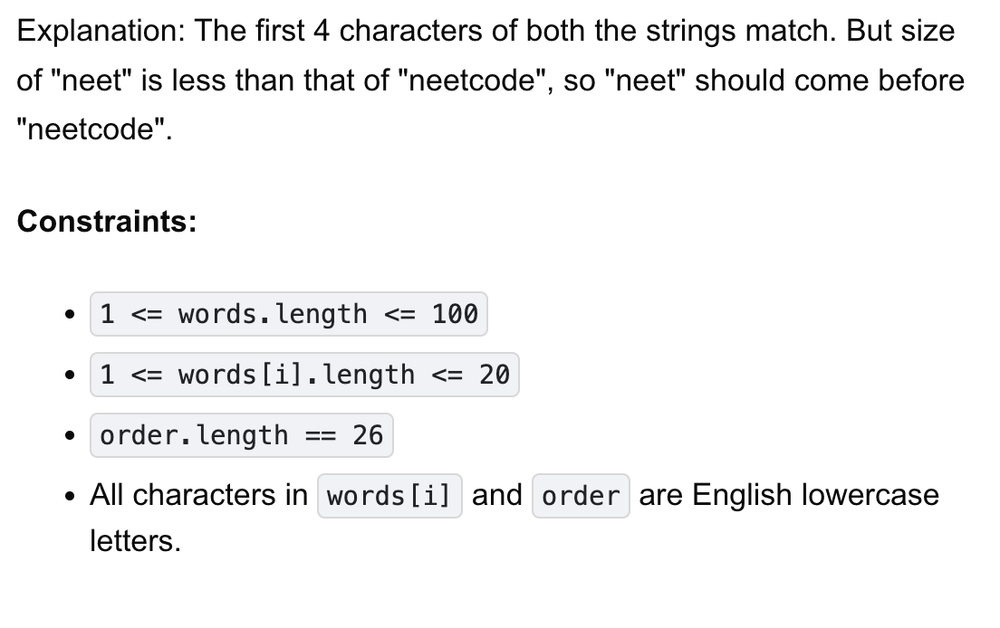

# 953-Verifying An Alien Dictionary-E

## 题目描述



题意：
- 给定一个单词列表 words 和 一个字符串 order
- order表示了外星语字符的顺序，判断 words 里的单词是否按照字母表排序，返回bool

解法：
- sorting
- Comparing adjacent words

## 1. Comparing adjacent words
```python
class Solution:
    def isAlienSorted(self, words: List[str], order: str) -> bool:
        order_index = {c: i for i, c in enumerate(order)}

        for i in range(len(words) - 1):
            w1, w2 = words[i], words[i + 1]

            for j in range(len(w1)):
                if j == len(w2): # 前词不能长于后词
                    return False

                if w1[j] != w2[j]:
                    if order_index[w1[j]] > order_index[w2[j]]:
                        return False
                    break # 遍历到不同的字符了，可以进行下一组单词的比较了
        return True
```

- TC: O(n * m)
- SC: O(1) 
  - 因为只有26个字符
- n = len(words), m = avg(len(word))