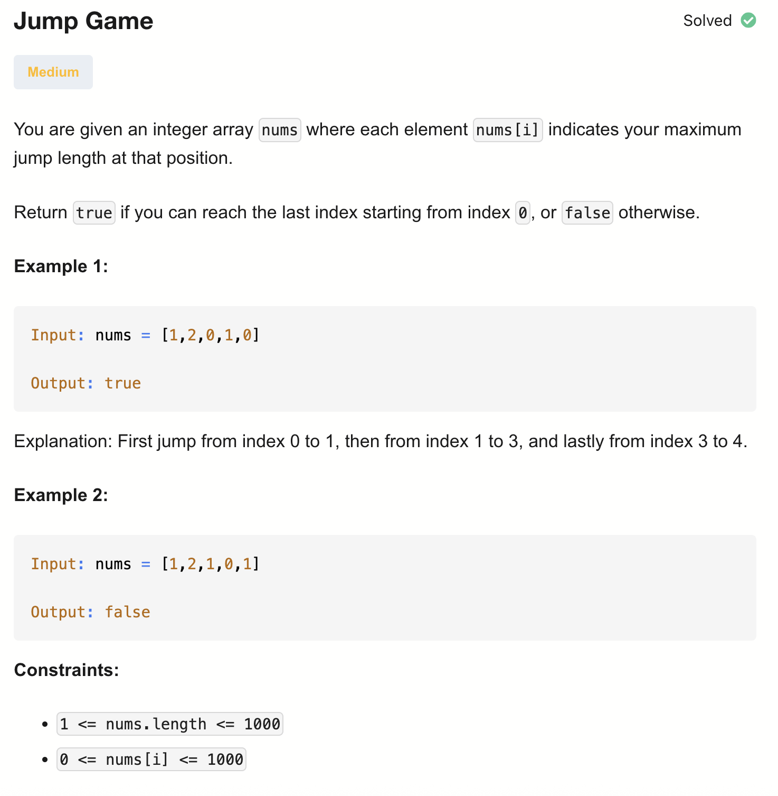

# 55-Jump Game-M

## 题目描述


题意:
- 数组元素表达从当前下标能走的距离，看是否能从头走到尾

解法：
- Recursion
- Dynamic Programming
- Greedy


## 1. Recursion

```python
class Solution:
    def canJump(self, nums: List[int]) -> bool:
        def dfs(i):
            if i == len(nums) - 1:
                return True
            end = min(len(nums) - 1, i + nums[i])
            for j in range(i + 1, end + 1):
                if dfs(j):
                    return True
            return False

        return dfs(0)
```

- TC: O(n!)
- SC: O(n)

TC分析: 
- 递归的时间是指数级的，所以可以估算为：
在最坏情况下（例如每次只能跳一步），递归深度可能达到 n。有跳或不跳这两种选择，所以O(2^n)

- 但是，这题其实不是二叉递归，而是多叉递归（题目有跳跃游戏、排列生成）
每步有多个分支（跳到所有可能点）

- 想象最坏情况：
nums = [n-1, n-2, n-3, ..., 2, 1, 0]
在这个数组里：
  - 从位置 0，你能跳到 1, 2, ..., n-1（≈ n-1 种可能）
  - 从位置 1，你又能跳到 2, 3, ..., n-1（≈ n-2 种可能）
  - 从位置 2，你又能跳到 3, 4, ..., n-1（≈ n-3 种可能）
  - 以此类推…… 于是递归树的分支数量大致是：
  (n−1)×(n−2)×(n−3)×...×1=O(n!)


## 2. Dynamic Programming (Top-Down)
```python
class Solution:
    def canJump(self, nums: List[int]) -> bool:
        memo = {}

        def dfs(i):
            if i in memo:
                return memo[i]
            if i == len(nums) - 1:
                return True
            if nums[i] == 0:
                return False

            end = min(len(nums), i + nums[i] + 1)
            for j in range(i + 1, end):
                if dfs(j):
                    memo[i] = True
                    return True
            memo[i] = False
            return False

        return dfs(0)
```

- TC: O(n^2)
- SC: O(n)

如果对if dfs(j): memo[i] = True 这一句有疑问可以看下面3. Dynamic Programming (Bottom-Up)里的代码注解

TC分析:
外层 DFS：每个位置 i 最多访问一次 → O(n)
内层循环：每次 DFS 最多遍历 O(n) 个后续位置


## 3. Dynamic Programming (Bottom-Up)

```python
class Solution:
    def canJump(self, nums: List[int]) -> bool:
        n = len(nums)
        dp = [False] * n # 表示从 i 位置出发能否到达最后一个下标
        dp[-1] = True

        for i in range(n-2, -1, -1):
            end = min(n-1, i + nums[i]) # i跳到的最小位置
            for j in range(i+1, end+1): # 因为规定了end的值，所以j都是i可以达到的下标
                if dp[j]:
                    dp[i] = True
                    break
        
        return dp[0]
```

- TC: O(n^2)
- SC: O(n)

## 4. Greedy

```python
class Solution:
    def canJump(self, nums: List[int]) -> bool:
        goal = len(nums) - 1

        for i in range(len(nums) - 2, -1, -1): ## 注意这里range里的不是goal - 1，goal一直在更新
            if i + nums[i] >= goal:
                goal = i
        return goal == 0
```

- TC: O(n)
- SC: O(1)

从右到左，相当于每一个下标处都跳nums[i]，看是否能跳到目标goal。
而目标goal初始为n-1，能从i跳到goal后，将goal更新为i