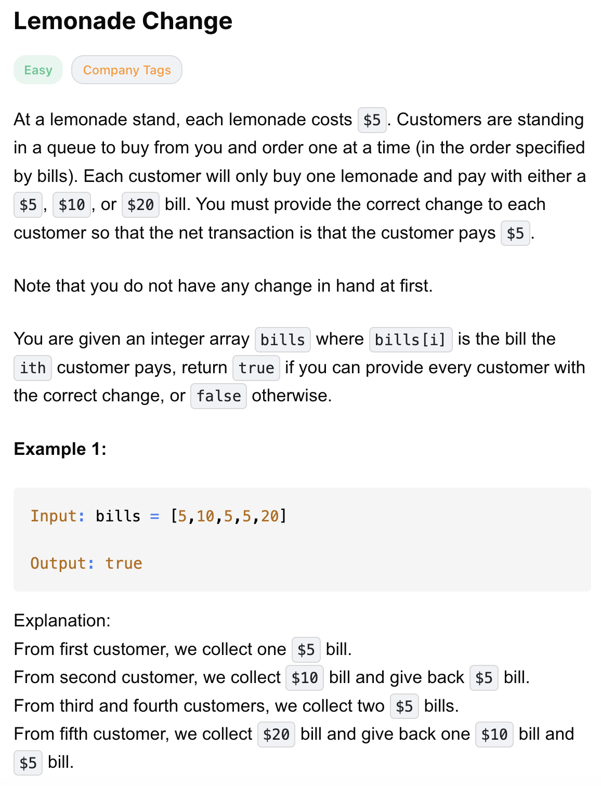
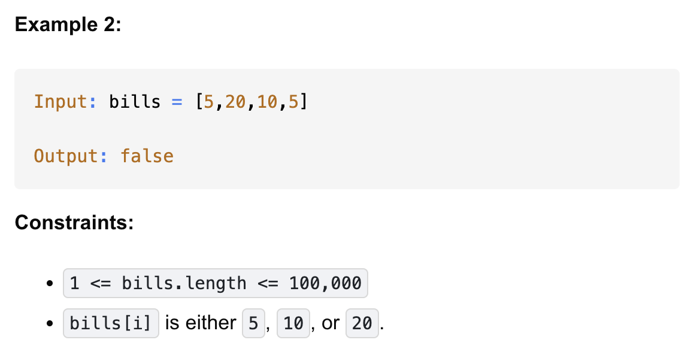

# 860-Lemonade Change-E

## 题目描述



题意：
- 我是橙子汁小摊摊主，每杯橙汁5元
- bills是客户付的钱的list，元素只会是5、10、20
- 一开始我手里没有零钱，问我是否能找客户零钱顺利走完整个bills，返回bool

解法：
- greedy 
  - “局部最优 → 全局最优”

## 1. greedy
```python
class Solution:
    def lemonadeChange(self, bills: List[int]) -> bool:
        five, ten = 0, 0
        for b in bills:
            if b == 5:
                five += 1
            elif b == 10:
                five, ten = five - 1, ten + 1
            elif ten > 0:
                five, ten = five - 1, ten - 1
            else:
                five -= 3
            if five < 0:
                return False
        return True
```

- TC :O(n)
- SC: O(1)

分析：
- 三种面值对于找零的作用：
  - 5: 能给10、20找零
  - 10: 只能给20找零
  - 20: 无法找零
  - 所以作用排序5 > 10，20根本没用
- 本题贪心的核心体现在在找零时先把10给出去，当没有10的时候才给5