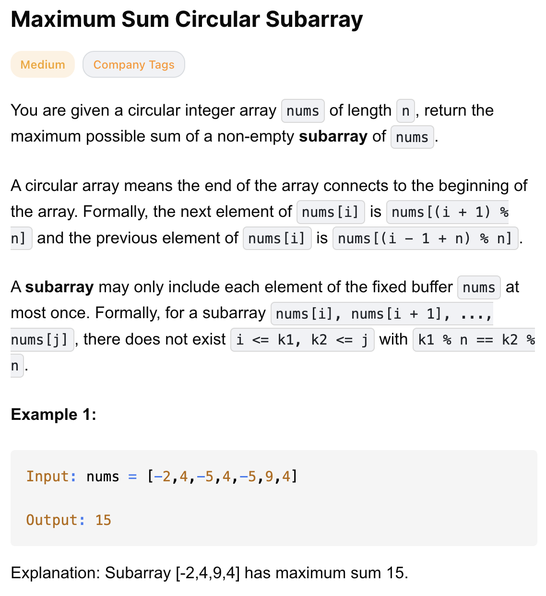
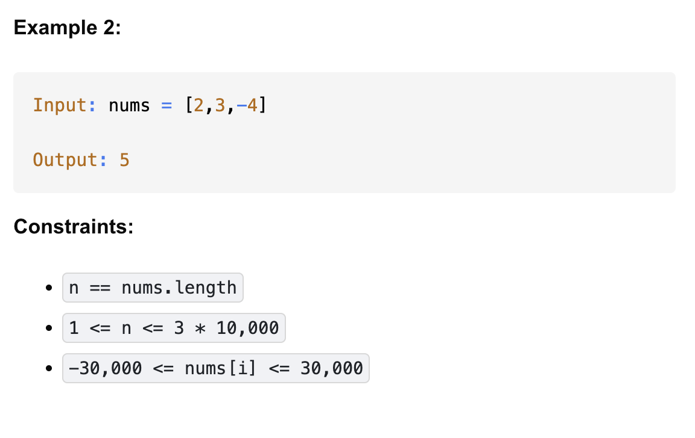

# 918-Maximum Sum Circular Subarray-M

## 题目描述





题意：
- 给一个整数数组，求子串的最大总和
- 特殊点：数组是circular，意思是nums[-1]的下一个是nums[0]
- 子串：连续的几个元素，每个元素只能用一次，并且要求子串**非空**


解法：
- Prefix & Suffix Sums
- Kadane's Algorithm

## 1. Kadane's Algorithm
```python
class Solution:
    def maxSubarraySumCircular(self, nums: List[int]) -> int:
        globMax, globMin = nums[0], nums[0] # 注意这里非0
        curMax, curMin = 0, 0
        total = 0

        for num in nums:
            curMax = max(curMax + num, num)
            curMin = min(curMin + num, num)
            total += num
            globMax = max(globMax, curMax)
            globMin = min(globMin, curMin)

        return max(globMax, total - globMin) if globMax > 0 else globMax
```

- TC: O(n)
- SC: O(1)

分析：
- curMax: 遍历过程中一直累加num 与 当前 num 中的较大值；与自身比较，更新 globMax
- curMin: 遍历过程中一直累加num 与 当前 num 中的较小值；与自身比较，更新 globMin
- 在不跨环的情况下，最大子数组 = globMax
- 在跨环的情况下，最大子数组 = total - globMin
- 有一种特殊情况，当所有元素都为负数，那么globMin = total。
  - total - globMin = 0，但此时最终答案取不到0，因为子串不能为空。所以最终答案为globMax
- 贪心思想：
  - Kadane 本身就是贪心
    - curMax = max(curMax + num, num)：每走到一个 num，就立刻做局部最优选择
    - 全局最优 = 一直选择局部最优
  - 第二层贪心：跨环 ≈ 去掉一个最差的连续段
    - 全局最优 = 总体 − 全局最差
