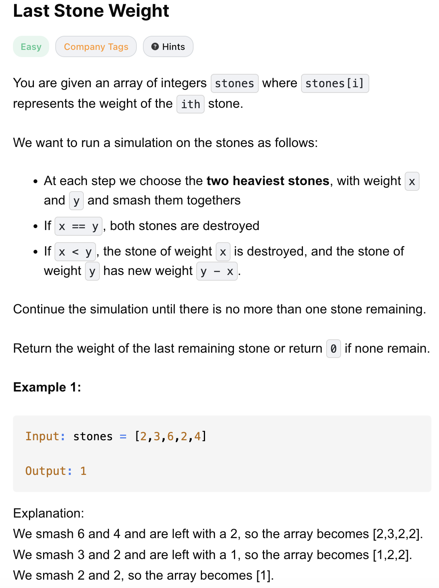
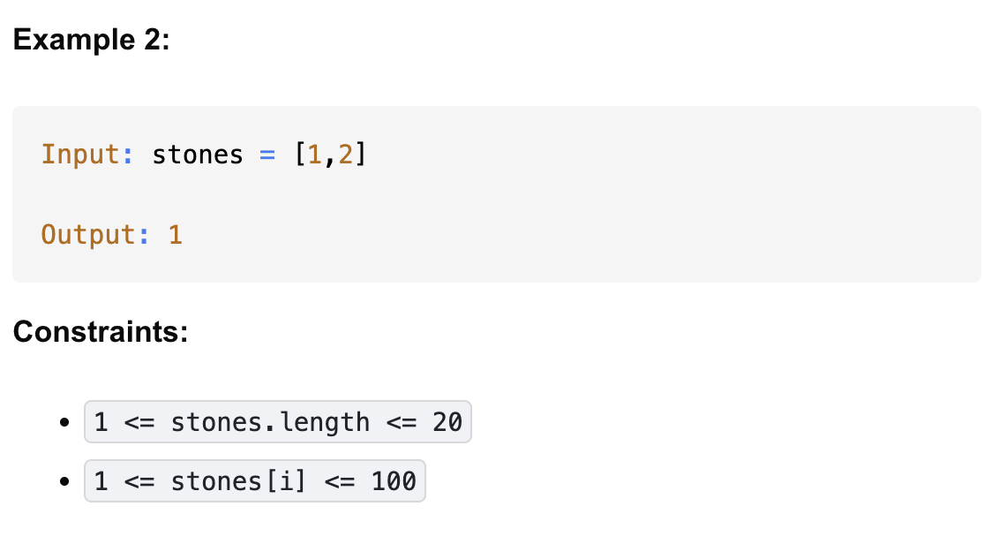

# 1046-Last Stone Weight-E

## 题目描述




题意：
- 给定一个正整数数组stones
- 对数组元素进行smash操作，返回最后剩下的值，若无值剩下，那么返回0. 
    - smash操作: 选数组里的**最大的两个元素**，只留下两值之差。也就是说如果两者相等，那么将这两个元素都pop出数组；不相等，pop出去后加入两值之差
- 与1049-Last Stone Weight II-M的区别：这里每一步都取最大的两个元素，最终返回是确定值，而不需要在过程中求最小


解法：
- Sorting
- Binary Search
- Heap
- Bucket Sort

## 1. Heap
```python
class Solution:
    def lastStoneWeight(self, stones: List[int]) -> int:
        stone_heap = [-s for s in stones] # 用负数 + 最小堆，堆顶为最大值的相反数
        heapq.heapify(stone_heap)

        while len(stone_heap) > 1:
            first = heapq.heappop(stone_heap)
            second = heapq.heappop(stone_heap)
            if first < second:
                heapq.heappush(stone_heap, first - second)
        
        return 0 if len(stone_heap) < 1 else abs(stone_heap[0])
```

- TC: O(nlogn)
- SC: O(n)

## 2. Bucket Sort