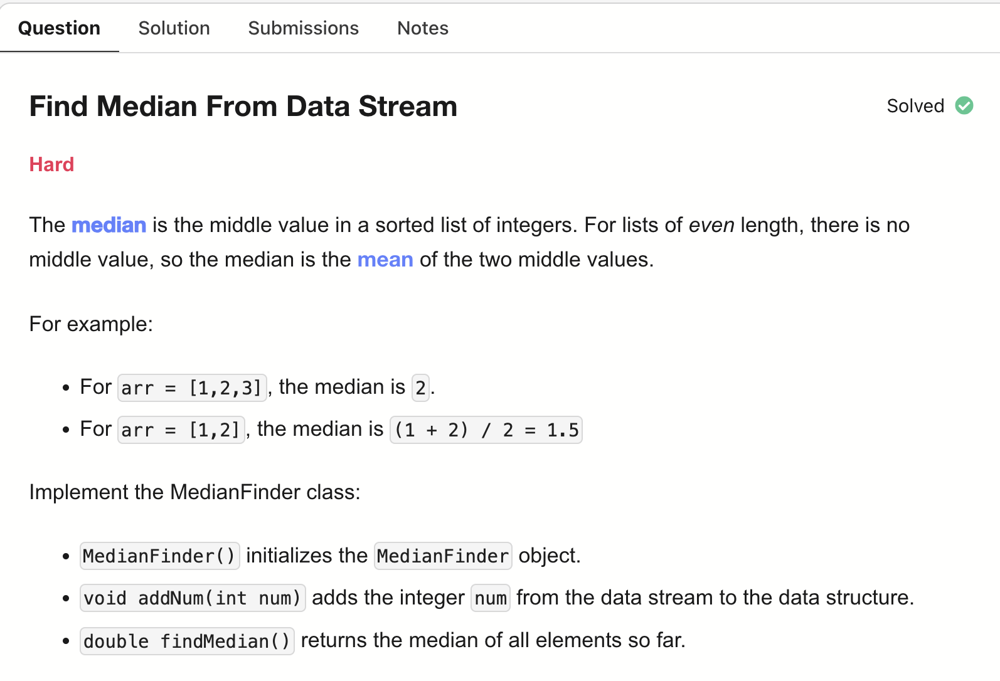
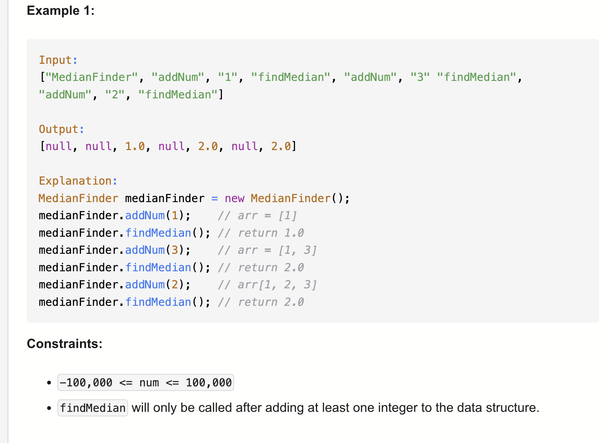

# 295-Find Median From Data Stream-H

## 题目描述



题意：
- 实现一个数据结构，要找到数组中的中位数，对于元素个数为偶数的情况，返回中间两个的平均值
- 支持以下两种操作：
  - void addNum(int num)：从数据流中添加一个整数到数据结构中
  - double findMedian()：返回目前所有元素的中位数

解法：
- Sorting
- Two Heaps

## 1. Sorting
```python
class MedianFinder:

    def __init__(self):
        self.data = []

    def addNum(self, num: int) -> None:
        self.data.append(num)

    def findMedian(self) -> float:
        self.data.sort()
        n = len(self.data)
        return (self.data[n // 2] if (n & 1) else
                (self.data[n // 2] + self.data[n // 2 - 1]) / 2)
```

忽略调用次数m来看：
- TC: addNum: O(1), findMedian: O(nlogn)
- SC: O(n)

## 2. Heap
```python
class MedianFinder:

    def __init__(self):
        # 双堆维护中位数
        # 将list分为左右两半
        # small:用负数实现最大堆，放的是左半边元素，即较小元素 * -1，所以堆顶是左半边最大的元素
        # large:放的是右半边元素，堆顶是右半边最小的元素
        self.small, self.large = [], []
        

    def addNum(self, num: int) -> None:
        # 平衡两个堆的大小，差不超过1
        if self.large and num > self.large[0]: # 只有大于右半边最小元素，说明才会排在右边
            heapq.heappush(self.large, num)
        else:
            heapq.heappush(self.small, -1 * num)

        if len(self.large) > len(self.small) + 1:
            val = -1 * heapq.heappop(self.large)
            heapq.heappush(self.small, val)
        if len(self.small) > len(self.large) + 1:
            val = -1 * heapq.heappop(self.small)
            heapq.heappush(self.large, val)
        

    def findMedian(self) -> float:
        # 两边大小不相等说明list为奇数，取栈顶元素就行。注意是取[0]而非弹出
        if len(self.small) > len(self.large):
            return -1 * self.small[0]
        if len(self.large) > len(self.small):
            return self.large[0]
        val = (-1 * self.small[0] + self.large[0]) / 2
        return val
```

忽略调用次数m来看：
- TC: addNum: O(logn), findMedian: O(1)
- SC: O(n)