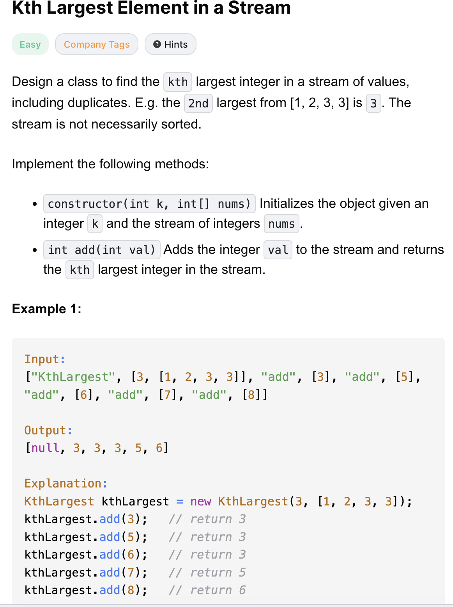
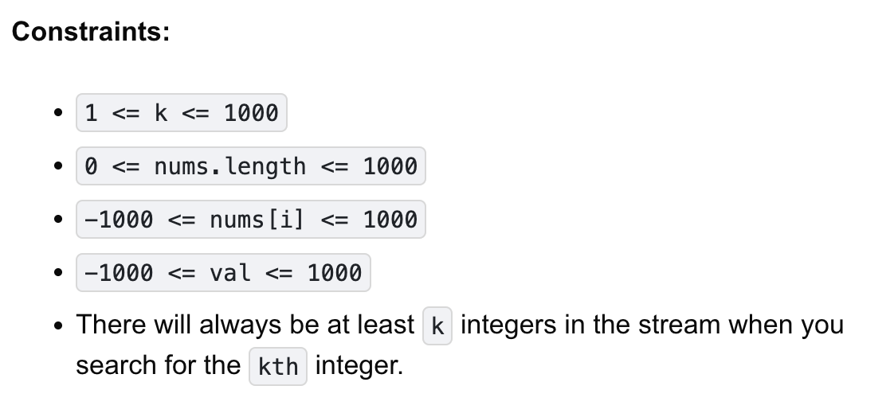

# 703-Kth Largest Element in a Stream-E

## 题目描述



题意：
- 实现一个类，使得能返回一个数组中第k大的元素
  - 数组内数字是无序的
  - 数组内元素可能有重复元素，那么求第k个的时候是不去重的
  - 若不足k个，返回null

解法：
- Min-Heap 

## 1. Min-Heap
```python
class KthLargest:

    def __init__(self, k: int, nums: List[int]):
        self.minHeap, self.k = nums, k
        heapq.heapify(self.minHeap)
        while len(self.minHeap) > k: # minHeap里只维护k个数
            heapq.heappop(self.minHeap)

    def add(self, val: int) -> int:
        heapq.heappush(self.minHeap, val)
        if len(self.minHeap) > self.k: # 可能初始化时不足k个元素，所以要加判断
            heapq.heappop(self.minHeap)
        return self.minHeap[0]
```
- TC: O(m * logk)
  - 因为堆内只有k个元素
- SC: O(k)
  - 因为堆内只有k个元素
- m是 the number of calls made to add()

分析：
- minHeap里只维护k个数，堆顶就是原nums里第k大的数

注意heapq的方法调用：
- 名字是heapify、heappop、heappush
- heappush的第二个参数为加入的值
