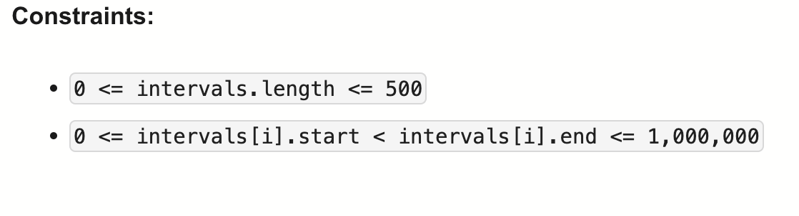

# 253-Meeting Rooms II-M

## 题目描述



题意：
- 把intervals拆分成几个组，每个组里的interval不重叠。问最少需要几个组
- (0,8),(8,10) 是不冲突的


解法：
- Min Heap
- Sweep Line Algorithm
- Two Pointers
- Greedy

## 1. Min Heap
```python
"""
Definition of Interval:
class Interval(object):
    def __init__(self, start, end):
        self.start = start
        self.end = end
"""

class Solution:
    def minMeetingRooms(self, intervals: List[Interval]) -> int:
        intervals.sort(key=lambda x: x.start)
        min_heap = []

        for interval in intervals:
            if min_heap and min_heap[0] <= interval.start:
                heapq.heappop(min_heap)
            heapq.heappush(min_heap, interval.end)

        return len(min_heap)
```

- TC: O(nlogn)
- SC: O(n)

## 2. Sweep Line Algorithm
```python
"""
Definition of Interval:
class Interval(object):
    def __init__(self, start, end):
        self.start = start
        self.end = end
"""

class Solution:
    def minMeetingRooms(self, intervals: List[Interval]) -> int:
        mp = defaultdict(int)
        for i in intervals:
            mp[i.start] += 1
            mp[i.end] -= 1
        prev = 0
        res = 0
        for i in sorted(mp.keys()):
            prev += mp[i]
            res = max(res, prev)
        return res
```

- TC: O(nlogn)
- SC: O(n)

prev：当前正在进行的会议数量（活动会议室数）
res：记录出现过的最大值（需要的最少会议室数）

直觉理解：
想象一条时间轴，会议开始时往上+1，会议结束时往下–1；
曲线最高的地方，就是「同时开的会议数最多」的时刻；
这就是你需要的会议室数量。

## 3. Two Pointers
```python
"""
Definition of Interval:
class Interval(object):
    def __init__(self, start, end):
        self.start = start
        self.end = end
"""

class Solution:
    def minMeetingRooms(self, intervals: List[Interval]) -> int:
        start = sorted([i.start for i in intervals])
        end = sorted([i.end for i in intervals])

        res = count = 0
        s = e = 0
        while s < len(intervals):
            if start[s] < end[e]:
                s += 1
                count += 1
            else:
                e += 1
                count -= 1
            res = max(res, count)
        return res
```
- TC: O(nlogn)
- SC: O(n)

## 4. Sweep Line Algorithm + Greedy
```python
"""
Definition of Interval:
class Interval(object):
    def __init__(self, start, end):
        self.start = start
        self.end = end
"""

class Solution:
    def minMeetingRooms(self, intervals: List[Interval]) -> int:
        time = []
        for i in intervals:
            time.append((i.start, 1)) # 会议开始 → 需要一个房间
            time.append((i.end, -1))  # 会议结束 → 释放一个房间

        time.sort(key=lambda x: (x[0], x[1]))

        res = count = 0
        for t in time:
            count += t[1]
            res = max(res, count)
        return res
```
- TC: O(nlogn)
- SC: O(n)

分析：
- 最少会议室 = 任意时刻同时进行的会议的最大数量，所以res取的是max
- 至于+1 -1:
  - 直觉理解：
    想象一条时间轴，会议开始时往上+1，会议结束时往下–1；
    曲线最高的地方，就是「同时开的会议数最多」的时刻；
    这就是你需要的会议室数量。
- 注意start code给的Interval不是list/tuple，而是自定义类
  - 使用时需要用属性，比如i.start
- time.sort(key=lambda x: (x[0], x[1]))
  - 按第一个字段升序排列，若相等则按第二个字段升序排列
  - 所以若有i.start和i.end值相等，**先-1再1**，因为(5,10) 和 (10,18) 是不重叠的
- greedy体现在只关心当前同时进行的会议的数量(count)，不等以后, 不幻想“也许可以复用”,只要现在冲突，就马上加房间