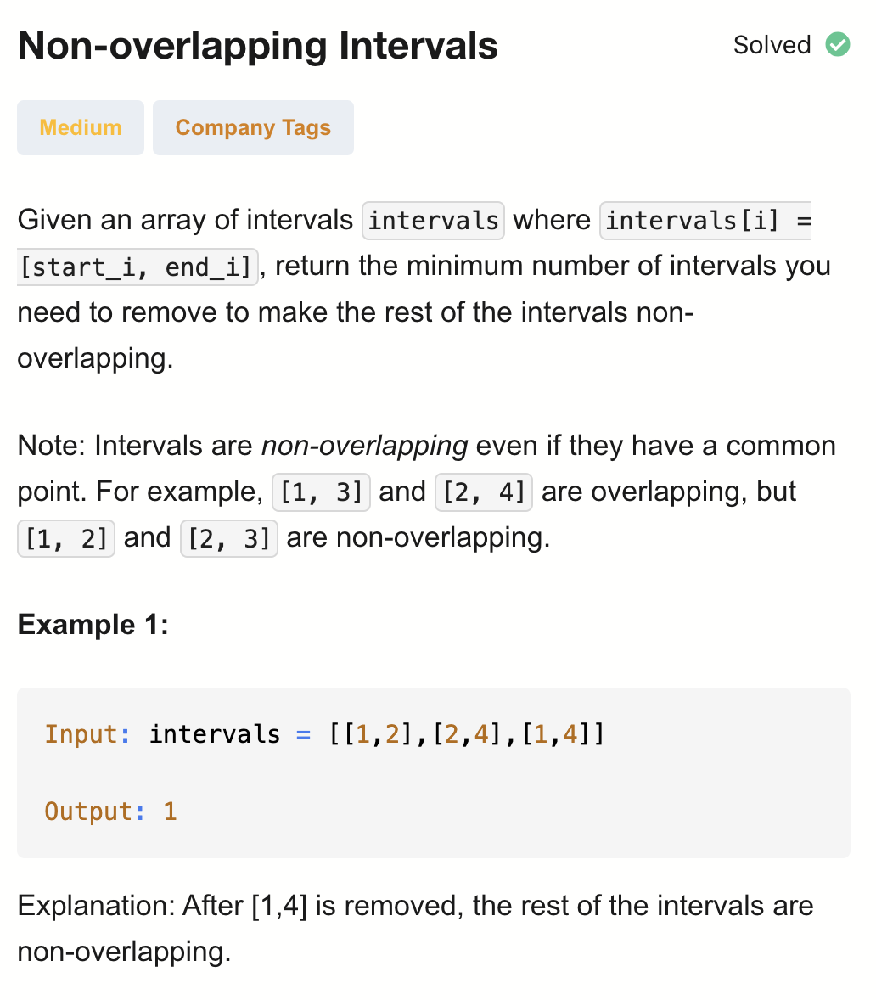
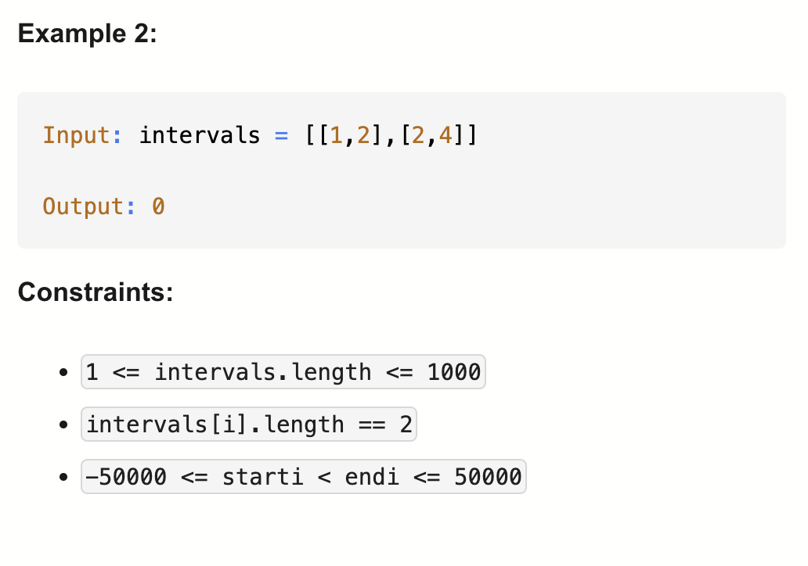

# 435.Non-overlapping Intervals - M

## 题目描述




## 题意分析
题意：
- 删除intervals里的interval，使得剩下的都是不重叠的。求最少需要删除几个

解法：
1. Recursion
2. Dynamic Programming
3. Greedy

## 1. Recursion

```python
class Solution:
    def eraseOverlapIntervals(self, intervals: list[list[int]]) -> int:
        intervals.sort() # 升序排序

        def dfs(i, prev): # i: 当前处理到第 i 个区间，prev：上一个被选择保留的区间索引
            if i == len(intervals):
                return 0
            
            # 第一种情况：跳过当前区间
            # 意味着删除当前区间 → 不更新 prev
            res = dfs(i+1, prev)

            # 第二种情况：保留当前区间
            if prev == -1 or intervals[prev][1] <= intervals[i][0]: # or后面的表示当前区间和前一个保留的区间不重叠
                res = max(res, 1+dfs(i+1, i))
            return res
        
        return len(intervals) - dfs(0,-1)
```

- TC: O(2^n)
- SC: O(n)

dfs(i, prev) 最多可以保留的不重叠区间数量

## 2. Dynamic Programming (Top-Down)

```python
class Solution:
    def eraseOverlapIntervals(self, intervals: list[list[int]]) -> int:
        intervals.sort(key = lambda x: x[1]) # 注意要按终点来升序排列，思想是贪心，看下面解释
        n = len(intervals)
        memo = {}

        # dfs(i) 表示从第 i 个区间开始，最多能保留多少不重叠区间
        def dfs(i):            
            if i in memo:
                return memo[i]
            
            res = 1
            for j in range(i+1, n):
                if intervals[i][1] <= intervals[j][0]:
                    res = max(res, 1+dfs(j))
            memo[i] = res
            return res
        
        return n - dfs(0)
```

- TC: O(n^2)
- SC: O(n)

为什么要按终点排序 核心思想：贪心 + DFS 的剪枝优化
1. 尽早选择结束早的区间
- 如果两个区间 [a,b] 和 [c,d] 可以选择，那么选择结束早的区间 b < d，可以留给后面的区间更多空间 → 最大化不重叠区间数
这是经典 区间调度问题（Interval Scheduling） 的贪心策略
2. DFS 遍历更简单
- 排序后，intervals[i][1] <= intervals[j][0] 的判断只需往后看，不用回头检查
- 否则，如果按起点排序，可能出现：
  - 后面的区间早结束、前面晚结束 → DFS 需要回溯更多可能性
  - 按终点排序，可以自然保证递归选择的是“最优”顺序


## 3. Dynamic Programming (Bottom-Up)
```python
class Solution:
    def eraseOverlapIntervals(self, intervals: list[list[int]]) -> int:
        intervals.sort(key = lambda x: x[1])
        n = len(intervals)
        dp = [0] * n

        for i in range(n):
            dp[i] = 1
            for j in range(i):
                if intervals[j][1] <= intervals[i][0]:
                    dp[i] = max(dp[i], 1+dp[j])
        
        res = max(dp)
        return n - res
```

- TC: O(n^2)
- SC: O(n)

## 4. Greedy (Sort By Start)
```python
class Solution:
    def eraseOverlapIntervals(self, intervals: list[list[int]]) -> int:
        intervals.sort() 
        prevEnd = intervals[0][1]
        res = 0

        for start, end in intervals[1:]:
            if start >= prevEnd: # 不重叠
                prevEnd = end
            else: # 当前区间与上一个区间重叠 → 必须删除一个
                res += 1
                prevEnd = min(prevEnd, end) # 贪心策略：保留结束早的区间
        
        return res
```

- TC: O(nlogn) 排序的时间，遍历仅O(n)
- SC: O(1)

保留结束早的区间，才能让尽可能多的interval不重叠

## 5. Greedy (Sort By End)

```python
class Solution:
    def eraseOverlapIntervals(self, intervals: list[list[int]]) -> int:
        intervals.sort(key = lambda x: x[1]) 
        n = len(intervals)
        prevEnd = intervals[0][1] # 当前被保留的最后一个区间的终点
        res = 0 # 记录 需要删除的区间数量

        for i in range(1, n):
            if prevEnd > intervals[i][0]: # 当前区间与上一个保留区间重叠
                res += 1
            else: # 不重叠
                prevEnd = intervals[i][1]
        
        return res
```
- TC: O(nlogn) 排序的时间，遍历仅O(n)
- SC: O(1) 

为什么只删除“当前区间”是最优?
- 假设我们遇到两个重叠区间：prev = [a, b] 当前 = [c, d]
- 条件：b > c → 重叠
- 可选的删除方案：
  - 1.删除 prev → 选择 [c,d] 保留
  - 2.删除 当前 → 保留 [a,b]

为什么删除“当前区间”更优？
- 因为我们已经按 终点升序排序：
- b <= d（当前区间终点 >= prev 终点）
- 删除当前区间能保留结束早的区间 prev
- 保留结束早的区间可以让 后续区间更容易不重叠
- 如果删除 prev，保留 [c,d]，可能后续更多区间会重叠 → 不利于最少删除

关键点：贪心策略保证保留结束早的区间 → 给后续区间留最大空间 → 最少删除