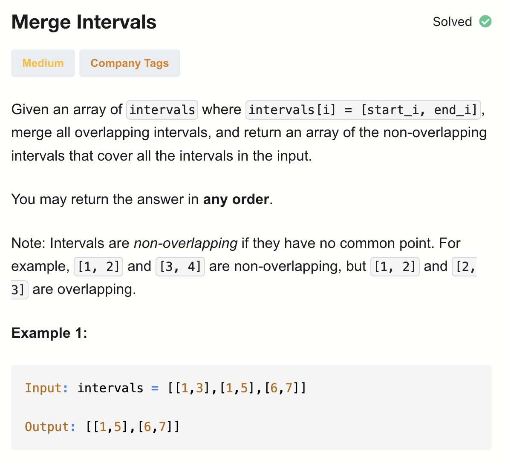
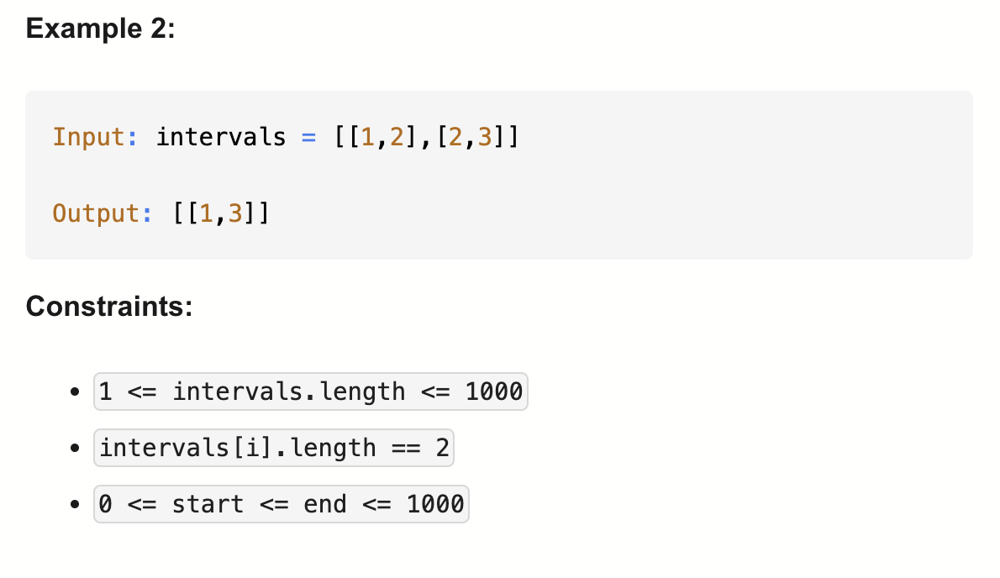

# 56-Merge Intervals-M

## 题目描述



题意：
- 给定一个intervals数组，merge overlap 的间隔
- [1, 2] and [3, 4] are non-overlapping, but [1, 2] and [2, 3] are overlapping

解法：
- Sorting
- Sweep Line Algorithm
- Greedy

## 1. Sorting

```python
class Solution:
    def merge(self, intervals: List[List[int]]) -> List[List[int]]:
        intervals.sort(key=lambda pair: pair[0]) # 就地排序, 对于列表中的每个元素 pair，取它的第 0 个值（即 pair[0]）作为排序的标准, 升序
        res = [intervals[0]]

        for start, end in intervals:
            lastEnd = res[-1][1]

            if start <= lastEnd:
                res[-1][1] = max(lastEnd, end)
            else:
                res.append([start, end])
        
        return res
```

- TC: O(nlogn)  
  - 排序时间：O(nlogn)
- SC: O(n)

## 2. Sweep Line Algorithm
```python
class Solution:
    def merge(self, intervals: List[List[int]]) -> List[List[int]]:
        mp = defaultdict(int) # 用来记录每个时间点的“增减事件”
        for start, end in intervals:
            mp[start] += 1 # 表示“区间开始”，在这个点活跃区间数 +1
            mp[end] -= 1 # 表示“区间结束”，在这个点活跃区间数 -1
        
        res = []
        interval = []
        have = 0
        for i in sorted(mp): # 排序
            if not interval: # interval 为空，那么i就是起点
                interval.append(i)
            have += mp[i]
            if have == 0: # 当没有活跃区间时，说明之前的区间合并结束了，可以加入终点了
                interval.append(i)
                res.append(interval)
                interval = []

        return res
```

- TC: O(nlogn)  
  - 排序时间：O(nlogn)
- SC: O(n)

Sweep Line：扫描线思想
核心：把所有关键事件点（区间的起点和终点）按顺序排列，然后沿着这些点扫描
在扫描的过程中，维护一个“状态变量”，本例中就是 have，表示当前活跃的区间数

也可以说用到了“前缀和”思想
have += mp[i]，这里的 have 相当于一个 累加量，类似前缀和的概念
你可以把它看作在时间轴上做了一个“差分数组”，然后扫描累加 → 就是前缀和

例子：
intervals = [[1,3],[2,4],[5,6]]
构建 mp：{1:1, 2:1, 3:-1, 4:-1, 5:1, 6:-1}
最终返回 [[1,4],[5,6]]


## 3. Greedy
```python
class Solution:
    def merge(self, intervals: List[List[int]]) -> List[List[int]]:
        max_val = max(interval[0] for interval in intervals) # 所有区间起点的最大值

        mp = [-1] * (max_val+1) # 用来存储每个起点能延伸的最远终点
        for start, end in intervals:
            mp[start] = max(mp[start], end)
        
        res = []
        end = -1 # 当前区间能延伸的最远终点
        interval_start = -1 # 当前合并区间的起点
        for i in range(len(mp)):
            if mp[i] != -1: # 说明有区间从 i 开始
                if interval_start == -1:
                    interval_start = i
                end = max(end, mp[i])
            if end == i:
                res.append([interval_start, end])
                end = -1 # 复原到初始状态，准备加入下一个间隔
                interval_start = -1 # 复原到初始状态，准备加入下一个间隔
        
        # 防止最后扫描完数组还有未添加的区间
        if interval_start != -1:
            res.append([interval_start, end])
        
        return res
```

- TC: O(n+m)  
  - 两个for循环，一个O(n)，一个O(m)
- SC: O(n+m) 
  - mp和res的大小
- n = len(intervals), m = max(interval.start)

初始化后(第7行后)数据结构的样例：
intervals = [[1,3],[2,4],[5,6]]
初始化：mp = [-1,-1,-1,-1,-1,-1]，后更新为mp = [0,3,4,0,0,6]

贪心点在于：
一旦进入一个合并区间，就始终选择“当前能延伸到的最远右端点”，
并且只有在“再也延伸不了了”的那一刻，才确定并输出这个区间。