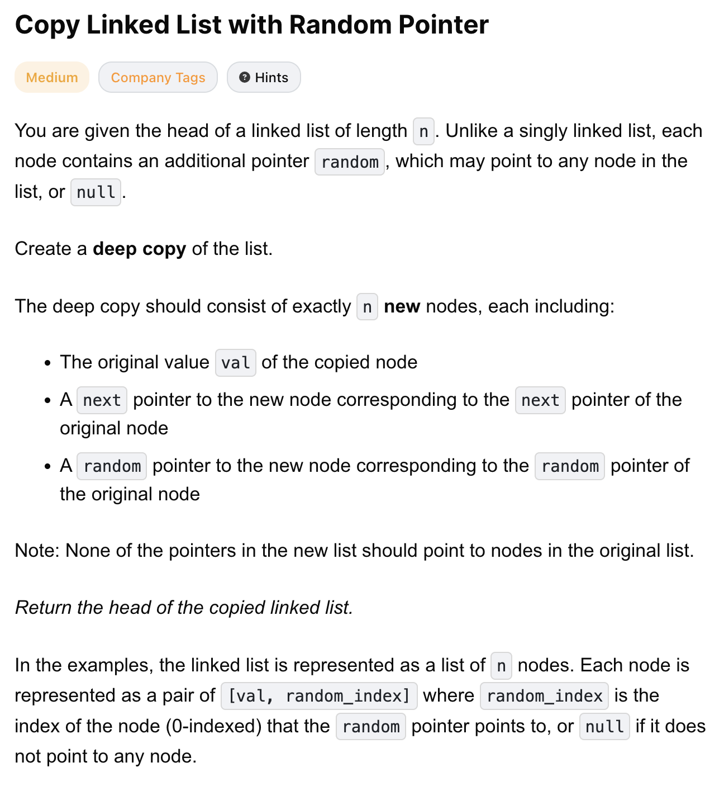
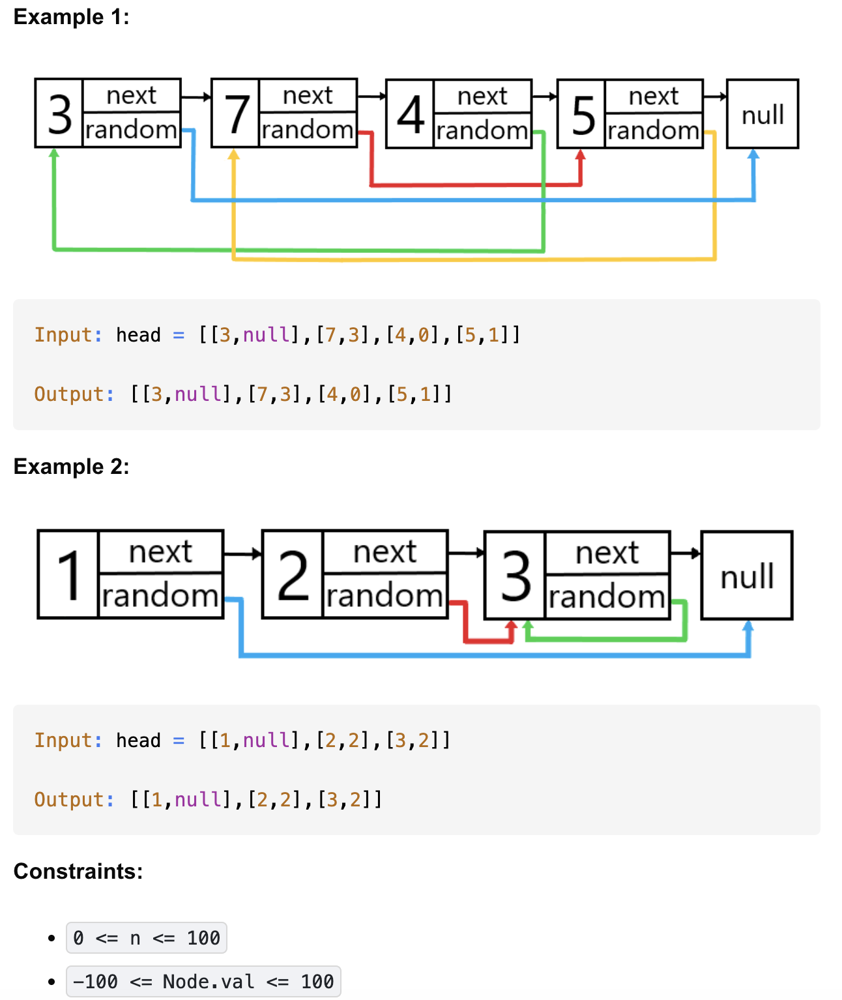

# 138-Copy Linked List with Random Pointer-M

## 题目描述



题意：
- 比起单链表，有一个random指针，可以指向null或链表里的任一节点
- 给的二维list，是链表的n个节点，每个元素结构为[val, random_index]，val是节点值，random_index是random指针指向的下标，是数字或null
- 深拷贝这个链表


解法：
- Recursion + Hash Map
- Hash Map
- iteration

## 1. iteration
```python
"""
# Definition for a Node.
class Node:
    def __init__(self, x: int, next: 'Node' = None, random: 'Node' = None):
        self.val = int(x)
        self.next = next
        self.random = random
"""

class Solution:
    def copyRandomList(self, head: 'Optional[Node]') -> 'Optional[Node]':
        if head is None:
            return None

        l1 = head
        while l1:
            l2 = Node(l1.val)
            l2.next = l1.random
            l1.random = l2
            l1 = l1.next

        newHead = head.random # 是l2头节点，也就是l1深拷贝后的头节点

        l1 = head
        while l1:
            l2 = l1.random
            l2.random = l2.next.random if l2.next else None # 注意判断空
            l1 = l1.next

        l1 = head
        while l1 is not None:
            l2 = l1.random
            l1.random = l2.next
            l2.next = l1.next.random if l1.next else None # 注意判断空
            l1 = l1.next

        return newHead
```
- TC: O(n)
- SC: O(n) for the output 


分析：
- 核心：把新节点“偷偷塞进”旧链表中，用旧节点的 random 来当映射表。这样就不需要哈希表
- 三段while分别在做：
  1. 每个旧节点后面插入一个新节点，断开原有random
     - 旧节点l1，新节点l2，l2是与l1值相同的新节点
     - l1的random指向l2
     - l2的next指向l1的random
  2. 利用旧节点的 random，设置新节点的random
     - l2.random = l2.next.random （l2.next是原random，再.random是原random的拷贝）
  3. 把新链表和旧链表拆开
     - 复原l1的random指针，用l2.next
     - 添加l2的next指针

精简版：
1. 复制新节点，改l1.random为新节点, l2.next为原random
2. 更新l2.random指针
3. 复原，改l1.random, l2.next